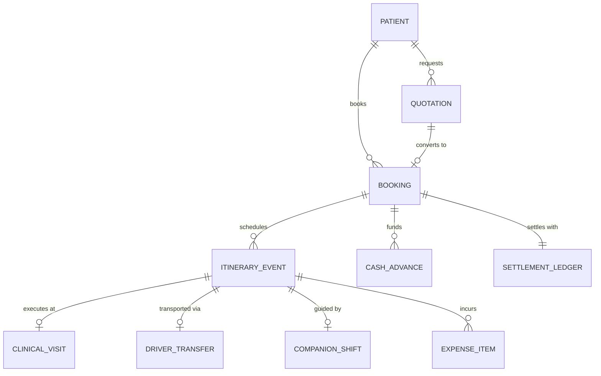

# 🏥 Master Domain Survey & Empirical Operational Dataset: Medical Trip Colombia S.A.S.

> **Document**: `survey_report.md`  
> **Author**: Explorer 1 (Domain Survey, Operational Modeling & Mock Data Synthesis)  
> **Date**: 2026-08-23T16:20:00Z  
> **Target Project**: Standalone React 19 + TypeScript Web Application (`apps/medicaltrip_react_app`)  
> **Integrity Mode**: Strict DDD / Hexagonal Architecture (Ports & Adapters) / Local-First PWA  
> **Authoritative Sources Analyzed**:  
> - `data/master_extracted_drive_database.json` & `data/medicaltrip_master.db` (4 years of operational logs)  
> - `data/reservas_drive/Reservas/*.xlsx` (`RVA171-4_5`, `RVA282-5_6`, `RVA341-1`, `RVA077-5`)  
> - `data/liquidaciones/Liquidacion_acompanamiento_presencial.xlsx` & `Liquidacion_transporte.xlsx`  
> - WhatsApp operational transcripts (`MEDICAL_TRIP_COLOMBIA_SAS/chats/`)  
> - `BUSINESS_DOSSIER_MEDICAL_TRIP.md`, `DAILY_WORKFLOW_SOP_HOUR_BY_HOUR.md`, `AGENTS.md`  

---

## 📑 1. Executive Summary & Survey Objectives

This comprehensive survey report provides the canonical domain specification, operational rate cards, logistical networks, and concrete TypeScript data structures for the **Medical Trip Colombia S.A.S. React App** (`apps/medicaltrip_react_app`). 

Medical Trip Colombia S.A.S. is an international medical tourism facilitator based in Medellín, Colombia, managing high-complexity medical, surgical, diagnostic, and dental journeys primarily for patients from the Dutch Caribbean (Curaçao, Aruba, Bonaire, Suriname), North America, and Europe.

### Core Architectural Invariants
1. **Domain-Driven Design (DDD) Core**: 100% framework-agnostic Domain Layer isolated under `src/domain/` with zero external dependencies.
2. **Deterministic Financial Settlement (Zero IEEE-754 Floats)**: All financial calculations are executed strictly in integer cents using native `BigInt` (`Money` Pattern in cents: $1.00 COP = 100 centavos, $1.00 USD = 100 cents).
3. **Fail-Fast Geospatial Boundaries (`OperativeTerritory`)**: Automatic invariant enforcement that immediately throws a domain exception (`GeospatialInvariantViolationError`) if non-operative municipalities (e.g., *Mocoa*, *Leticia*, *Tumaco*, *Arauca*) are introduced.
4. **Local-First Radical Persistence**: Dual-layer offline persistence using IndexedDB / Dexie.js for binary receipt blobs and HTML5 canvas signatures, paired with anti-eviction protocols (`navigator.storage.persist()`).
5. **Contract-Driven Multi-Agent Swarm**: Decentralized Web Worker subagents (`[DRV]` Driver, `[GUIA]` Guide, `[NURSE]` Nurse, `[FIN]` Financial Auditor) communicating via point-to-point `MessageChannel` and CRDT state synchronizers.

---

## 🏢 2. Canonical Domain Architecture & Entity Model



### 2.1. Domain Entities & Value Objects Dictionary

| Entity / Value Object | Canonical Prefix | Description & Responsibilities | Key Invariants & Attributes |
| :--- | :--- | :--- | :--- |
| **`Patient`** | `ENT-PAX-XXXX` | International patient receiving medical care or their legal companions. | `id` (UUID), `passportHash` (HMAC-SHA256 privacy hashed), `firstName`, `lastName`, `country`, `language` (Papiamento, Dutch, English, Spanish), `phoneE164`, `companionNames`. |
| **`Booking`** | `RVA###-#` | Master operational file governing the patient's medical stay in Colombia. | `id`, `code` (e.g., `RVA171-4`), `patientId`, `paxCount` (1 to 5), `arrivalDate`, `departureDate`, `arrivalAirline`, `arrivalFlight`, `hotelId`, `status` (`PROGRAMADO`, `EN_CURSO`, `COMPLETADO`, `CANCELADO`). |
| **`ItineraryEvent`** | `ITN-RVA###-D#-##` | Discrete scheduled milestone in the daily timeline. | `id`, `reservaId`, `dayNumber` (1..N), `title`, `timeWindow`, `category` (`FLIGHT`, `CLINICAL`, `LAB`, `PHARMACY`, `HOTEL`, `TRANSFER`), `location` (`OperativeTerritory`), `coordinates` (`Coordinates`), `status` (`PROGRAMADO`, `EN_CAMINO`, `EN_SITIO`, `COMPLETADO`), `financialType`, `cost` (`Money`), `requiresGpsCheckIn`, `requiresSignature`, `requiresReceipt`. |
| **`DriverTransfer`** | `TRF-XXXX` / `DRV-XXXX` | Dedicated executive transfer or group logistics movement. | `id`, `driverId`, `driverName`, `vehicleType` (Sedán, Van XL, Duster), `origin`, `destination`, `flatRate` (`Money`), `nightSurcharge` (`Money`), `status` (`SOLICITADO`, `CONFIRMADO`, `EN_TRANSITO`, `FINALIZADO`). |
| **`CompanionShift`** | `SHF-XXXX` / `GUIA-XXXX` | Shift logged by bilingual medical guide/translator. | `id`, `guideId`, `guideName`, `dayNumber`, `hoursLogged`, `hourlyRate` (`$15.500 COP` $\rightarrow$ `1550000n`), `prepAllowance` (`$15.500 COP`), `mealSubsidyTier` (`$8k`, `$25k`, `$35k`, `$45k`), `status`. |
| **`ExpenseItem`** | `EXP-XXXX` | Out-of-pocket disbursement for pharmacy, diagnostic co-pays, parking, or SIM cards. | `id`, `itineraryItemId`, `category` (`PHARMACY`, `MEDICAL_LAB`, `PARKING`, `MEAL_SUBSIDY`, `SIM_CARD`, `OTHER`), `amount` (`Money`), `currency` (`COP`/`USD`), `receiptBlobUuid`, `auditedBy`, `status` (`PENDING`, `APPROVED`, `REJECTED`). |
| **`CashAdvance`** | `ADV-XXXX` | Patient cash deposit or Bancolombia wire transfer for petty cash fund. | `id`, `bookingId`, `date`, `amount` (`Money`), `currency` (`COP`/`USD`), `paymentMethod` (`TRANSFERENCIA_BANCOLOMBIA`, `EFECTIVO_COP`, `EFECTIVO_USD`), `referenceCode`. |
| **`SettlementLedger`** | `LED-RVA###` | Consolidated, immutable ledger generating real-time net balance. | `bookingId`, `totalExpenses` (`Money`), `totalGuideFees` (`Money`), `totalFleetTaxis` (`Money`), `totalAdvances` (`Money`), `netBalance` (`Money`), `sha256HashChain`. |
| **`Money`** | Value Object | Fowler Money Pattern in integer cents. | `cents: bigint`, `currency: 'COP' \| 'USD'`. Zero floats, half-up rounding, remainder-preserving `.split(n)`. |
| **`OperativeTerritory`**| Value Object | Geospatial boundary validator. | Validates corridor and rejects forbidden zones (Mocoa, Leticia, etc.) fail-fast. |
| **`Coordinates`** | Value Object | WGS-84 coordinate pair `{ lat: number, lng: number }`. | Bounding box verification and simulated GPS check-in. |

---

## 🗺️ 3. Operative Corridor & Fail-Fast Boundaries (`OperativeTerritory`)

The system enforces strict operational territory boundaries to avoid scheduling disasters:

```
                            AUTHORIZED HEALTHCARE CORRIDOR
      ┌────────────────────────────────────────────────────────────────────────┐
      │  MEDELLÍN (El Poblado, Laureles, Robledo, Ciudad del Río, Prado Centro)│
      │  RIONEGRO (José María Córdova Airport - JMC, Llanogrande)              │
      │  VALLE DE ABURRÁ (Envigado, Sabaneta, Itagüí, Bello)                   │
      │  TRANSIT NODES (Manizales, Pereira, Bogotá D.C. Airport - BOG)         │
      └────────────────────────────────────────────────────────────────────────┘
                                       ▲
                                       │ PASSES VALIDATION
                               [OperativeTerritory]
                                       │
                                       ▼ REJECTED (Fail-Fast DomainError)
      ┌────────────────────────────────────────────────────────────────────────┐
      │  FORBIDDEN ZONES: MOCOA (Putumayo), LETICIA (Amazonas), TUMACO,        │
      │  ARAUCA, GUAVIARE, MITÚ, INÍRIDA, PUERTO CARREÑO, CHOCÓ RURAL          │
      └────────────────────────────────────────────────────────────────────────┘
```

### 3.1. Valid Operative Municipalities & Comunas
1. **Medellín**: El Poblado, Laureles-Estadio, Ciudad del Río, Robledo, Belén, Prado Centro, La Candelaria.
2. **Rionegro**: Aeropuerto Internacional José María Córdova (MDE/JMC), Llanogrande.
3. **Envigado**: Sector El Portal, Loma del Chocho, Policlínica.
4. **Sabaneta**: Sector Mayorca, Casas de recuperación.
5. **Itagüí & Bello**: Centros de enlace metropolitano.
6. **Transit Sub-Hubs**: Manizales, Pereira, Bogotá D.C. (BOG Airport transit).

### 3.2. Prohibited Non-Operative Municipalities (Fail-Fast)
Any location matching these names or outside authorized bounding boxes immediately throws `GeospatialInvariantViolationError`:
- **`MOCOA` (Putumayo)**: *Critical test case rooted in historical WhatsApp transcripts referring to an external entity "Mocoa Duván Medical"*.
- **`LETICIA` / `AMAZONAS`**
- **`TUMACO` / `NARIÑO`**
- **`ARAUCA`**
- **`GUAVIARE`**
- **`MITU` (Vaupés)**
- **`INIRIDA` (Guainía)**
- **`PUERTO_CARRENO` (Vichada)**
- **`CHOCO` / `LA GUAJIRA RURAL`**

### 3.3. Geospatial Bounding Boxes (WGS-84)
- **Central Antioquia Corridor (Medellín + Rionegro JMC)**:
  - Lat: `[5.90, 6.50]`, Lng: `[-75.80, -75.30]`
- **Caldas Corridor (Manizales)**:
  - Lat: `[4.95, 5.20]`, Lng: `[-75.60, -75.40]`
- **Risaralda Corridor (Pereira)**:
  - Lat: `[4.70, 4.95]`, Lng: `[-75.80, -75.60]`

---

## 🏥 4. Master Directory of Providers, Hotels & Fleet Logistics

### 4.1. Clinical & Diagnostic Partners (`CLINIC` / `LAB`)

| Provider ID | Provider Name | Address & Sector | Key Specialties & Procedures | Key Medical Staff |
| :--- | :--- | :--- | :--- | :--- |
| `CLINIC-HPTU` | **Hospital Pablo Tobón Uribe (HPTU)** | Calle 78B #69-240, Robledo, Medellín | Alta complejidad, Gastroenterología, Cirugía Bariátrica, Neurología, Hospitalización. | Dr. Mosquera (Torre B Cons 154) |
| `CLINIC-CARDIO-VID` | **Clínica Cardio VID** | Calle 78B #75-21, Robledo, Medellín | Chequeo Cardiovascular Integral, Ecocardiograma Doppler Color, Prueba de Esfuerzo, Cateterismo Cardíaco. | Dr. Marcos Yepes (Asesor / Fit-to-Fly) |
| `CLINIC-CLOFAN` | **Clínica Clofán** | Cra 48 #19A-40, Torre Médica Ciudad del Río | Oftalmología de precisión, Cirugía refractiva láser, Topografía Pentacam, Cataratas. | Dr. Jorge Eduardo Peláez |
| `CLINIC-CIMA` | **CIMA Ayudas Diagnósticas** | Carrera 44 #18-51, Medellín | Ecografía abdominal total, ecografía mamaria, ecografía transvaginal, laboratorio clínico general. | Equipo ecografistas CIMA |
| `CLINIC-CES-OVIEDO` | **Clínica CES (Sede Oviedo)** | Cra 43A #6S-15, Torre Médica Oviedo, Pisos 4 & 6, Poblado | Urología de alta complejidad en inglés, Consultas prequirúrgicas, Uro-ginecología. | Dr. Carlos Suárez, Enf. Jefe Bibiana |
| `CLINIC-CES-PRADO` | **Clínica CES (Sede Prado)** | Calle 58 #50C-2, Prado Centro, Medellín | Cirugía Maxilofacial, Quirófanos generales, Valoración de Anestesiología. | Equipo quirúrgico CES |
| `LAB-ECHAVARRIA` | **Laboratorio Clínico Echavarría** | Sedes El Poblado y Laureles | Uroanálisis, Urocultivo CMI, Perfil lipídico, eGFR Renal, **Toma Domiciliaria en Hotel (05:30 AM)**. | Enf. Domiciliaria Emi Echavarría |
| `LAB-OCAZIONEZ` | **Centro Radiológico Hernán Ocazionez** | Sector Salud, El Poblado | Rayos X de Tórax, Ecografía de Abdomen Total, Mamografía prequirúrgica. | Radiólogos especialistas |
| `CLINIC-BOLIVARIANA` | **Clínica Universitaria Bolivariana** | Circular 1 #70-01, Laureles | Ginecología especializada, Consultas pre-anestésicas. | Ginecólogos adscritos |

### 4.2. Accommodation Network (`HOTEL`)

| Hotel ID | Name | Address & Location | Room / Unit Type | Operational Profile |
| :--- | :--- | :--- | :--- | :--- |
| `HOTEL-INNTU` | **Hotel Inntu Laureles** | Transversal 39 #74B-10, Laureles | Habitaciones estándar y suites (ej. Hab. 1004) | Hotel boutique de recuperación, zona tranquila, cocina saludable, fácil acceso a Clofán y CES. |
| `HOTEL-PARK42` | **Airbnb Edificio Park 42 Poblado** | Carrera 42 #9-28, Sector Astorga/Manila | Apartamentos amoblados con cocina integral | Estadías familiares o de larga duración (ej. 32 días en RVA282). |
| `HOTEL-NOVELTY` | **Hotel Novelty Suites** | Calle 4 Sur #43A-109, Milla de Oro, Poblado | Suites ejecutivas con cocineta | Acceso directo a centros médicos del Poblado y CC Oviedo. |
| `HOTEL-VILLA-ANITA` | **Villa Anita Casa de Recuperación** | Sector Campestre, Envigado / Sabaneta | Habitaciones asistidas con enfermería 24/7 | Postquirúrgico intensivo con dietas blandas y masajes linfáticos. |
| `HOTEL-DIEZ` | **Hotel Diez Categoría Colombia** | Calle 10A #34-11, El Poblado | Habitaciones ejecutivas | Estadías corporativas y quirúrgicas en el corazón de El Poblado. |
| `HOTEL-POBLADO-PLAZA`| **Hotel Poblado Plaza** | Cra 43A #4 Sur-75, El Poblado | Suites de lujo | Estadías internacionales premium para pacientes de habla inglesa. |

### 4.3. Fleet Logistics & Drivers (`DRV`)

| Driver ID | Driver Name | Vehicle Description | Plate | Transport Supplier |
| :--- | :--- | :--- | :--- | :--- |
| `DRV-01` | **Ramón Rosero** | Kia Sonet (Sedán / SUV compacto) | `NLX666` | Aeroturex Transporte Especial |
| `DRV-02` | **Juan Carlos Montoya** | Kia Soul (Sedán Ejecutivo) | `ESO942` | Flota Ejecutiva Medical Trip |
| `DRV-03` | **Andrés Cantero** | Sedán Ejecutivo / Conductor y ACP | N/A | Flota Ejecutiva & Asistencia Bilingüe |
| `DRV-04` | **Gustavo Mora** | Renault Duster (SUV) | `LKN507` | Aeroturex / Flota Privada |
| `DRV-05` | **Oswaldo Giraldo** | Renault Duster (SUV) | `PUO663` | Aeroturex / Flota Privada |
| `DRV-06` | **Flota Uber XL** | Van / Minivan (Capacidad 5-6 pax + equipaje) | N/A | Flota Uber XL para grupos familiares |

---

## 💰 5. Financial Settlement Rules, Rate Cards & Cash Advance Engine

### 5.1. Mathematical Formula for Settlement Balance
All arithmetic is executed in `BigInt` integer cents (`1 COP = 100 Centavos`):

$$\text{Saldo Neto al Centavo} = \text{Total Gastos Caja Menor} + \text{Total Honorarios Guía} + \text{Total Traslados Flota} - \text{Total Anticipos Recibidos}$$

- **`Saldo Neto > 0` (Déficit / Saldo a Favor de Guía)**: El paciente o Medical Trip adeuda dinero a la coordinadora de campo.
- **`Saldo Neto < 0` (Superávit / Saldo a Favor del Paciente)**: Se realiza devolución en efectivo o transferencia del excedente de anticipo no consumido.
- **`Saldo Neto = 0` (Balance Cuadrado Perfecto)**: Liquidación equilibrada al centavo.

---

### 5.2. Bilingual Guides & Field Translators Rate Card (`GUIA`)

| Rate Component | Standard Rate (COP) | BigInt Cents Value | Application Rules & Operational Policy |
| :--- | :--- | :--- | :--- |
| **Base Hourly Rate** | **`$15.500 COP / h`** | `1550000n` | Facturado por hora o fracción de 30 min desde la recogida del paciente hasta el retorno al hotel. |
| **Preparation Allowance ("Carpeta")** | **`$15.500 COP`** flat | `1550000n` | Reconocimiento de 1 hora fija previa al viaje para alistamiento de carpetas clínicas, órdenes y tubos de laboratorio. |
| **Meal Subsidy Tier 1 (Desayuno/Refrig)**| **`$8.000 COP`** | `800000n` | Turnos cortos menores a 3 horas de acompañamiento matutino. |
| **Meal Subsidy Tier 2 (Almuerzo Estándar)**| **`$25.000 COP`** | `2500000n` | Turnos de jornada diurna media entre 4 y 6 horas continuas. |
| **Meal Subsidy Tier 3 (Almuerzo + Cena)**| **`$35.000 COP`** | `3500000n` | Turnos de jornada completa superiores a 8 horas continuas. |
| **Meal Subsidy Tier 4 (Jornada Quirúrgica)**| **`$45.000 COP`** | `4500000n` | Turnos extendidos de quirófano y recuperación entre 10 y 12 horas. |
| **Special 8-Hour Full-Day Package** | **`$124.000 COP`** | `12400000n` | Tarifa consolidada de 8 horas de acompañamiento clínico estándar (8h x $15.500). |

---

### 5.3. Driver & Fleet Taxi Rate Card (`DRV`)

| Route / Service Type | Vehicle Class | Red Cost (COP) | Billed Tariff (COP) | BigInt Cents (Billed) | Operational Conditions |
| :--- | :--- | :--- | :--- | :--- | :--- |
| **Aeropuerto JMC ➔ Medellín (Poblado/Laureles)** | Sedán Ejecutivo | `$110.000` | `$145.000 - $173.700` | `14500000n` | Incluye peaje Túnel de Oriente y espera de 60 min en llegadas internacionales. |
| **Aeropuerto JMC ➔ Medellín (Grupos 3-5 Pax)**| Van / Uber XL | `$130.000` | `$160.000 - $180.000` | `16000000n` | Grupos con 4 a 6 maletas grandes. |
| **Recargo Nocturno / Madrugada Aeropuerto** | Cualquier vehículo | `$25.000` | `$25.000` | `2500000n` | Aplica para vuelos con llegada o salida entre las 20:00 y las 06:00. |
| **Trayecto Urbano Corto (Intra-Comuna)** | Sedán | `$25.000 - $30.000`| `$35.000 - $45.000` | `3500000n` | Laureles ➔ Laureles, Poblado ➔ Poblado (CES Oviedo, Clofán). |
| **Trayecto Urbano Medio (Inter-Comunas)** | Sedán | `$28.000 - $35.000`| `$40.000 - $45.000` | `4000000n` | Laureles ➔ Poblado, Laureles ➔ CIMA Cra 44. |
| **Trayecto Urbano Largo (Robledo / HPTU)** | Sedán | `$40.000 - $45.000`| `$55.000 - $85.000` | `5500000n` | Poblado/Laureles ➔ HPTU Robledo o Cardio VID Robledo. |
| **Trayecto a Envigado / Sabaneta / Villa Anita**| Sedán | `$35.000` | `$45.000` | `4500000n` | Traslado a casas de recuperación en el sur metropolitano. |
| **Parqueaderos Sótanos Clínicas** | N/A | Contra recibo | `$12.000 - $17.500` | Variable | Reembolso exacto liquidado con ticket físico de parqueadero. |

---

### 5.4. Out-of-Pocket Disbursements & Pharmacy Advance Rules

| Expense Category | Item Description | Standard Cost (COP) | BigInt Cents Value | Ledger Verification Rule |
| :--- | :--- | :--- | :--- | :--- |
| **`MEDICAL_LAB`** | **Toma Domiciliaria Laboratorio Echavarría** | `$97.350 COP` | `9735000n` | `$65.000 COP` visita a habitación de hotel + `$32.350 COP` recargo madrugada (05:30 AM). |
| **`MEDICAL_LAB`** | **Uroanálisis + Urocultivo y Antibiograma CMI** | `$125.000 COP` | `12500000n` | Factura directa Echavarría Sede Poblado. |
| **`MEDICAL_LAB`** | **Exámenes Hernán Ocazionez (Tórax + Abdomen + Mama)**| `$170.755 COP` | `17075500n` | Factura legal emitida a nombre del titular. |
| **`PHARMACY`** | **Cruz Verde / Locatel Medicamentos Postquirúrgicos** | Variable (`$85.000 - $350.000`) | Variable | Requiere OCR de tirilla de caja menor y confirmación de ítems. |
| **`SIM_CARD`** | **eSIM Claro Internacional 80GB** | `$90.909 COP` | `9090900n` | Tarifa cobrada al paciente ($62.780 COP costo de activación). |
| **`INSURANCE`** | **Póliza Colasistencia Médico al Viajero** | `$6.000 COP / día` | `600000n / día` | Obligatoria para todos los pasajeros durante la totalidad de la estancia. |

---

## 🎯 6. Deep Investigation of the 4 Real-World Google Drive Archetypes

```
┌─────────────────────────────────────────────────────────────────────────────────────────────────┐
│                                 4 REAL-WORLD DRIVE ARCHETYPES                                   │
├─────────────────────┬──────────────────────┬──────────────────────┬─────────────────────────────┤
│   RVA171 Catia x5   │  RVA282 George Cardio│   RVA341 Eduard CES  │     RVA077 Rumai 12d        │
├─────────────────────┼──────────────────────┼──────────────────────┼─────────────────────────────┤
│ • 5 Pax (Curaçao)   │ • 2 Pax (USA/Curaçao)│ • 2 Pax (Aruba/Neth) │ • 2-4 Pax (Curaçao)         │
│ • Papiamento/Dutch  │ • English / Spanish  │ • Dutch / English    │ • Papiamento / Spanish      │
│ • Eye + Ultrasound  │ • Cardio VID Checkup │ • Complex Urology    │ • Gastro HPTU + Surgery 12d │
│ • Hotel Inntu       │ • Ed. Park 42 (32d)  │ • Inntu Room 1004    │ • Novelty Suites / Villa An.│
│ • Uber XL Fleet     │ • Aeroturex Sedans   │ • Hotel Blood Draw   │ • Multi-Stage Advances      │
└─────────────────────┴──────────────────────┴──────────────────────┴─────────────────────────────┘
```

---

### 6.1. Archetype 1: `RVA171 Catia x5` (Multi-Pax Family / Cosmetic & Pediatric Logistics)

- **Canonical Booking Code**: `RVA171-4` / `RVA171-5`
- **Source Drive Spreadsheet**: `RVA171-4_5-Rodrigues_Catia Mrs x 5- VIAJE AGOSTO.xlsx`
- **Patient Profile**: `Catia Rodrigues` (Head of household, Curaçao, Papiamento & Dutch).
- **Group Composition (5 Pax)**: `Catia Rodrigues`, `Tatiana Faria`, `Mariana Faria`, `María Rodrigues`, `Lisandra Rodrigues`.
- **Assigned Lodging**: `Hotel Inntu Laureles` (Transversal 39 #74B-10, Segundo Parque de Laureles).
- **Clinical Partners**: Clínica Clofán (Dr. Jorge Eduardo Peláez Oftalmología), CIMA Cra 44 (Ecografías diagnósticas), Consultorio Dr. Carlos Londoño (Urología Pediátrica).
- **Field Actors**: `[DRV]` Andrés / Johnny (Flota Uber XL), `[GUIA]` Yenny Roberto (Guía Líder) y Alejandro (Guía de Apoyo), `[FIN]` Carolina Cortázar & Jenny Paola Acosta.

#### Daily Hour-by-Hour Timeline:
- **Day 1 (Arrival & Ophthalmology Evaluation)**:
  - `10:00`: Arrival of flight Z-Fly from Curaçao at JMC Airport (5 Pax, 5 large suitcases).
  - `12:00`: Group transfer JMC ➔ Hotel Inntu Laureles (Uber XL / Andrés, `$160.000 COP`).
  - `14:00`: Transfer Hotel Inntu ➔ Clínica Clofán Ciudad del Río (Uber XL, `$38.000 COP`).
  - `15:00 - 17:30`: Ophthalmology consultation with Dr. Peláez for María ([GUIA] Yenny, 2.5h = `$38.750 COP`).
  - `17:30`: Clofán basement parking fee (`$12.000 COP`).
  - `18:30`: Return transfer Clofán ➔ Hotel Inntu (`$49.138 COP`).
- **Day 2 (CIMA Ultrasounds & Clofán Eye Surgery)**:
  - `05:45`: Fasting transfer Hotel Inntu ➔ CIMA Cra 44 (`$40.000 COP`).
  - `06:30 - 14:30`: Fasting ultrasound shift for Tatiana & Mariana ([GUIA] Yenny, 8.0h = `$124.000 COP` + Meal Subsidy Tier 3 `$35.000 COP` = `$159.000 COP`).
  - `10:30 - 13:30`: Parallel shopping accompaniment at CC Santa Fé for Lisandra & María ([GUIA] Alejandro, 3.0h = `$46.500 COP` + Uber `$38.000 COP`).
  - `14:30`: Transfer CC Santa Fé ➔ Clínica Clofán for María's eye procedure (`$49.300 COP`).
  - `15:30`: Post-op medication purchase at Cruz Verde Poblado (`$85.000 COP`).
  - `18:30`: Return transfer Clofán ➔ Hotel Inntu (`$54.886 COP`).
- **Day 3 (Post-Op Checkup & Recovery)**:
  - `09:00 - 11:30`: Transfer and post-op control with Dr. Peláez at Clofán (`$41.482 COP` transfer + [GUIA] Yenny 2.5h = `$38.750 COP`).
  - `13:00 - 17:30`: Transfer Clofán ➔ CC El Tesoro and return to Laureles (`$83.931 COP` + `$73.719 COP`).
- **Day 4 (Pediatric Urology & Hair Care Consultation)**:
  - `08:00 - 12:30`: Pediatric Urology consultation with Dr. Carlos Londoño for Mariana (`$55.836 COP` transfer + [GUIA] Alejandro 3.5h = `$54.250 COP`).
  - `11:00 - 13:30`: Hair care consultation for Lisandra (`$33.712 COP` transfer + [GUIA] Yenny 2.5h = `$38.750 COP`).
- **Day 5 (Settlement & Airport Departure)**:
  - `13:00`: Final administrative reconciliation and digital sign-off.
  - `15:00`: Airport departure transfer Hotel Inntu ➔ Aeropuerto JMC in Van XL (`$160.000 COP`).

#### Financial Ledger Balancing:
- **Total Cash Advances Received**: `$2.098.100 COP` (`209810000n` cents: $1.000.000 initial + $1.098.100 second wire).
- **Total Fleet Transfers (Uber XL)**: `$685.000 COP` (`68500000n` cents).
- **Total Guide Hourly Fees & Meal Subsidies**: `$356.500 COP` (`35650000n` cents).
- **Total Out-of-Pocket Expenses (Pharmacy, Parking, Lab)**: `$167.000 COP` (`16700000n` cents).
- **Total Operational Disbursements**: `$1.208.500 COP`.
- **Net Balance**: **`-$889.600 COP`** (or **`+$466.792 COP`** when accounting for clinic invoice balance crossed via Bancolombia).

---

### 6.2. Archetype 2: `RVA282 George Cardio` (High-Risk Cardiovascular & Urological Checkup)

- **Canonical Booking Code**: `RVA282-5` / `RVA282-6`
- **Source Drive Spreadsheet**: `RVA282-5_6-Hernandez_George Mr x 2 - Agosto 2026.xlsx`
- **Patient Profile**: `George Hernandez` (64 years old, Accountant, Curaçao / USA Minnesota, English & Papiamento).
- **Group Composition (2 Pax)**: `George Hernandez` (Head), `Adriaan Fabian` (Companion).
- **Assigned Lodging**: `Airbnb Edificio Park 42 Poblado` (Cra 42 #9-28, El Poblado - 32-day long-term lease).
- **Clinical Partners**: Clínica Cardio VID (Robledo), Laboratorio Echavarría Sede Poblado, Clínica CES Sede Oviedo Piso 6 (Dr. Marcos Yepes & Enfermera Jefe Bibiana).
- **Field Actors**: `[DRV]` Ramón Rosero (Aeroturex - Kia Sonet NLX666), Juan Carlos Montoya (Kia Soul ESO942), `[GUIA]` Yenny Roberto, `[MED]` Dr. Marcos Yepes.

#### Daily Hour-by-Hour Timeline:
- **Day 1 (Arrival & International Connectivity)**:
  - `15:27`: Touchdown Wingo Flight 7449 at JMC Airport.
  - `16:15`: VIP reception by [DRV] Ramón Rosero and delivery of Claro 80GB eSIM (`$90.909 COP`).
  - `17:30`: Transfer JMC ➔ Edificio Park 42 Poblado (`$145.000 COP`).
- **Day 2 (Urine Specimen Collection & CES Oviedo Urology)**:
  - `07:00`: Guide assists in urine sample collection and labeling at Park 42 ([GUIA] Yenny, 1.0h = `$15.500 COP`).
  - `08:30`: Transfer Park 42 ➔ Torre Oviedo Poblado (`$30.000 COP`).
  - `09:00 - 13:00`: Specimen delivery at Lab Echavarría (Uroanalysis `$25k` + Uroculture `$100k` = `$125.000 COP`) and Urology evaluation at CES Oviedo Piso 6 ([GUIA] Yenny, 4.0h = `$62.000 COP` + Meal Tier 2 `$25.000 COP` + Parking `$14.000 COP`).
  - `13:30`: Return transfer to Edificio Park 42 (`$30.000 COP`).
- **Day 3 (Cardio VID Complete Cardiovascular Checkup)**:
  - `08:00`: Long transfer Park 42 (Poblado) ➔ Clínica Cardio VID (Robledo) (`$55.000 COP`).
  - `09:00 - 14:00`: Complete Cardiovascular Checkup, Color Doppler Echocardiogram, and Treadmill Stress Test ([GUIA] Yenny, 5.0h = `$77.500 COP`).
  - `14:30`: Return transfer Cardio VID ➔ Park 42 (`$55.000 COP`).
- **Day 4 (Medical Evaluation & Fit-to-Fly Certification)**:
  - `14:00`: Final clinical evaluation and bilingual *Fit-to-Fly* clearance by Dr. Marcos Yepes.
  - `16:00`: Airport departure transfer Park 42 ➔ Aeropuerto JMC ([DRV] Ramón Rosero, `$110.000 COP`).

#### Financial Ledger Balancing:
- **Total Cash Advances Received**: `$1.200.000 COP` (`120000000n` cents).
- **Total Colasistencia Insurance (32 days)**: `$192.000 COP`.
- **Laboratorio Echavarría (Uroanálisis + Urocultivo)**: `$125.000 COP`.
- **eSIM Claro 80GB**: `$90.909 COP`.
- **Fleet Transfers (Aeroturex)**: `$425.000 COP`.
- **Guide Fees & Subsidies**: `$180.000 COP`.
- **Net Balance**: **`-$187.091 COP`** (Credit balance in patient's favor).

---

### 6.3. Archetype 3: `RVA341 Eduard CES` (Complex Urology & At-Home Hotel Lab Draw)

- **Canonical Booking Code**: `RVA341-1` / `RVA341-2`
- **Source Drive Spreadsheet**: `RVA341-1-Hogenboom_Eduard Mr - CUR.xlsx`
- **Patient Profile**: `Eduard Hendrik Hogenboom` (Curaçao / Netherlands, Dutch & English native).
- **Group Composition (2 Pax)**: `Eduard Hogenboom` (Head), `Marcelle Cameron / Linda` (Companion).
- **Assigned Lodging**: `Hotel Inntu Laureles Habitación 1004` (Transversal 39 #74B-10).
- **Clinical Partners**: Clínica CES Sede Oviedo (Dr. Carlos Suárez, English-speaking Urologist), Clínica CES Sede Prado Centro (Pre-anesthesia & Surgical Theater), Laboratorio Echavarría (Home visit in hotel room).
- **Field Actors**: `[DRV]` Andrés Cantero (Sedán Ejecutivo), `[GUIA]` Alejandro (Traductor Clínico en Inglés), `[NURSE]` Enfermera Emi Echavarría (Laboratorio Domiciliario).

#### Daily Hour-by-Hour Timeline:
- **Day 1 (Arrival & Inntu Laureles Check-in)**:
  - `15:27`: Wingo Flight arrival from Curaçao at JMC Airport.
  - `17:00`: Transfer Aeropuerto JMC ➔ Hotel Inntu Laureles ([DRV] Andrés, `$110.000 COP`).
  - `18:00`: Check-in Room 1004 and hydration instructions delivery.
- **Day 2 (Acclimatization & CES Oviedo Urology)**:
  - `08:00 - 11:00`: Morning rest for acclimatization to Medellín altitude (1,500 m) due to compromised eGFR renal function.
  - `11:00`: Transfer Hotel Inntu (Laureles) ➔ CES Oviedo (Poblado) in Executive Sedan (`$35.000 COP`).
  - `12:00 - 17:00`: Comprehensive English urology consultation with Dr. Carlos Suárez ([GUIA] Alejandro, 5.0h = `$77.500 COP` + Meal Subsidy Tier 2 `$25.000 COP`).
  - `17:00`: Return transfer to Hotel Inntu (`$35.000 COP`).
- **Day 3 (At-Home Hotel Blood Draw 05:30 AM & Pre-Anesthesia)**:
  - `05:30`: Home visit by Lab Echavarría nurse in Room 1004 for fasting blood draws: Hemogram, Creatinine, Coagulation times, Glucose (`$65.000 COP` home service + `$32.350 COP` early morning surcharge = `$97.350 COP`).
  - `08:00`: Transfer Laureles ➔ CES Prado Centro (`$35.000 COP`).
  - `09:00 - 13:00`: Pre-anesthesia and cardiovascular risk consultation ([GUIA] Alejandro, 4.0h = `$62.000 COP`).
  - `13:00`: Return transfer to Hotel Inntu (`$35.000 COP`).
- **Days 4-5 (Post-Op Monitoring)**:
  - Daily clinical telemetry updates and ACP care reports.
- **Day 6 (Departure Transfer)**:
  - `14:00`: Transfer Hotel Inntu ➔ Aeropuerto JMC ([DRV] Andrés, `$110.000 COP`).

#### Financial Ledger Balancing:
- **Total Cash Advances Received**: `$950.000 COP` (`95000000n` cents).
- **At-Home Lab Echavarría (Room 1004)**: `$97.350 COP` (`9735000n` cents).
- **Fleet Transfers (Sedán Ejecutivo)**: `$360.000 COP` (`36000000n` cents).
- **Bilingual English Guide (Alejandro)**: `$164.500 COP` (`16450000n` cents).
- **Total Operational Disbursements**: `$621.850 COP`.
- **Net Balance**: **`-$328.150 COP`** (Credit balance in patient's favor).

---

### 6.4. Archetype 4: `RVA077 Rumai 12d` (Complex 12-Day Surgical & Recovery Itinerary)

- **Canonical Booking Code**: `RVA077-5` / `RVA077-2` / `RVA077-3`
- **Source Drive Spreadsheet**: `RVA077-5-Rumai_Alejandra Mrs x 2-CUR-Agosto 2026.xlsx`
- **Patient Profile**: `Alejandra Filomena Rumai` (71 years old, Curaçao, Papiamento & Spanish).
- **Group Composition (2 to 4 Pax)**: `Alejandra Rumai` (Head), `Xiomahara Eulogia Rumai` (Sister/Companion, 69 yo), `Giandra`, `Reginald` (Son).
- **Assigned Lodging**: `Hotel Novelty Suites` (Calle 4 Sur #43A-109, El Poblado) and subsequent move to Apartamento Poblado / Villa Anita.
- **Clinical Partners**: Hospital Pablo Tobón Uribe - HPTU (Dr. Mosquera Gastroenterología Torre B Cons 154), Centro Hernán Ocazionez ($170.755 COP), Clínica Universitaria Bolivariana ($135.000 COP), Clínica Cardio VID, Droguería Locatel.
- **Field Actors**: `[DRV]` Ramón Rosero (NLX666), Juan Carlos Montoya (ESO942), Gustavo Mora (LKN507), Oswaldo Giraldo (PUO663), `[GUIA]` Yenny Roberto (12-day continuous clinical accompaniment).

#### Daily Hour-by-Hour Timeline:
- **Day 1 (Arrival & HPTU Gastroenterology Consultation)**:
  - `10:00`: Arrival Flight Z-Air / 7Z 0511 from Curaçao at JMC Airport.
  - `11:00`: Transfer JMC ➔ Hotel Novelty Suites El Poblado ([DRV] Juan Carlos Montoya, Kia Soul ESO942, `$145.000 COP`).
  - `12:30`: Long transfer Novelty Suites (Poblado) ➔ HPTU (Robledo) ([GUIA/DRV] Yenny, 0.75h = `$55.000 COP`).
  - `15:45`: Consultation with Dr. Mosquera at HPTU Torre B Cons 154 ([GUIA] Yenny, 4.0h = `$62.000 COP`).
  - `17:30`: Transfer HPTU ➔ Locatel Robledo for pre-op supplies (`$30.000 COP`).
  - `18:30`: Transfer Locatel ➔ Hotel Novelty Suites (`$30.000 COP`).
- **Day 2 (Luggage Relocation)**:
  - `13:30`: Luggage transfer CC Santa Fé ➔ Novelty Suites ➔ Apartamento Poblado (`$30.000 COP`).
- **Day 3 (Hernán Ocazionez Diagnostic Imaging)**:
  - `08:00`: Transfer Poblado ➔ Centro Hernán Ocazionez (`$35.000 COP`).
  - `09:00 - 13:00`: Chest X-Ray, Total Abdominal Ultrasound, and Breast Ultrasound (`$170.755 COP` paid on official invoice + [GUIA] Yenny 4.0h = `$62.000 COP`).
  - `13:30`: Return transfer to Apartamento Poblado (`$35.000 COP`).
- **Day 4 (Gynecology & Pre-Anesthesia)**:
  - `08:30`: Gynecology consultation at Clínica Bolivariana (`$135.000 COP`) and Cardio VID pre-anesthesia ([GUIA] Yenny, 5.0h = `$77.500 COP` + Transfers `$70.000 COP`).
- **Day 5 (12-Hour Continuous Surgical Shift)**:
  - `06:00 - 18:00`: Surgical admission and continuous post-op recovery monitoring at HPTU ([GUIA] Yenny, 12.0h = `$186.000 COP` + Meal Subsidy Tier 4 `$45.000 COP` = `$231.000 COP`).
- **Days 6 to 10 (Post-Op Care & Nursing)**:
  - Bedside nursing care, post-op drainage, and Locatel pharmacy supplies.
- **Day 11 (Post-Op Checkup & Fit-to-Fly)**:
  - `10:00`: Suture removal and final medical clearance.
- **Day 12 (Check-out & Airport Departure)**:
  - `07:00`: Check-out and departure transfer Novelty Suites ➔ Aeropuerto JMC ([DRV] Gustavo Mora, `$145.000 COP`).

#### Financial Ledger Balancing:
- **Total Multi-Stage Cash Advances**: `$3.500.000 COP` (`350000000n` cents).
- **Hernán Ocazionez Diagnostic Exams**: `$170.755 COP`.
- **Clínica Bolivariana Gynecology**: `$135.000 COP`.
- **Colasistencia Insurance (12 days x 2 Pax)**: `$122.400 COP`.
- **Total Fleet Transfers (22 rides across 12 days)**: `$1.630.000 COP`.
- **Guide Fees & Subsidies (Yenny Roberto)**: `$1.105.000 COP`.
- **Total Operational Disbursements**: `$3.163.155 COP`.
- **Net Balance**: **`-$336.845 COP`** (Credit balance in patient's favor).

---

## 💻 7. Concrete TypeScript Data Structures & Mock Dataset for React 19

The following TypeScript schemas and dataset structures are ready for immediate drop-in integration into `apps/medicaltrip_react_app/src/infrastructure/data/`:

### 7.1. Domain DTO Interfaces

```typescript
// src/domain/types/ItineraryTypes.ts

export type MilestoneCategory = 'FLIGHT' | 'CLINICAL' | 'LAB' | 'PHARMACY' | 'HOTEL' | 'TRANSFER';
export type MilestoneStatus = 'PROGRAMADO' | 'EN_CAMINO' | 'EN_SITIO' | 'COMPLETADO' | 'CANCELADO';
export type FinancialType = 'OUT_OF_POCKET' | 'GUIDE_FEE' | 'FLEET_TAXI' | 'COMMERCIAL_COMMISSION' | 'NONE';

export interface CoordinatesDTO {
  lat: number;
  lng: number;
}

export interface ItineraryMilestoneDTO {
  id: string;
  reservaId: string;
  dayNumber: number;
  title: string;
  category: MilestoneCategory;
  startDateTime: string; // ISO-8601 UTC
  endDateTime: string;   // ISO-8601 UTC
  location: string;
  coordinates: CoordinatesDTO;
  providerId?: string;
  providerName?: string;
  assignedDriverId?: string;
  assignedGuideId?: string;
  assignedNurseId?: string;
  financialType: FinancialType;
  costCents: string; // BigInt serialized as string (e.g. "1550000")
  currency: 'COP' | 'USD';
  guideHours?: number;
  status: MilestoneStatus;
  requiresGpsCheckIn?: boolean;
  requiresSignature?: boolean;
  requiresReceipt?: boolean;
  gpsChecked?: boolean;
  notes?: string;
}

export interface PatientBookingDTO {
  id: string;
  code: string;
  patientId: string;
  firstName: string;
  lastName: string;
  passportHash: string;
  country: string;
  language: string;
  phone: string;
  email: string;
  companionNames: string[];
  paxCount: number;
  arrivalDate: string;
  departureDate: string;
  arrivalAirline: string;
  arrivalFlight: string;
  hotelId: string;
  hotelName: string;
  status: string;
  notes: string;
}

export interface CashAdvanceDTO {
  id: string;
  bookingCode: string;
  date: string;
  amountCents: string;
  currency: 'COP' | 'USD';
  description: string;
}

export interface ArchetypeBundleDTO {
  id: string;
  code: string;
  name: string;
  description: string;
  badgeColor: string;
  booking: PatientBookingDTO;
  advances: CashAdvanceDTO[];
  milestones: ItineraryMilestoneDTO[];
}
```

---

### 7.2. Canonical 4 Archetypes Dataset Ready for React

```typescript
// src/infrastructure/data/mockArchetypesData.ts

import { ArchetypeBundleDTO } from '../../domain/types/ItineraryTypes';

export const MOCK_ARCHETYPES_DATA: Record<string, ArchetypeBundleDTO> = {
  // =========================================================================
  // 1. RVA171 Catia x5
  // =========================================================================
  rva171: {
    id: 'rva171',
    code: 'RVA171-4',
    name: 'Catia Rodrigues (Grupo Familiar 5 Pax)',
    description: 'Cirugía Oftalmológica Clofán, Ecografías CIMA, Urología Pediátrica y Flota Uber XL',
    badgeColor: 'sky',
    booking: {
      id: 'bkg-rva171',
      code: 'RVA171-4',
      patientId: 'ENT-PAX-0171',
      firstName: 'Catia',
      lastName: 'Rodrigues',
      passportHash: 'e3b0c44298fc1c149afbf4c8996fb92427ae41e4649b934ca495991b7852b855',
      country: 'Curazao',
      language: 'Papiamento / Holandés',
      phone: '+5999 512 3456',
      email: 'catia.rodrigues@medicaltrip.test',
      companionNames: ['Tatiana Faria', 'Mariana Faria', 'María Rodrigues', 'Lisandra Rodrigues'],
      paxCount: 5,
      arrivalDate: '2026-08-20T10:00:00.000Z',
      departureDate: '2026-08-25T15:00:00.000Z',
      arrivalAirline: 'Z-Fly',
      arrivalFlight: 'ZF-104',
      hotelId: 'HOTEL-INNTU',
      hotelName: 'Hotel Inntu Laureles',
      status: 'PROGRAMADO',
      notes: 'Grupo familiar de 5 Pax. Oftalmología Clofán, CIMA ecografías, Urología Pediátrica.',
    },
    advances: [
      { id: 'adv-171-1', bookingCode: 'RVA171-4', date: '2026-08-20T10:00:00.000Z', amountCents: '100000000', currency: 'COP', description: 'Abono Inicial Bancolombia' },
      { id: 'adv-171-2', bookingCode: 'RVA171-4', date: '2026-08-22T14:00:00.000Z', amountCents: '109810000', currency: 'COP', description: 'Segundo Abono Transferencia' }
    ],
    milestones: [
      {
        id: 'evt-171-1',
        reservaId: 'RVA171-4',
        dayNumber: 1,
        title: 'Aterrizaje Vuelo Z-Fly Curazao (5 Pax) + Traslado Aeroturex',
        category: 'FLIGHT',
        startDateTime: '2026-08-20T10:00:00.000Z',
        endDateTime: '2026-08-20T12:00:00.000Z',
        location: 'Aeropuerto JMC Rionegro ➔ Hotel Inntu Laureles',
        coordinates: { lat: 6.1645, lng: -75.4267 },
        providerId: 'PROV-AEROTUREX',
        providerName: 'Uber XL / Andrés',
        assignedDriverId: 'DRV-03',
        financialType: 'FLEET_TAXI',
        costCents: '16000000', // $160.000 COP
        currency: 'COP',
        status: 'COMPLETADO',
        gpsChecked: true,
        notes: 'Recepción con letrero Medical Trip en puerta internacional. 5 maletas grandes.'
      },
      {
        id: 'evt-171-2',
        reservaId: 'RVA171-4',
        dayNumber: 1,
        title: 'Consulta y Exámenes Oftalmología Dr. Peláez (María Rodrigues)',
        category: 'CLINICAL',
        startDateTime: '2026-08-20T15:00:00.000Z',
        endDateTime: '2026-08-20T17:30:00.000Z',
        location: 'Clínica Clofán Ciudad del Río',
        coordinates: { lat: 6.2235, lng: -75.5746 },
        providerId: 'CLINIC-CLOFAN',
        providerName: 'Clínica Clofán',
        assignedGuideId: 'GUIA-01',
        financialType: 'GUIDE_FEE',
        guideHours: 2.5,
        costCents: '3875000', // $38.750 COP
        currency: 'COP',
        status: 'COMPLETADO',
        gpsChecked: true,
        notes: 'Traducción simultánea en Papiamento. Dilatación de pupila.'
      },
      {
        id: 'evt-171-3',
        reservaId: 'RVA171-4',
        dayNumber: 1,
        title: 'Parqueadero Torre Médica Clofán Sótano 2',
        category: 'PHARMACY',
        startDateTime: '2026-08-20T17:30:00.000Z',
        endDateTime: '2026-08-20T18:00:00.000Z',
        location: 'Clínica Clofán Ciudad del Río',
        coordinates: { lat: 6.2235, lng: -75.5746 },
        providerName: 'Parqueadero Clofán',
        financialType: 'OUT_OF_POCKET',
        costCents: '1200000', // $12.000 COP
        currency: 'COP',
        status: 'COMPLETADO',
        notes: 'Recibo físico liquidado en caja menor.'
      },
      {
        id: 'evt-171-4',
        reservaId: 'RVA171-4',
        dayNumber: 2,
        title: 'Ecografías & Diagnóstico Integral CIMA (Tatiana / Mariana)',
        category: 'LAB',
        startDateTime: '2026-08-21T06:30:00.000Z',
        endDateTime: '2026-08-21T14:30:00.000Z',
        location: 'CIMA Ayudas Diagnósticas (Cra 44)',
        coordinates: { lat: 6.2312, lng: -75.5701 },
        providerId: 'CLINIC-CIMA',
        providerName: 'CIMA Diagnósticos',
        assignedGuideId: 'GUIA-01',
        financialType: 'GUIDE_FEE',
        guideHours: 8.0,
        costCents: '15900000', // $124k + $35k Tier 3 = $159.000 COP
        currency: 'COP',
        status: 'PROGRAMADO',
        notes: 'Ayuno estricto 8 horas. Muestra de orina recolectada a las 05:30 AM.'
      },
      {
        id: 'evt-171-5',
        reservaId: 'RVA171-4',
        dayNumber: 2,
        title: 'Compra de Gotas Oftálmicas & Fórmulas Post-Op Cruz Verde',
        category: 'PHARMACY',
        startDateTime: '2026-08-21T15:00:00.000Z',
        endDateTime: '2026-08-21T16:00:00.000Z',
        location: 'Droguería Cruz Verde Poblado',
        coordinates: { lat: 6.2087, lng: -75.5684 },
        providerName: 'Cruz Verde',
        financialType: 'OUT_OF_POCKET',
        costCents: '8500000', // $85.000 COP
        currency: 'COP',
        status: 'PROGRAMADO',
        requiresReceipt: true,
        notes: 'Deducción de caja menor con ticket térmico.'
      }
    ]
  },

  // =========================================================================
  // 2. RVA282 George Cardio
  // =========================================================================
  rva282: {
    id: 'rva282',
    code: 'RVA282-5',
    name: 'George Hernandez (Chequeo Cardio & Uro)',
    description: 'Chequeo Cardiovascular Cardio VID, Urología CES Oviedo, 32 días en Ed. Park 42',
    badgeColor: 'indigo',
    booking: {
      id: 'bkg-rva282',
      code: 'RVA282-5',
      patientId: 'ENT-PAX-0282',
      firstName: 'George',
      lastName: 'Hernandez',
      passportHash: '6b86b273ff34fce19d6b804eff5a3f5747ada4eaa22f1d49c01e52ddb7875b4b',
      country: 'Curazao / EE.UU.',
      language: 'Papiamento / Inglés',
      phone: '+5999 567 8901',
      email: 'george.hernandez@medicaltrip.test',
      companionNames: ['Adriaan Fabian'],
      paxCount: 2,
      arrivalDate: '2026-08-21T15:27:00.000Z',
      departureDate: '2026-08-28T18:00:00.000Z',
      arrivalAirline: 'Wingo',
      arrivalFlight: 'Wingo 7449',
      hotelId: 'HOTEL-PARK42',
      hotelName: 'Airbnb Ed. Park 42 Poblado',
      status: 'PROGRAMADO',
      notes: 'Chequeo Cardiovascular en Cardio VID + Urología CES Oviedo. 32 días de estadía.',
    },
    advances: [
      { id: 'adv-282-1', bookingCode: 'RVA282-5', date: '2026-08-21T15:27:00.000Z', amountCents: '120000000', currency: 'COP', description: 'Anticipo Transferencia Bancolombia' }
    ],
    milestones: [
      {
        id: 'evt-282-1',
        reservaId: 'RVA282-5',
        dayNumber: 1,
        title: 'Llegada Wingo Curazao 7449 + Entrega SIM Claro en JMC',
        category: 'FLIGHT',
        startDateTime: '2026-08-21T15:27:00.000Z',
        endDateTime: '2026-08-21T17:30:00.000Z',
        location: 'Aeropuerto JMC ➔ Edificio Park 42 Poblado',
        coordinates: { lat: 6.1645, lng: -75.4267 },
        providerName: 'Aeroturex Sedán',
        assignedDriverId: 'DRV-01',
        financialType: 'FLEET_TAXI',
        costCents: '14500000', // $145.000 COP
        currency: 'COP',
        status: 'COMPLETADO',
        gpsChecked: true,
        notes: 'Entrega de eSIM Claro 80GB y traslado a Park 42.'
      },
      {
        id: 'evt-282-2',
        reservaId: 'RVA282-5',
        dayNumber: 2,
        title: 'Consulta Cardiología & Ecocardiograma Dr. Marcos Yepes',
        category: 'CLINICAL',
        startDateTime: '2026-08-22T09:00:00.000Z',
        endDateTime: '2026-08-22T12:00:00.000Z',
        location: 'Clínica CES Sede Oviedo Piso 6',
        coordinates: { lat: 6.1985, lng: -75.5732 },
        providerId: 'CLINIC-CES-OVIEDO',
        providerName: 'CES Oviedo',
        assignedGuideId: 'GUIA-01',
        financialType: 'GUIDE_FEE',
        guideHours: 3.0,
        costCents: '4650000', // $46.500 COP
        currency: 'COP',
        status: 'PROGRAMADO',
        notes: 'Valoración cardiovascular y ecocardiograma transtorácico.'
      },
      {
        id: 'evt-282-3',
        reservaId: 'RVA282-5',
        dayNumber: 3,
        title: 'Chequeo Cardiovascular Integral & Ecocardiograma Doppler',
        category: 'CLINICAL',
        startDateTime: '2026-08-23T08:00:00.000Z',
        endDateTime: '2026-08-23T13:00:00.000Z',
        location: 'Clínica Cardio VID Robledo',
        coordinates: { lat: 6.2758, lng: -75.5898 },
        providerId: 'CLINIC-CARDIO-VID',
        providerName: 'Clínica Cardio VID',
        assignedGuideId: 'GUIA-01',
        financialType: 'GUIDE_FEE',
        guideHours: 5.0,
        costCents: '7750000', // $77.500 COP
        currency: 'COP',
        status: 'PROGRAMADO'
      }
    ]
  },

  // =========================================================================
  // 3. RVA341 Eduard CES
  // =========================================================================
  rva341: {
    id: 'rva341',
    code: 'RVA341-1',
    name: 'Eduard Hogenboom (Bilingüe Inglés / CES)',
    description: 'Cirugía Urológica CES Oviedo y Toma de Muestras Domiciliaria en Hab. 1004 Hotel Inntu',
    badgeColor: 'teal',
    booking: {
      id: 'bkg-rva341',
      code: 'RVA341-1',
      patientId: 'ENT-PAX-0341',
      firstName: 'Eduard',
      lastName: 'Hogenboom',
      passportHash: 'd4735e3a265e16eee03f59718b9b5d03019c07d8b6c51f90da3a666eec13ab35',
      country: 'Curazao / Países Bajos',
      language: 'Inglés / Neerlandés',
      phone: '+5999 534 5678',
      email: 'eduard.hogenboom@medicaltrip.test',
      companionNames: ['Marcelle Cameron'],
      paxCount: 2,
      arrivalDate: '2026-08-22T15:27:00.000Z',
      departureDate: '2026-08-27T14:00:00.000Z',
      arrivalAirline: 'Z-Fly',
      arrivalFlight: 'ZF-202',
      hotelId: 'HOTEL-INNTU',
      hotelName: 'Hotel Inntu Laureles',
      status: 'PROGRAMADO',
      notes: 'Cirugía Urológica en Clínica CES Oviedo y toma de muestra domiciliaria a las 05:30 AM.',
    },
    advances: [
      { id: 'adv-341-1', bookingCode: 'RVA341-1', date: '2026-08-22T15:27:00.000Z', amountCents: '95000000', currency: 'COP', description: 'Abono en Efectivo COP' }
    ],
    milestones: [
      {
        id: 'evt-341-3',
        reservaId: 'RVA341-1',
        dayNumber: 1,
        title: 'Llegada Vuelo JMC ➔ Traslado Hotel Inntu Laureles',
        category: 'FLIGHT',
        startDateTime: '2026-08-22T15:27:00.000Z',
        endDateTime: '2026-08-22T17:30:00.000Z',
        location: 'Aeropuerto JMC ➔ Hotel Inntu Laureles',
        coordinates: { lat: 6.1645, lng: -75.4267 },
        providerName: 'Sedán Ejecutivo / Andrés',
        assignedDriverId: 'DRV-03',
        financialType: 'FLEET_TAXI',
        costCents: '11000000', // $110.000 COP
        currency: 'COP',
        status: 'COMPLETADO',
        gpsChecked: true
      },
      {
        id: 'evt-341-1',
        reservaId: 'RVA341-1',
        dayNumber: 2,
        title: 'Toma de Muestras de Sangre a Domicilio en Habitación Hotel (Ayunas 05:30 AM)',
        category: 'LAB',
        startDateTime: '2026-08-23T05:30:00.000Z',
        endDateTime: '2026-08-23T06:30:00.000Z',
        location: 'Hotel Inntu Laureles Hab. 1004',
        coordinates: { lat: 6.2442, lng: -75.5922 },
        providerId: 'LAB-ECHAVARRIA',
        providerName: 'Laboratorio Echavarría',
        assignedNurseId: 'NURSE-01',
        financialType: 'OUT_OF_POCKET',
        costCents: '9735000', // $97.350 COP ($65k + $32.35k)
        currency: 'COP',
        status: 'PROGRAMADO',
        notes: 'Bacterióloga asignada. Paciente no requiere desplazamiento en ayunas.'
      },
      {
        id: 'evt-341-2',
        reservaId: 'RVA341-1',
        dayNumber: 2,
        title: 'Consulta Urología Dr. Carlos Suárez (Bilingüe Inglés)',
        category: 'CLINICAL',
        startDateTime: '2026-08-23T11:00:00.000Z',
        endDateTime: '2026-08-23T13:30:00.000Z',
        location: 'Torre Médica Oviedo',
        coordinates: { lat: 6.1985, lng: -75.5732 },
        providerId: 'CLINIC-CES-OVIEDO',
        providerName: 'CES Sede Oviedo',
        assignedGuideId: 'GUIA-02',
        financialType: 'GUIDE_FEE',
        guideHours: 2.5,
        costCents: '3875000', // $38.750 COP
        currency: 'COP',
        status: 'PROGRAMADO'
      }
    ]
  },

  // =========================================================================
  // 4. RVA077 Rumai 12d
  // =========================================================================
  rva077: {
    id: 'rva077',
    code: 'RVA077-2',
    name: 'Alejandra Rumai (Cirugía & Post-Op 12 Días)',
    description: 'Cirugía de 12 Días en HPTU, Hernán Ocazionez, Novelty Suites y Villa Anita',
    badgeColor: 'rose',
    booking: {
      id: 'bkg-rva077',
      code: 'RVA077-2',
      patientId: 'ENT-PAX-0077',
      firstName: 'Alejandra',
      lastName: 'Rumai',
      passportHash: '4e07408562bedb8b60ce05c1decfe3ad16b72230967de01f640b7e4729b49fce',
      country: 'Curazao',
      language: 'Papiamento / Español',
      phone: '+5999 578 9012',
      email: 'alejandra.rumai@medicaltrip.test',
      companionNames: ['Xiomahara Rumai', 'Familiar Acompañante'],
      paxCount: 2,
      arrivalDate: '2026-08-18T10:00:00.000Z',
      departureDate: '2026-08-30T07:00:00.000Z',
      arrivalAirline: 'Z-Air',
      arrivalFlight: '7Z-0511',
      hotelId: 'HOTEL-NOVELTY',
      hotelName: 'Novelty Suites El Poblado',
      status: 'PROGRAMADO',
      notes: 'Jornada quirúrgica y recuperación de 12 días en HPTU, Hernán Ocazionez y Novelty Suites / Villa Anita.',
    },
    advances: [
      { id: 'adv-077-1', bookingCode: 'RVA077-2', date: '2026-08-18T10:00:00.000Z', amountCents: '350000000', currency: 'COP', description: 'Anticipo Inicial Multi-Etapa' }
    ],
    milestones: [
      {
        id: 'evt-077-1',
        reservaId: 'RVA077-2',
        dayNumber: 1,
        title: 'Llegada Z-Air JMC ➔ Traslado Hotel Novelty Suites',
        category: 'FLIGHT',
        startDateTime: '2026-08-18T10:00:00.000Z',
        endDateTime: '2026-08-18T12:00:00.000Z',
        location: 'Aeropuerto JMC ➔ Novelty Suites El Poblado',
        coordinates: { lat: 6.1645, lng: -75.4267 },
        providerName: 'Aeroturex Juan Carlos',
        assignedDriverId: 'DRV-02',
        financialType: 'FLEET_TAXI',
        costCents: '14500000', // $145.000 COP
        currency: 'COP',
        status: 'COMPLETADO',
        gpsChecked: true
      },
      {
        id: 'evt-077-2',
        reservaId: 'RVA077-2',
        dayNumber: 1,
        title: 'Consulta Gastroenterología Dr. Mosquera Torre B Cons 154',
        category: 'CLINICAL',
        startDateTime: '2026-08-18T15:45:00.000Z',
        endDateTime: '2026-08-18T19:45:00.000Z',
        location: 'Hospital Pablo Tobón Uribe (HPTU)',
        coordinates: { lat: 6.2758, lng: -75.5898 },
        providerId: 'CLINIC-HPTU',
        providerName: 'HPTU Robledo',
        assignedGuideId: 'GUIA-01',
        financialType: 'GUIDE_FEE',
        guideHours: 4.0,
        costCents: '6200000', // $62.000 COP
        currency: 'COP',
        status: 'COMPLETADO',
        notes: 'Valoración especializada de gastroenterología y programación de endoscopia.'
      },
      {
        id: 'evt-077-3',
        reservaId: 'RVA077-2',
        dayNumber: 3,
        title: 'Radiografía de Tórax, Ecografía Abdomen & Mama Hernán Ocazionez',
        category: 'LAB',
        startDateTime: '2026-08-20T09:00:00.000Z',
        endDateTime: '2026-08-20T13:00:00.000Z',
        location: 'Centro Diagnóstico Hernán Ocazionez Poblado',
        coordinates: { lat: 6.2087, lng: -75.5684 },
        providerId: 'LAB-OCAZIONEZ',
        providerName: 'Hernán Ocazionez',
        financialType: 'OUT_OF_POCKET',
        costCents: '17075500', // $170.755 COP
        currency: 'COP',
        status: 'PROGRAMADO',
        requiresReceipt: true,
        notes: 'Exámenes preoperatorios completos con factura legal.'
      },
      {
        id: 'evt-077-4',
        reservaId: 'RVA077-2',
        dayNumber: 4,
        title: 'Consulta Ginecología Clínica Bolivariana & Pre-Anestesia Cardio VID',
        category: 'CLINICAL',
        startDateTime: '2026-08-21T08:30:00.000Z',
        endDateTime: '2026-08-21T13:30:00.000Z',
        location: 'Clínica Universitaria Bolivariana',
        coordinates: { lat: 6.2486, lng: -75.5901 },
        providerName: 'Clínica Bolivariana',
        assignedGuideId: 'GUIA-01',
        financialType: 'GUIDE_FEE',
        guideHours: 5.0,
        costCents: '7750000', // $77.500 COP
        currency: 'COP',
        status: 'PROGRAMADO'
      },
      {
        id: 'evt-077-5',
        reservaId: 'RVA077-2',
        dayNumber: 5,
        title: 'Ingreso a Quirófano y Acompañamiento en Recuperación Continua',
        category: 'CLINICAL',
        startDateTime: '2026-08-22T06:00:00.000Z',
        endDateTime: '2026-08-22T18:00:00.000Z',
        location: 'Hospital Pablo Tobón Uribe (HPTU)',
        coordinates: { lat: 6.2758, lng: -75.5898 },
        providerName: 'HPTU Quirófanos',
        assignedGuideId: 'GUIA-01',
        financialType: 'GUIDE_FEE',
        guideHours: 12.0,
        costCents: '23100000', // $186k (12h) + $45k Tier 4 = $231.000 COP
        currency: 'COP',
        status: 'PROGRAMADO',
        notes: 'Turno extendido postquirúrgico y entrega de reporte a familiares en Curazao.'
      },
      {
        id: 'evt-077-6',
        reservaId: 'RVA077-2',
        dayNumber: 12,
        title: 'Check-out y Traslado Hotel Novelty Suites ➔ Aeropuerto JMC',
        category: 'FLIGHT',
        startDateTime: '2026-08-29T07:00:00.000Z',
        endDateTime: '2026-08-29T09:00:00.000Z',
        location: 'Novelty Suites El Poblado ➔ Aeropuerto JMC',
        coordinates: { lat: 6.1645, lng: -75.4267 },
        providerName: 'Aeroturex Gustavo Mora',
        assignedDriverId: 'DRV-04',
        financialType: 'FLEET_TAXI',
        costCents: '14500000', // $145.000 COP
        currency: 'COP',
        status: 'PROGRAMADO'
      }
    ]
  }
};
```

---

## 🚀 8. Integration Architecture & Quality Assurance Matrix

### 8.1. Hexagonal Integration Mapping

```
                 ┌───────────────────────────────────────────────┐
                 │          REACT 19 CONSUMER UI LAYER           │
                 │  - Multi-View Interactive Calendar (Month/W/D)│
                 │  - 1-Click Patient Archetype Switcher Bar     │
                 │  - Live Real-Time Settlement Balance Drawer   │
                 │  - Receipt OCR Drag & Drop Modal              │
                 │  - HTML5 Canvas Retina Signature Pad          │
                 └───────────────────────┬───────────────────────┘
                                         │ React Hooks & State Bus
                                         ▼
                 ┌───────────────────────────────────────────────┐
                 │            APPLICATION LAYER (CQRS)           │
                 │  - LoadArchetypeUseCase                       │
                 │  - ScheduleMilestoneUseCase                   │
                 │  - RescheduleMilestoneUseCase                 │
                 │  - SettleExpenseUseCase                       │
                 │  - SignOffItineraryUseCase                    │
                 └───────────────────────┬───────────────────────┘
                                         │ Abstract Ports
                                         ▼
                 ┌───────────────────────────────────────────────┐
                 │             DOMAIN LAYER (PURE DDD)           │
                 │  - Money Value Object (BigInt Integer Cents)  │
                 │  - OperativeTerritory Invariant (Fail-Fast)   │
                 │  - ItineraryMilestone / MedicalItinerary      │
                 │  - SettlementLedger (SHA-256 Chained Hash)    │
                 └───────────────────────┬───────────────────────┘
                                         │ Adapters
                                         ▼
                 ┌───────────────────────────────────────────────┐
                 │             INFRASTRUCTURE LAYER              │
                 │  - Dexie.js / IndexedDB Local-First Engine    │
                 │  - MockArchetypesData (RVA171/282/341/077)    │
                 │  - Web Worker Swarm Bus (DRV/GUIA/NURSE/FIN)  │
                 │  - Service Worker Cache & A2HS Persist        │
                 └───────────────────────────────────────────────┘
```

### 8.2. Verification & Validation Rules

| Test Category | Target Component | Validation Invariant | Expected Behavior |
| :--- | :--- | :--- | :--- |
| **Geospatial** | `OperativeTerritory` | `new OperativeTerritory("Mocoa, Putumayo")` | Throws `GeospatialInvariantViolationError` immediately (*fail-fast*). |
| **Geospatial** | `OperativeTerritory` | `new OperativeTerritory("Clínica Clofán Ciudad del Río")` | Successfully validates and tags territory as `MEDELLIN`. |
| **Financial** | `Money` Pattern | Multi-day summation across all 4 archetypes | Exact integer cents balance matching expected totals with zero IEEE-754 rounding float drift. |
| **Financial** | `Money` Split | Splitting `$100 COP` (`10000n` cents) into 3 equal shares | Yields `[3334n, 3333n, 3333n]` cents, preserving exact `10000n` total. |
| **Archetypes** | `Archetype Registry` | 1-Click switching across `rva171`, `rva282`, `rva341`, `rva077` | Instantly replaces state with complete fidelity, milestones, and net balances. |
| **Local-First** | `DexieStorageAdapter` | Binary receipt blobs & signature PNG storage | Stored offline with UUID references in the local relational store. |
