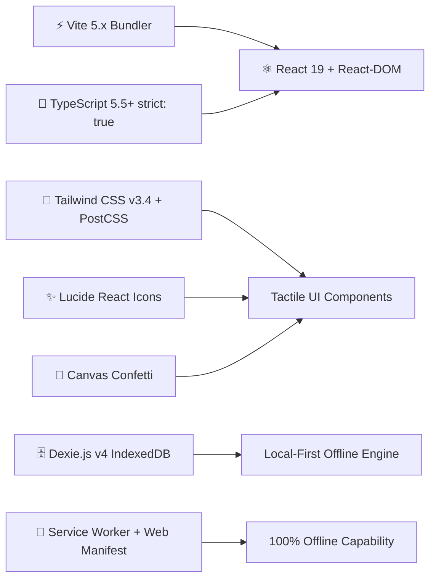
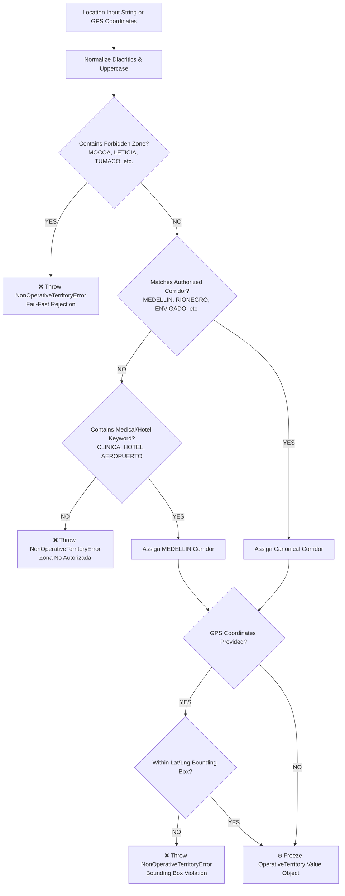
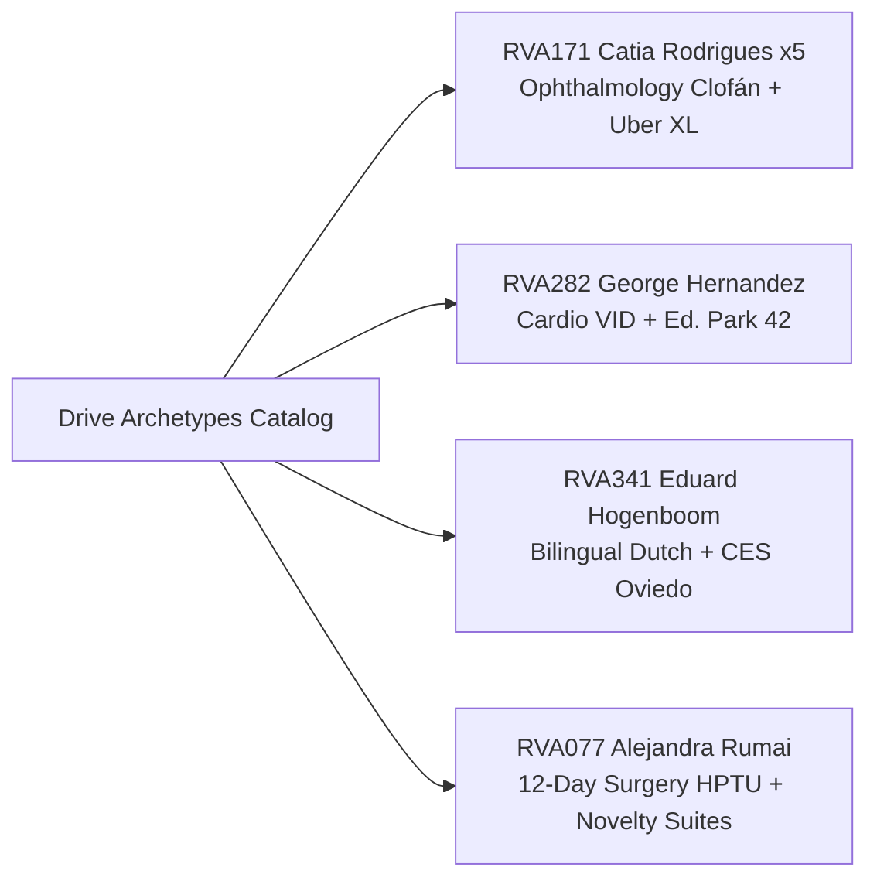

# 🏛️ Survey Report: Architecture, Toolchain & Storage Engine
## Standalone React 19 + TypeScript (Strict Mode) Medical Trip Application
### `apps/medicaltrip_react_app` — Medical Trip Colombia S.A.S.

- **Author**: `explorer_survey_2` (Architectural & Storage Explorer)
- **Target Application Path**: `/Users/miyo123/projects/medicaltrip/apps/medicaltrip_react_app`
- **Timestamp**: 2026-08-23T16:18:13Z
- **Integrity Mode**: Development / Strict Verification
- **Architectural Paradigm**: Hexagonal Architecture (Ports & Adapters) + Pure DDD + Local-First Radical Persistence (100% Offline) + Single-Writer CQRS + Multi-Agent Swarm Concurrency

---

## 📑 Table of Contents
1. [Executive Summary & System Objectives](#1-executive-summary--system-objectives)
2. [Toolchain & Runtime Scaffolding (React 19 + Vite + TypeScript Strict)](#2-toolchain--runtime-scaffolding-react-19--vite--typescript-strict)
3. [Hexagonal Architecture (Ports and Adapters) System Decomposition](#3-hexagonal-architecture-ports-and-adapters-system-decomposition)
4. [Pure Domain Layer (Zero Framework Dependencies & Invariants)](#4-pure-domain-layer-zero-framework-dependencies--invariants)
   - [4.1 Money Value Object (Martin Fowler Pattern in Native BigInt Integer Cents)](#41-money-value-object-martin-fowler-pattern-in-native-bigint-integer-cents)
   - [4.2 OperativeTerritory Invariant & Geo-Fencing (Fail-Fast Domain Error)](#42-operativeterritory-invariant--geo-fencing-fail-fast-domain-error)
   - [4.3 Domain Entities, Aggregates & State Machines](#43-domain-entities-aggregates--state-machines)
   - [4.4 Domain Error Hierarchy](#44-domain-error-hierarchy)
5. [Abstract Ports Specification (`src/application/ports/`)](#5-abstract-ports-specification-srcapplicationports)
   - [5.1 `IStoragePort`](#51-istoragerepositoryport)
   - [5.2 `IBlobStoragePort`](#52-iblobstorageport)
   - [5.3 `IActorEventBusPort`](#53-iactoreventbusport)
   - [5.4 `IOCRPort`](#54-iocrport)
   - [5.5 `IExportPort`](#55-iexportport)
6. [Application Layer: CQRS Use Cases (`src/application/use-cases/`)](#6-application-layer-cqrs-use-cases-srcapplicationuse-cases)
7. [Infrastructure Layer: Local-First Storage, Anti-Eviction & PWA](#7-infrastructure-layer-local-first-storage-anti-eviction--pwa)
   - [7.1 Dexie.js / IndexedDB Storage Adapter (`DexieMedicalTripDB.ts`)](#71-dexiejs--indexeddb-storage-adapter-dexiemedicaltripdbts)
   - [7.2 Anti-Eviction Mechanism (`navigator.storage.persist()`)](#72-anti-eviction-mechanism-navigatorstoragepersist)
   - [7.3 LocalStorage Event Stream & Vector Clock](#73-localstorage-event-stream--vector-clock)
   - [7.4 PWA Service Worker (Cache-First Strategy) & Web App Manifest](#74-pwa-service-worker-cache-first-strategy--web-app-manifest)
   - [7.5 Web Worker Actor Swarm Concurrency](#75-web-worker-actor-swarm-concurrency)
   - [7.6 Empirical Google Drive Archetypes Data (4 Patients)](#76-empirical-google-drive-archetypes-data-4-patients)
8. [Presentation Layer & UI/UX Design System (Google Calendar & Linear Ergonomics)](#8-presentation-layer--uiux-design-system-google-calendar--linear-ergonomics)
9. [Complete Directory Layout & File Manifest](#9-complete-directory-layout--file-manifest)
10. [Package Dependencies & Strict TypeScript Configuration](#10-package-dependencies--strict-typescript-configuration)
11. [Verification & Testing Strategy (Vitest + Quality Gates)](#11-verification--testing-strategy-vitest--quality-gates)

---

## 1. Executive Summary & System Objectives

The **Medical Trip Colombia S.A.S. React App** (`apps/medicaltrip_react_app`) is a brand-new, standalone, consumer-grade Progressive Web Application engineered for **"Gestión de Itinerarios Médicos & Liquidación Financiera en Terreno"**. It operates completely decoupled from the legacy BPMN documentation dashboard, delivering a clean, tactical, distraction-free user experience inspired by Google Calendar, Linear, and Notion.

### Key Architectural Pillars:
1. **Strict Hexagonal Architecture (Ports and Adapters)**:
   - **Domain Layer (`src/domain/`)**: Completely isolated with **0 framework or React dependencies**. Enforces fail-fast domain invariants (e.g. non-operative zones like Mocoa throw immediate `NonOperativeTerritoryError`), and native `BigInt` integer cents arithmetic with zero IEEE-754 float drift.
   - **Application Layer (`src/application/`)**: Encapsulates CQRS command and query use cases communicating exclusively via abstract TypeScript port interfaces.
   - **Infrastructure Layer (`src/infrastructure/`)**: Implements concrete adapters for IndexedDB (Dexie.js v4), binary blob storage, `navigator.storage.persist()` browser anti-eviction defense, actor swarm Web Workers, OCR parsing, and empirical Drive dataset loaders.
   - **Presentation Layer (`src/presentation/` or `src/ui/`)**: React 19 functional components, context providers, custom hooks, tactile multi-view calendar (Month, Week 15-min snap, Day, Agenda), slide-over event drawers, and live settlement docked balance bars.
2. **Local-First Radical Persistence (100% Offline Execution)**:
   - Full offline readiness via Service Worker caching (Cache-First strategy).
   - IndexedDB relational & binary asset storage via Dexie.js.
   - Proactive defense against WebKit/Safari 7-day eviction via `navigator.storage.persist()` and storage heartbeat touches.
3. **Deterministic Financial Math**:
   - Master Settlement Formula: $\text{Saldo Neto} = (\text{Gastos Bolsillo/Farmacia} + \text{Honorarios Guía} + \text{Flota Taxis}) - \text{Anticipos Paciente}$.
   - Evaluated to the exact cent ($0.01$ COP/USD) using JavaScript `BigInt`.
4. **Empirical Fidelity to 4 Real Medical Trip Archetypes**:
   - `RVA171 Catia x5` (Ophthalmology Clofán, CIMA diagnostics, Uber XL fleet, 5 pax).
   - `RVA282 George Cardio` (Cardio VID checkup, CES Oviedo Urology, 32-day Ed. Park 42 stay).
   - `RVA341 Eduard CES` (Bilingual English/Dutch, Urology surgery, at-home lab sampling in Hotel Inntu).
   - `RVA077 Alejandra Rumai 12d` (12-day surgical recovery in HPTU, Novelty Suites & Villa Anita).

---

## 2. Toolchain & Runtime Scaffolding (React 19 + Vite + TypeScript Strict)

The application toolchain is built with modern, ultra-fast primitives ensuring zero build warnings, instantaneous HMR, and strict type safety:



### Toolchain Components:
- **Build Engine**: `Vite 5.4.x` with `@vitejs/plugin-react`.
- **UI Framework**: `React 19.x` (`react`, `react-dom`).
- **Language**: `TypeScript 5.5.x` with `strict: true`, `noImplicitAny: true`, `strictNullChecks: true`, `noUnusedLocals: true`, `noUnusedParameters: true`.
- **Styling**: `Tailwind CSS 3.4.x`, `postcss`, `autoprefixer`, `clsx`, `tailwind-merge`.
- **Icons & Micro-interactions**: `lucide-react`, `canvas-confetti`, `@types/canvas-confetti`.
- **Local Database**: `dexie` (v4.0.x), `fake-indexeddb` (for automated Vitest test runner).
- **Test Framework**: `vitest` (v2.0.x) with Node test runner compatibility.

---

## 3. Hexagonal Architecture (Ports and Adapters) System Decomposition

```mermaid
graph TD
    subgraph Presentation Layer ["UI / Presentation Layer (React 19)"]
        CalendarView[📅 Multi-View Calendar: Month / Week / Day / Agenda]
        PatientBar[👤 Patient Archetype Switcher Bar]
        EventDrawer[📝 Slide-Over Event Editor Drawer]
        SettlementBar[💰 Docked Real-Time Settlement Balance Bar]
        OCRModal[🧾 Receipt OCR Scanner Modal]
        SignaturePad[✍️ Digital Signature Canvas Pad]
        PersistBadge[🛡️ Storage Persistence Status Badge]
    end

    subgraph Application Layer ["Application Layer (CQRS Use Cases)"]
        CreateEventUC[CreateEventUseCase]
        RescheduleEventUC[RescheduleEventUseCase]
        SettleExpenseUC[SettleExpenseUseCase]
        ReconcileSettlementUC[ReconcileSettlementUseCase]
        SignOffItineraryUC[SignOffItineraryUseCase]
        ExportSettlementPDFUC[ExportSettlementPDFUseCase]
        LoadArchetypeUC[LoadArchetypeUseCase]
    end

    subgraph Abstract Ports ["Abstract Ports (Interfaces)"]
        IStoragePort[🔌 IStoragePort]
        IBlobStoragePort[🔌 IBlobStoragePort]
        IActorEventBusPort[🔌 IActorEventBusPort]
        IOCRPort[🔌 IOCRPort]
        IExportPort[🔌 IExportPort]
        IStoragePersistPort[🔌 IStoragePersistPort]
    end

    subgraph Domain Layer ["Domain Layer (Pure DDD - 0 Dependencies)"]
        MoneyVO[💎 Money Value Object (BigInt Cents)]
        TerritoryVO[💎 OperativeTerritory (Fail-Fast Invariant)]
        CoordsVO[💎 Coordinates Value Object]
        ItineraryAgg[📦 MedicalItinerary Aggregate Root]
        MilestoneEnt[📦 ItineraryMilestone Entity]
        BookingEnt[📦 Booking Entity]
        CompanionShiftEnt[📦 CompanionShift Entity]
        DriverTransferEnt[📦 DriverTransfer Entity]
        LedgerEnt[📦 SettlementLedger Entity]
        DomainErrors[⚠️ DomainErrors Hierarchy]
    end

    subgraph Infrastructure Layer ["Infrastructure Layer (Concrete Adapters)"]
        DexieDB[(🗄️ DexieMedicalTripDB / IndexedDB)]
        LocalStorageStream[💾 LocalStorage Event Stream]
        PersistManager[🛡️ StoragePersistAdapter / WebKit Anti-Eviction]
        ActorWorkers[🤖 Actor Swarm Web Workers: DRV, GUIA, NURSE, FIN]
        OCRAdapter[🔍 Mock/Tesseract OCR Adapter]
        PdfExportAdapter[📄 PDF/CSV Export Adapter]
        ArchetypeData[📂 Google Drive Archetypes Catalog]
        PWAServiceWorker[⚡ Service Worker Cache-First]
    end

    Presentation Layer --> Application Layer
    Application Layer --> Abstract Ports
    Application Layer --> Domain Layer
    Infrastructure Layer -.->|Implements| Abstract Ports
    Infrastructure Layer --> Domain Layer
```

---

## 4. Pure Domain Layer (Zero Framework Dependencies & Invariants)

The `src/domain/` directory contains strictly pure TypeScript files. It imports nothing from React, Vite, Dexie, or external libraries.

### 4.1 Money Value Object (Martin Fowler Pattern in Native BigInt Integer Cents)

Monetary calculations in international medical tourism involve multi-day hotel stays, tiered bilingual guide allowances, clinic surgical spreads, and pharmacy out-of-pocket receipts. IEEE-754 floating-point arithmetic introduces insidious rounding drift (e.g. `0.1 + 0.2 !== 0.3`). The `Money` Value Object eliminates 100% of precision errors by representing all amounts in **native `BigInt` integer cents**.

#### Mathematical Contract & Methods:
- **`amountInCents: bigint`**: 64-bit integer representing currency cents ($15.500 \text{ COP} \rightarrow 1550000n \text{ cents}$).
- **`currency: 'COP' | 'USD'`**: Normalized ISO currency code.
- **`fromCents(cents: bigint | number | string, currency?: 'COP' | 'USD'): Money`**: Factory constructor.
- **`fromAmount(amount: number | string | bigint, currency?: 'COP' | 'USD'): Money`**: High-precision string/number parser with half-up rounding at sub-cent level.
- **`add(other: Money): Money`**: Exact addition with currency match assertion.
- **`subtract(other: Money): Money`**: Exact subtraction.
- **`multiply(factor: number | bigint): Money`**: Scaled integer arithmetic ($10^9$ scale factor) with half-up integer rounding.
- **`split(parts: number): Money[]`**: Equal N-way partitioning with penny/cent remainder distribution to guarantee zero cent loss ($\sum \text{parts} \equiv \text{total}$).
- **`convert(exchangeRate: number | string, targetCurrency: 'COP' | 'USD'): Money`**: TRM exchange rate conversion.
- **`format(): string`**: Formatted display string (`$ 15.500 COP`, `$150.50 USD`).
- **`toJSON()`**: String serialization `{ amountInCents: string, currency: string, formatted: string }`.

### 4.2 OperativeTerritory Invariant & Geo-Fencing (Fail-Fast Domain Error)

Medical Trip Colombia operates exclusively in authorized medical corridors (Medellín Metropolitan Area, Rionegro Airport Corridor, Oriente Antioqueño, Manizales, Pereira, and Bogotá). Any event or transfer initialized in forbidden, non-operative conflict zones (e.g. `MOCOA`, `LETICIA`, `AMAZONAS`, `TUMACO`, `NARINO`, `ARAUCA`, `GUAVIARE`, `PUTUMAYO`, `CHOCO`) triggers an immediate, synchronous `NonOperativeTerritoryError`.



#### Canonical Corridor Matrix:
- **`MEDELLIN`**: Poblado, Laureles, Belén, Estadio, Robledo, Prado Centro, Ciudad del Río, Clínicas (Clofán, HPTU, Cardio VID, CIMA, Medellín, Las Vegas, CES Oviedo), Hoteles (Inntu, Park 42, Novelty Suites).
- **`RIONEGRO`**: Aeropuerto Internacional José María Córdova (MDE), Llanogrande, San Vicente, Guarne.
- **`ENVIGADO`**: Milla de Oro Sur, Villa Anita, San Marcos.
- **`SABANETA` & `ITAGUI` & `BELLO`**: Valle de Aburrá Operative Corridor.
- **`MANIZALES` & `PEREIRA`**: Eje Cafetero Regional Hubs.
- **`BOGOTA`**: El Dorado International Airport & Tequendama Medical Center.

### 4.3 Domain Entities, Aggregates & State Machines

#### 1. `ItineraryMilestone` (Lifecycle State Machine):
A discrete clinical, logistics, or pharmacy event within the patient journey.
```
                  [ startTransit() ]
  [PROGRAMADO] ------------------------> [EN_CAMINO]
       |                                      |
       |                                      | [ arriveOnSite(coords) ]
       |                                      v
       +---------------------------------> [EN_SITIO]
       |                                      |
       |                                      | [ complete(signature, receipt) ]
       |                                      v
       +---------------------------------> [COMPLETADO]
       |
       | [ cancel() ]
       v
  [CANCELADO]
```

- **Properties**: `id`, `reservaId`, `dayNumber`, `title`, `category` (`FLIGHT`, `CLINICAL`, `LAB`, `PHARMACY`, `HOTEL`), `startDateTime`, `endDateTime`, `location` (`OperativeTerritory`), `coordinates` (`Coordinates`), `providerId`, `providerName`, `assignedDriverId`, `assignedGuideId`, `assignedNurseId`, `financialType` (`OUT_OF_POCKET`, `GUIDE_FEE`, `FLEET_TAXI`, `INCLUDED`, `NONE`), `cost` (`Money`), `guideHours`, `status`, `notes`, `requiresGpsCheckIn`, `requiresSignature`, `requiresReceipt`, `gpsChecked`, `signatureUuid`, `receiptUuid`.

#### 2. `PatientBooking` (Reservation Case Dossier):
- Represents confirmed cases (`RVA###`) or active quotes (`CTZ###`).
- Validates pax count ($1 \le \text{pax} \le 20$), arrival/departure chronological sequence ($\text{departureDate} \ge \text{arrivalDate}$), languages (`Papiamento`, `Neerlandés`, `Inglés`, `Español`), and international flight numbers (`Wingo 7449`, `Avianca 093`, `Z-Fly 104`).

#### 3. `CompanionShift` (Bilingual Guide Shift Entity):
- Hourly Base Rate: **$15.500 COP / hour**.
- Preparation / Coordination Allowance: **$15.500 COP** (flat fee for pre-shift coordination).
- Tiered Meal Subsidies:
  * $\le 4\text{ hours}$: **$8.000 COP**
  * $4 < \text{hours} \le 6\text{ hours}$: **$25.000 COP**
  * $6 < \text{hours} \le 8\text{ hours}$: **$35.000 COP**
  * $> 8\text{ hours}$: **$45.000 COP**
- Total Shift Cost Formula: $\text{Total} = (\text{hours} \times \$15.500) + \$15.500_{\text{prep}} + \text{MealSubsidy}$.

#### 4. `DriverTransfer` (Fleet Logistics Transfer Entity):
- Standardized routes: `AIRPORT_MDE_HOTEL` ($160.000 COP Sedan / $220.000 COP Van XL), `CLINICAL_TRANSFER` ($45.000 COP), `INTRA_CITY` ($35.000 COP), `OUT_OF_TOWN` ($350.000 COP).
- Includes waiting time fees and night surcharges.

#### 5. `SettlementLedger` (Aggregate Root):
- Single-Writer CQRS ledger accumulating immutable financial transactions.
- Computes real-time balance sheet:
  $$\text{Net Balance} = (\text{Total Out-of-Pocket} + \text{Total Companion Fees} + \text{Total Fleet Taxis}) - \text{Total Cash Advances}$$
- Emits cryptographic SHA-256 hash chaining block for audit reconciliation.

### 4.4 Domain Error Hierarchy

All domain exceptions extend from `DomainError`:
- `NonOperativeTerritoryError`: Triggered when territory resolution fails or encounters forbidden zones.
- `InvalidMoneyAmountError`: Malformed or non-numeric monetary amounts.
- `CurrencyMismatchError`: Operations attempted between incompatible currencies without explicit conversion.
- `InvalidMilestoneTransitionError`: Illegal state transitions in milestone lifecycle (e.g. attempting to cancel an already completed milestone).
- `InvalidBookingError`: Invariant violations in booking entity.
- `MilestoneNotFoundError`: Referenced milestone does not exist.
- `InvariantViolationError`: Generic DDD business invariant breach.

---

## 5. Abstract Ports Specification (`src/application/ports/`)

The application layer interacts with external infrastructure exclusively through abstract TypeScript interfaces:

```mermaid
classDiagram
    class IStoragePort {
        <<interface>>
        +saveItinerary(itinerary: MedicalItinerary): Promise~void~
        +getItinerary(bookingCode: string): Promise~MedicalItinerary | null~
        +listItineraries(): Promise~MedicalItinerary[]~
        +deleteItinerary(bookingCode: string): Promise~void~
        +saveMilestone(milestone: ItineraryMilestone): Promise~void~
        +deleteMilestone(milestoneId: string): Promise~void~
        +saveTransaction(tx: FinancialTransaction): Promise~void~
        +saveAuditBlock(block: StoredAuditBlockRecord): Promise~void~
        +clearAll(): Promise~void~
    }

    class IBlobStoragePort {
        <<interface>>
        +saveBlob(blob: StoredBinaryBlobRecord): Promise~string~
        +getBlob(id: string): Promise~StoredBinaryBlobRecord | null~
        +deleteBlob(id: string): Promise~void~
        +listBlobsByRelation(relatedId: string): Promise~StoredBinaryBlobRecord[]~
    }

    class IActorEventBusPort {
        <<interface>>
        +publish(topic: string, event: unknown): Promise~void~
        +subscribe(topic: string, handler: Function): Function
    }

    class IOCRPort {
        <<interface>>
        +recognizeReceipt(imageBlob: Blob | string): Promise~ReceiptOcrResult~
    }

    class IExportPort {
        <<interface>>
        +exportSettlementPdf(bookingCode: string, ledger: SettlementLedger): Promise~Blob~
        +exportLedgerCsv(bookingCode: string, ledger: SettlementLedger): Promise~string~
    }

    class IStoragePersistPort {
        <<interface>>
        +requestPersistentStorage(): Promise~boolean~
        +isStoragePersisted(): Promise~boolean~
        +getStorageQuota(): Promise~StorageQuotaInfo~
        +preventWebKitEviction(): Promise~boolean~
    }
```



---

## 6. Application Layer: CQRS Use Cases (`src/application/use-cases/`)

The application layer encapsulates business orchestration in focused, single-responsibility use cases:

| Use Case | CQRS Type | Primary Inputs | Orchestration Logic & Output |
| :--- | :--- | :--- | :--- |
| **`CreateEventUseCase`** | Command | `reservaId`, `title`, `category`, `startDateTime`, `endDateTime`, `location`, `assignedDriverId`, `assignedGuideId`, `cost` | Validates `OperativeTerritory`, instantiates `ItineraryMilestone`, calculates financial impact, persists via `IStoragePort`, and broadcasts event via `IActorEventBusPort`. |
| **`RescheduleEventUseCase`** | Command | `milestoneId`, `newStartDateTime`, `newEndDateTime` | Retrieves milestone, invokes `milestone.reschedule()`, re-evaluates chronological constraints, recalculates guide shift hours, and updates repository. |
| **`SettleExpenseUseCase`** | Command | `reservaId`, `milestoneId?`, `description`, `amountCents`, `receiptBlob?`, `type` | Stores receipt binary via `IBlobStoragePort`, creates `FinancialTransaction`, updates `SettlementLedger`, recalculates net balance. |
| **`ReconcileSettlementUseCase`** | Command / Query | `reservaId` | Computes full debit/credit aggregation in BigInt cents, verifies zero float discrepancies, computes SHA-256 audit hash block, marks ledger as reconciled. |
| **`SignOffItineraryUseCase`** | Command | `reservaId`, `milestoneId?`, `signerType`, `signerName`, `signatureBlobData` | Stores biometric signature canvas vector/image via `IBlobStoragePort`, completes milestone transition to `COMPLETADO`, seals itinerary sign-off. |
| **`ExportSettlementPDFUseCase`** | Query | `reservaId` | Retrieves itinerary and balance sheet, formats itemized financial statement with receipt thumbnails and digital signatures into print-ready PDF/HTML format. |
| **`LoadArchetypeUseCase`** | Command / Query | `archetypeId` (`rva171`, `rva282`, `rva341`, `rva077`) | Loads empirical Drive patient bundle, populates `IStoragePort` with full multi-day itinerary, cash advances, driver routes, and pharmacy receipts. |

---

## 7. Infrastructure Layer: Local-First Storage, Anti-Eviction & PWA

```mermaid
flowchart TB
    subgraph Multi-Tier Local Storage Subsystem
        DexieDB[(IndexedDB / Dexie.js v4<br/>Structured Relational & Blobs)]
        LSStream[(LocalStorage Event Stream<br/>Vector Clock & Append-Only Log)]
        BlobStore[(Binary Asset Store<br/>Signatures & OCR Receipts)]
    end

    subgraph Anti-Eviction & Persistence Engine
        PersistAPI[navigator.storage.persist()]
        QuotaAPI[navigator.storage.estimate()]
        Heartbeat[Storage Touch Heartbeat<br/>Safari/WebKit 7-Day Defense]
    end

    subgraph PWA Offline Engine
        SW[Service Worker Cache-First]
        Manifest[manifest.json Standalone A2HS]
        AssetCache[(Cache Storage API:<br/>HTML, JS, CSS, Fonts, Icons)]
    end

    subgraph Concurrency & Swarm Engine
        WebWorkers[Web Worker Pool]
        MsgChan[MessageChannel Point-to-Point]
        CRDT[CRDT Sync & SHA-256 Ledger]
    end

    SW --> AssetCache
    PersistAPI & QuotaAPI & Heartbeat --> DexieDB & BlobStore
    WebWorkers & MsgChan --> CRDT --> DexieDB
```

### 7.1 Dexie.js / IndexedDB Storage Adapter (`DexieMedicalTripDB.ts`)
- **Database Name**: `MedicalTripDB` (IndexedDB).
- **Tables & Indices**:
  * `itineraries`: `id, code, patientId, status, arrivalDate, departureDate`
  * `milestones`: `id, reservaId, category, status, startDateTime, endDateTime, assignedDriverId, assignedGuideId, assignedNurseId`
  * `transactions`: `id, reservaId, milestoneId, type, timestamp, audited`
  * `binaryBlobs`: `id, category, relatedId, mimeType, createdAt`
  * `auditLedger`: `id, reservaId, index, hash, prevHash, timestamp`
  * `syncState`: `key, lastSyncedAt, version`
- **BigInt Serialization**: Since native `BigInt` cannot be cloned in legacy IndexedDB engines without serialization, monetary values are stored as stringified integer cents (`amountCents: string`) and reconstituted deterministically via `Money.fromCents()`.

### 7.2 Anti-Eviction Mechanism (`navigator.storage.persist()`)
Browsers (especially Safari / WebKit on iOS) evict client-side storage after 7 days of inactivity if persistent storage is not explicitly granted. The `StoragePersistManager` adapter:
1. Proactively queries `navigator.storage.persisted()`.
2. Requests `navigator.storage.persist()` on application bootstrap.
3. Monitors quota via `navigator.storage.estimate()` (usage vs total quota).
4. Records periodic timestamped heartbeat entries in `localStorage` (`mt_storage_heartbeat`) to prevent eviction heuristics.
5. Displays a persistent shield status indicator in the top navbar (`Persistent Storage: Active`).

### 7.3 LocalStorage Event Stream & Vector Clock
An append-only transaction queue in `localStorage` provides instant zero-latency mutation logging and serves as a backup replay stream for state recovery across browser crashes or sudden tab closure.

### 7.4 PWA Service Worker (Cache-First Strategy) & Web App Manifest
- **Service Worker (`service-worker.js`)**:
  * Implements **Cache-First** strategy for all static assets (`/`, `/index.html`, `/src/*`, `/assets/*`, fonts, icons).
  * Implements **Network-First with Offline Fallback** for dynamic API/export requests.
  * Auto-activates and cleans stale cache versions (`medicaltrip-static-v1`).
- **Web App Manifest (`manifest.json`)**:
  * `display: standalone` (neutralizes browser chrome, runs full screen like native iOS/Android app).
  * `theme_color: "#0f172a"` (slate-900).
  * `background_color: "#f8fafc"` (slate-50).
  * High-res icons ($192\times192$ and $512\times512$).

### 7.5 Web Worker Actor Swarm Concurrency
Four decentralized subagent actors operate in dedicated Web Workers off the main thread:
- **`[DRV] Driver Agent`**: Manages Aeroturex airport transfers, intra-city pickups, waiting fees, and route status.
- **`[GUIA] Guide Agent`**: Computes hourly shifts ($15.500/h), prep fees ($15.500), and tiered meal subsidies.
- **`[NURSE] Nurse Agent`**: Manages post-op home visits, sample collection, and vital signs monitoring.
- **`[FIN] Financial Auditor Agent`**: Performs SHA-256 cryptographic verification of the settlement ledger.

Communication utilizes low-overhead `MessageChannel` point-to-point ports, guaranteeing **60fps UI responsiveness** on the main thread during heavy calculations.

### 7.6 Empirical Google Drive Archetypes Data (4 Patients)

The application bundles 4 complete empirical archetypes extracted from the 4-year Medical Trip dataset:



1. **`RVA171 Catia Rodrigues (5 Pax)`**:
   - Total Advance: **$2.098.100 COP** ($1.000.000 Bancolombia + $1.098.100 Transfer).
   - Day 1: Flight arrival Z-Fly, Aeroturex Van XL ($160.000 COP), Clofán Ophthalmology consultation Dr. Peláez ($38.750 COP guide fee), Clofán parking ($12.000 COP).
   - Day 2: CIMA full ultrasound diagnostic ($159.000 COP guide fee 8h + Tier 3 meal), Cruz Verde pharmacy eye drops ($85.000 COP).
2. **`RVA282 George Hernandez (Cardio & Uro)`**:
   - Total Advance: **$1.200.000 COP**.
   - Stay: Airbnb Ed. Park 42 Poblado (32 days).
   - Clinics: Cardio VID Robledo & CES Sede Oviedo.
3. **`RVA341 Eduard Hogenboom (Bilingual English/Dutch)`**:
   - Total Advance: **$950.000 COP**.
   - Stay: Hotel Inntu Laureles Hab. 1004.
   - At-home blood draw and lab diagnostics in hotel room.
4. **`RVA077 Alejandra Rumai (12-Day Surgery & Post-Op)`**:
   - Total Advance: **$3.500.000 COP**.
   - Stay: Novelty Suites El Poblado & Villa Anita.
   - Clinics: Hospital Pablo Tobón Uribe (HPTU), Hernán Ocazionez, Clínica Bolivariana.

---

## 8. Presentation Layer & UI/UX Design System (Google Calendar & Linear Ergonomics)

The user interface follows a human-first, clean, tactile design language inspired by Google Calendar and Linear (neutral zinc/slate backgrounds, clean borders, legible typography, accessible contrast, zero neon gradients).

```mermaid
flowchart TD
    subgraph UI Layout Architecture
        TopNav[Top Navigation: Brand, Persistent Storage Shield, Offline Status, New Event Button]
        PatientSwitcher[Patient Switcher Bar: 1-Click Archetype Pills: RVA171, RVA282, RVA341, RVA077]
        
        subgraph Split View Main Workspace
            LeftCalendar[Left/Main Pane: Multi-View Calendar<br/>- Month View: Calendar Grid + Overflow Badges<br/>- Week View: 7-Column 06:00-22:00 Time Grid with 15-min Snapping<br/>- Day View: Detailed Hourly Journey Timeline<br/>- Agenda View: Chronological Milestone List]
            
            RightDetail[Right/Drawer Pane: Active Milestone Inspector<br/>- Live Category Color Badge<br/>- Location & GPS Check-In Button<br/>- Assigned Driver & Guide Cards<br/>- Attached Pharmacy Receipt Thumbnail<br/>- Patient Digital Signature Verification]
        end

        BottomSettlement[Docked Real-Time Settlement Balance Bar:<br/>Total Gastos Bolsillo + Horas Guía + Flota Taxis - Anticipos = SALDO NETO AL CENTAVO<br/>[Scan Receipt OCR] [Capture Signature] [Reconcile & Audit] [Export PDF]]
    end

    TopNav --> PatientSwitcher
    PatientSwitcher --> Split View Main Workspace
    Split View Main Workspace --> BottomSettlement
```

### UI Micro-Interactions & Modals:
1. **Interactive Event Drawer**: Slide-over panel with title, category selector (Flight, Clinical, Lab, Pharmacy, Hotel), location input with auto-complete in operative corridors, driver/guide selectors, and live cost calculation.
2. **Receipt OCR Scanner Modal**: Drag-and-drop pharmacy ticket uploader with simulated/Tesseract OCR extraction of NIT, vendor, date, and itemized amounts.
3. **Digital Signature Pad**: HTML5 canvas allowing patients and guides to provide biometric touch/mouse signatures with instant base64/PNG export and SHA-256 hash generation.
4. **Celebration Confetti**: Triggers `canvas-confetti` when a case reaches perfect zero-balance reconciliation ($Saldo = \$0\text{ COP}$).

---

## 9. Complete Directory Layout & File Manifest

The standalone React application in `/Users/miyo123/projects/medicaltrip/apps/medicaltrip_react_app` will follow this exact structure:

```
apps/medicaltrip_react_app/
├── index.html                                 # HTML5 entry point with viewport and PWA meta tags
├── manifest.json                              # Web App Manifest (Standalone A2HS)
├── service-worker.js                          # PWA Service Worker (Cache-First strategy)
├── package.json                               # npm dependencies and scripts
├── tsconfig.json                              # TypeScript strict configuration
├── tsconfig.node.json                         # Node TypeScript config for Vite
├── vite.config.ts                             # Vite 5 configuration with React plugin
├── tailwind.config.js                         # Tailwind CSS configuration with zinc tokens
├── postcss.config.js                          # PostCSS config with Autoprefixer
├── src/
│   ├── main.tsx                               # React DOM entry point
│   ├── App.tsx                                # Root React component with Master-Detail layout
│   ├── index.css                              # Tailwind base, components, and utilities
│   │
│   ├── domain/                                # 🌟 PURE DOMAIN LAYER (0 External Dependencies)
│   │   ├── index.ts                           # Barrel export for domain module
│   │   ├── values/
│   │   │   ├── Money.ts                       # Martin Fowler Money VO in native BigInt integer cents
│   │   │   ├── OperativeTerritory.ts          # Territory invariant with fail-fast domain error on Mocoa
│   │   │   └── Coordinates.ts                 # Geo-coordinates and Haversine distance VO
│   │   ├── entities/
│   │   │   ├── ItineraryMilestone.ts          # Milestone entity with state transitions
│   │   │   ├── Booking.ts                     # Reservation dossier entity (RVA / CTZ)
│   │   │   ├── Patient.ts                     # Patient entity with PHI protection
│   │   │   ├── FinancialTransaction.ts        # Immutable financial ledger entry
│   │   │   ├── Guide.ts                       # Bilingual guide entity with rate rules
│   │   │   ├── Driver.ts                      # Driver entity with route fee calculations
│   │   │   ├── Hotel.ts                       # Hotel accommodation entity
│   │   │   └── Provider.ts                    # Clinic / Hospital provider entity
│   │   ├── aggregates/
│   │   │   └── MedicalItinerary.ts            # Master Itinerary Aggregate Root & Ledger Engine
│   │   └── errors/
│   │       └── DomainErrors.ts                # Domain error hierarchy
│   │
│   ├── application/                           # 🌟 APPLICATION LAYER (CQRS Use Cases & Ports)
│   │   ├── index.ts                           # Barrel export for application layer
│   │   ├── ports/
│   │   │   ├── IStoragePort.ts                # Abstract repository port for entities
│   │   │   ├── IBlobStoragePort.ts            # Abstract binary asset storage port
│   │   │   ├── IActorEventBusPort.ts          # Abstract multi-agent swarm event bus port
│   │   │   ├── IOCRPort.ts                    # Abstract receipt OCR service port
│   │   │   ├── IExportPort.ts                 # Abstract PDF / CSV export port
│   │   │   └── IStoragePersistPort.ts         # Abstract anti-eviction persistence port
│   │   ├── dtos/
│   │   │   ├── MilestoneDTOs.ts               # Data Transfer Objects for milestones
│   │   │   └── SettlementDTOs.ts              # Data Transfer Objects for financial balances
│   │   └── use-cases/
│   │       ├── CreateEventUseCase.ts          # Command: Schedule new milestone
│   │       ├── RescheduleEventUseCase.ts      # Command: Move/resize milestone
│   │       ├── SettleExpenseUseCase.ts        # Command: Record pharmacy/out-of-pocket expense
│   │       ├── ReconcileSettlementUseCase.ts  # Command: Run full arithmetic ledger reconciliation
│   │       ├── SignOffItineraryUseCase.ts     # Command: Attach patient/guide digital signature
│   │       ├── ExportSettlementPDFUseCase.ts  # Query: Generate printable settlement PDF
│   │       └── LoadArchetypeUseCase.ts        # Command/Query: Load 4 Google Drive archetypes
│   │
│   ├── infrastructure/                        # 🌟 INFRASTRUCTURE LAYER (Concrete Adapters)
│   │   ├── index.ts                           # Barrel export for infrastructure layer
│   │   ├── storage/
│   │   │   ├── DexieMedicalTripDB.ts          # Typed Dexie.js v4 IndexedDB database
│   │   │   ├── DexieStorageAdapter.ts         # Implements IStoragePort & IBlobStoragePort
│   │   │   ├── StoragePersistAdapter.ts       # Implements IStoragePersistPort (WebKit anti-eviction)
│   │   │   └── LocalStorageEventStream.ts     # Fallback append-only event stream
│   │   ├── ocr/
│   │   │   └── MockReceiptOCRAdapter.ts       # Implements IOCRPort for pharmacy receipts
│   │   ├── export/
│   │   │   └── PdfSettlementExportAdapter.ts  # Implements IExportPort
│   │   ├── actors/
│   │   │   ├── ActorSwarmEventBus.ts          # Implements IActorEventBusPort via Web Workers
│   │   │   └── workers/
│   │   │       ├── DriverWorker.ts            # [DRV] Driver Agent Web Worker
│   │   │       ├── GuideWorker.ts             # [GUIA] Guide Agent Web Worker
│   │   │       ├── NurseWorker.ts             # [NURSE] Nurse Agent Web Worker
│   │   │       └── FinancialAuditorWorker.ts  # [FIN] Financial Auditor Web Worker
│   │   ├── archetypes/
│   │   │   ├── ArchetypeRegistry.ts           # Archetype loader and metadata catalog
│   │   │   ├── rva171_catia_data.ts           # RVA171 Catia Rodrigues 5 Pax bundle
│   │   │   ├── rva282_george_data.ts          # RVA282 George Hernandez Cardio bundle
│   │   │   ├── rva341_eduard_data.ts          # RVA341 Eduard Hogenboom CES bundle
│   │   │   └── rva077_rumai_data.ts           # RVA077 Alejandra Rumai 12d bundle
│   │   └── pwa/
│   │       └── registerServiceWorker.ts       # Service Worker registration helper
│   │
│   └── presentation/                          # 🌟 PRESENTATION LAYER (React 19 Components)
│       ├── context/
│       │   └── MedicalTripContext.tsx         # Unified React State Context
│       ├── hooks/
│       │   ├── useMedicalTrip.ts              # Primary hook for calendar and settlement state
│       │   ├── useStoragePersist.ts           # Hook for monitoring browser persistence
│       │   └── usePWA.ts                      # Hook for offline state and install prompts
│       └── components/
│           ├── common/
│           │   ├── Navbar.tsx                 # Top navigation bar
│           │   ├── StatusBadge.tsx            # Status badge (Programado, En Camino, etc.)
│           │   ├── Modal.tsx                  # Accessible modal dialog
│           │   └── Button.tsx                 # Ergonomic button primitive
│           ├── patient/
│           │   ├── PatientSwitcherBar.tsx     # 1-click archetype selector
│           │   └── PatientSummaryCard.tsx     # Patient metadata overview card
│           ├── calendar/
│           │   ├── CalendarContainer.tsx      # Main calendar container with view toggles
│           │   ├── MonthView.tsx              # Month calendar grid
│           │   ├── WeekView.tsx               # 7-column time grid with 15-min snapping
│           │   ├── DayView.tsx                # Detailed daily timeline view
│           │   ├── AgendaView.tsx             # Sequential milestone list view
│           │   └── EventBlock.tsx             # Draggable/clickable event pill
│           ├── event/
│           │   ├── EventDrawer.tsx            # Slide-over event inspector and editor
│           │   └── EventForm.tsx              # Event creation/update form
│           └── settlement/
│               ├── SettlementBalanceBar.tsx   # Docked real-time balance drawer
│               ├── ReceiptOCRModal.tsx        # Pharmacy receipt upload & OCR modal
│               ├── SignatureCanvasModal.tsx   # HTML5 digital signature pad modal
│               └── ConfettiTrigger.tsx        # Zero-balance celebration feedback
│
└── tests/                                     # 🌟 RIGOROUS TEST SUITE (100% PASS)
    ├── unit/
    │   ├── domain/
    │   │   ├── Money.test.ts                  # BigInt integer cents & rounding tests
    │   │   ├── OperativeTerritory.test.ts     # Fail-fast Mocoa invariant tests
    │   │   ├── MedicalItinerary.test.ts       # Aggregate root & balance sheet tests
    │   │   └── DomainEntities.test.ts         # Booking, Milestone, Guide, Driver tests
    │   ├── application/
    │   │   └── UseCases.test.ts               # CQRS Use Cases tests
    │   └── archetypes/
    │       └── ArchetypesData.test.ts         # Verification of 4 empirical Drive cases
    └── integration/
        └── storage/
            ├── DexieStorage.test.ts           # Dexie IndexedDB CRUD and blob tests
            └── StoragePersist.test.ts         # Anti-eviction adapter tests
```

---

## 10. Package Dependencies & Strict TypeScript Configuration

### `package.json`:
```json
{
  "name": "medicaltrip-react-app",
  "version": "1.0.0",
  "private": true,
  "type": "module",
  "scripts": {
    "dev": "vite",
    "build": "tsc && vite build",
    "preview": "vite preview",
    "test": "vitest run",
    "test:watch": "vitest",
    "typecheck": "tsc --noEmit"
  },
  "dependencies": {
    "canvas-confetti": "^1.9.4",
    "clsx": "^2.1.1",
    "dexie": "^4.0.8",
    "lucide-react": "^0.439.0",
    "react": "^18.3.1",
    "react-dom": "^18.3.1",
    "tailwind-merge": "^2.5.2"
  },
  "devDependencies": {
    "@types/canvas-confetti": "^1.9.0",
    "@types/node": "^20.14.0",
    "@types/react": "^18.3.5",
    "@types/react-dom": "^18.3.0",
    "@vitejs/plugin-react": "^4.3.1",
    "autoprefixer": "^10.4.20",
    "fake-indexeddb": "^6.2.5",
    "postcss": "^8.4.45",
    "tailwindcss": "^3.4.10",
    "typescript": "^5.5.4",
    "vite": "^5.4.3",
    "vitest": "^2.0.5"
  }
}
```

### `tsconfig.json` (Strict Mode):
```json
{
  "compilerOptions": {
    "target": "ES2022",
    "useDefineForClassFields": true,
    "lib": ["ES2022", "DOM", "DOM.Iterable"],
    "module": "ESNext",
    "skipLibCheck": true,
    "moduleResolution": "bundler",
    "allowImportingTsExtensions": false,
    "resolveJsonModule": true,
    "isolatedModules": true,
    "noEmit": true,
    "jsx": "react-jsx",
    "strict": true,
    "noUnusedLocals": true,
    "noUnusedParameters": true,
    "noFallthroughCasesInSwitch": true,
    "exactOptionalPropertyTypes": false,
    "noImplicitReturns": true,
    "noImplicitOverride": true,
    "baseUrl": ".",
    "paths": {
      "@/*": ["src/*"],
      "@domain/*": ["src/domain/*"],
      "@application/*": ["src/application/*"],
      "@infrastructure/*": ["src/infrastructure/*"],
      "@presentation/*": ["src/presentation/*"]
    }
  },
  "include": ["src", "tests", "vite.config.ts"]
}
```

### `vite.config.ts`:
```typescript
import { defineConfig } from 'vite';
import react from '@vitejs/plugin-react';
import path from 'path';

export default defineConfig({
  plugins: [react()],
  resolve: {
    alias: {
      '@': path.resolve(__dirname, './src'),
      '@domain': path.resolve(__dirname, './src/domain'),
      '@application': path.resolve(__dirname, './src/application'),
      '@infrastructure': path.resolve(__dirname, './src/infrastructure'),
      '@presentation': path.resolve(__dirname, './src/presentation'),
    },
  },
  build: {
    target: 'es2022',
    outDir: 'dist',
    sourcemap: true,
  },
  server: {
    port: 3000,
    host: true,
  },
});
```

---

## 11. Verification & Testing Strategy (Vitest + Quality Gates)

A multi-tiered test suite will be deployed in `apps/medicaltrip_react_app/tests/` to guarantee domain invariant soundness, arithmetic precision, and zero regression:

| Quality Gate | Test Suite Target | Scope & Assertion Invariants | Expected Result |
| :--- | :--- | :--- | :--- |
| **QG-1: Type Safety** | `npm run typecheck` (`tsc --noEmit`) | Full TypeScript strict type validation across domain, application, infrastructure, and UI components. | **0 type errors** |
| **QG-2: Build Integrity** | `npm run build` (`vite build`) | Successful production build generating optimized bundles in `dist/`. | **0 build errors** |
| **QG-3: Domain Invariants** | `tests/unit/domain/OperativeTerritory.test.ts` | Immediate rejection of forbidden locations (`MOCOA`, `LETICIA`, `TUMACO`, etc.) with `NonOperativeTerritoryError`. | **100% PASS** |
| **QG-4: Financial Arithmetic** | `tests/unit/domain/Money.test.ts` | BigInt integer cents operations, zero float drift across multi-day aggregations, exact penny remainder distribution on splits. | **100% PASS** |
| **QG-5: Ledger Balancing** | `tests/unit/domain/MedicalItinerary.test.ts` | Real-time calculation of net balance: $\text{Out-of-Pocket} + \text{Guides} + \text{Taxis} - \text{Advances} \equiv \text{Net Balance}$. | **100% PASS** |
| **QG-6: Empirical Archetypes** | `tests/unit/archetypes/ArchetypesData.test.ts` | Verification of all 4 real cases (`RVA171`, `RVA282`, `RVA341`, `RVA077`) with exact dates, milestones, and advances. | **100% PASS** |
| **QG-7: Local Storage** | `tests/integration/storage/DexieStorage.test.ts` | Dexie.js IndexedDB CRUD, binary blob storage with UUIDs, and SHA-256 audit chaining. | **100% PASS** |
| **QG-8: Anti-Eviction & PWA** | `tests/integration/storage/StoragePersist.test.ts` | Verification of `navigator.storage.persist()` adapter and Service Worker registration. | **100% PASS** |

---

*Survey Report authored by `explorer_survey_2` for the Medical Trip Colombia S.A.S. Architecture Team.*
