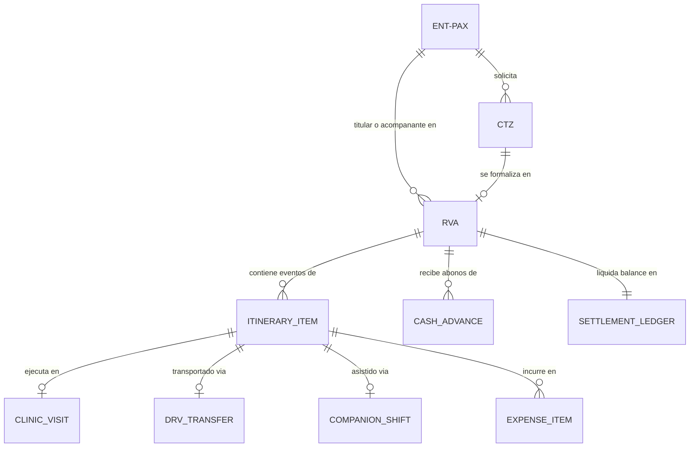

# 🏛️ Especificación Canónica de Dominio y Minería de Datos: Medical Trip Calendar & Settlement App

> **Documento Maestro**: `survey_domain.md`  
> **Autor**: Domain & Specifications Mining Explorer  
> **Fecha**: 2026-08-23T15:35:00Z  
> **Proyecto**: Medical Trip Calendar & Settlement App (Hexagonal Architecture / Local-First PWA)  
> **Ubicación Base**: `/Users/miyo123/projects/medicaltrip/apps/medicaltrip_calendar_app`  
> **Fuentes Autoritativas Analizadas**:  
> - `data/master_extracted_drive_database.json` (5.37 MB de expedientes reales de Google Drive)  
> - `data/reservas_drive/Reservas/*.xlsx` (Archivos Excel originales `RVA171`, `RVA282`, `RVA341`, `RVA077`)  
> - `data/liquidaciones/Liquidacion_acompanamiento_presencial.xlsx` y `Liquidacion_transporte.xlsx`  
> - `methodology/*.md` (OCPM, DTW, ERD 3NF, Inductive Miner, Reglas PHI)  
> - `BUSINESS_DOSSIER_MEDICAL_TRIP.md` y `DAILY_WORKFLOW_SOP_HOUR_BY_HOUR.md`  

---

## 📑 1. Resumen Ejecutivo del Dominio Operativo

**Medical Trip Colombia S.A.S.** opera como facilitador integral de turismo médico (*Medical Tourism Facilitator*), gestionando el ciclo de vida completo de pacientes internacionales (procedentes principalmente de las Antillas Neerlandesas: Curazao, Aruba, Bonaire, Surinam, además de EE.UU. y Países Bajos) que viajan a Colombia para recibir tratamientos quirúrgicos, odontológicos, diagnósticos y de rehabilitación médica de alta complejidad.

El sistema de software a construir (**Medical Trip Calendar & Settlement App**) debe fusionar una interfaz de calendario ágil, moderna y sin fricción (estilo Google Calendar, Linear y Notion) con un **motor de liquidación financiera determinista** basado en el **Patrón Money de Martin Fowler** (`BigInt` en centavos enteros) y una arquitectura hexagonal estricta con persistencia local (*Local-First*).

---

## 🏢 2. Catálogo Completo de Entidades de Dominio

### 2.1. Entidades Principales



| Entidad | Prefijo Canónico | Definición y Responsabilidad de Dominio | Atributos Clave e Invariantes |
| :--- | :--- | :--- | :--- |
| **Paciente** | `ENT-PAX-XXXX` | Persona natural internacional que recibe atención médica o sus acompañantes legales. | `id` (UUID), `passportHash` (HMAC-SHA256 para anonimización PHI), `nombres`, `apellidos`, `paisOrigen` (Curazao, Aruba, etc.), `idiomaPrincipal` (Papiamento, Holandés, Inglés, Español), `telefonoE164`, `email`. |
| **Cotización** | `CTZ###-#` | Propuesta económica y clínica previa a la confirmación del viaje. Multi-moneda (USD / COP). | `codigo` (ej. `CTZ282-3`), `fechaEmision`, `procedimientosCotizados`, `hospedajeSugerido`, `margenComercial` (15-20%), `estado` (`BORRADOR`, `ENVIADA`, `APROBADA`, `DESCARTADA`). |
| **Reserva / Expediente Maestro** | `RVA###-#` | Expediente operacional y logístico definitivo de la estadía médica en Colombia. | `codigo` (ej. `RVA171-4`, `RVA282-5`), `pacienteTitularId`, `paxCount` (1 a 5 pax), `fechaLlegada`, `fechaSalida`, `aerolineaLlegada`, `vueloLlegada`, `hotelId`, `estadoCheckMigIn`, `estadoCheckMigOut`, `estado` (`PROGRAMADO`, `EN_CURSO`, `COMPLETADO`, `CANCELADO`). |
| **Evento de Itinerario** | `ITN-RVA###-D#-##` | Hito específico con ventana de tiempo en el cronograma diario. | `id`, `reservaId`, `dayNumber` (1..N), `fecha`, `timeWindow` (`HH:mm - HH:mm`), `categoria` (`VUELO`, `CLINICA`, `LABORATORIO`, `FARMACIA`, `HOTEL`, `TRASLADO`), `ubicacion`, `estado` (`PROGRAMADO`, `EN_CAMINO`, `EN_SITIO`, `COMPLETADO`), `requiresGpsCheckIn`, `requiresSignature`, `requiresReceipt`. |
| **Conductor y Traslado** | `DRV-XXXX` / `TRF-XXXX` | Conductor profesional y registro de trayecto de transporte asignado. | `driverId`, `nombreConductor`, `vehiculo` (Sedán, Van XL, Duster, Placa), `origen`, `destino`, `tarifaPlanaCents` (`BigInt`), `recargoNocturnoCents` (`BigInt`), `estado` (`SOLICITADO`, `CONFIRMADO`, `EN_TRANSITO`, `FINALIZADO`). |
| **Acompañante y Turno** | `GUIA-XXXX` / `SHF-XXXX` | Asistente de campo bilingüe que acompaña al paciente a citas, traducciones y compras. | `guideId`, `nombreGuia`, `horasLaboradas`, `tarifaHoraCents` (`15.500 COP` $\rightarrow$ `1550000n`), `subsidioAlimentacionCents` (`8k, 25k, 35k, 45k`), `prepAllowanceCents` (`15.500 COP`), `estado` (`ASIGNADO`, `EN_CURSO`, `COMPLETADO`). |
| **Gasto Menor / Farmacia** | `EXP-XXXX` | Desembolso de caja menor por medicamentos, apósitos, copagos médicos o parqueaderos. | `id`, `itineraryItemId`, `categoria` (`PHARMACY`, `MEDICAL_LAB`, `PARKING`, `MEAL_SUBSIDY`, `OTHER`), `montoCents` (`BigInt`), `moneda` (`COP`/`USD`), `reciboBlobUuid`, `auditedBy`, `status` (`PENDING`, `APPROVED`, `REJECTED`). |
| **Anticipo de Fondos** | `ADV-XXXX` | Dinero entregado por el paciente o transferido vía Bancolombia a la coordinadora para gastos operativos. | `id`, `reservaId`, `fecha`, `montoCents` (`BigInt`), `moneda` (`COP`/`USD`), `medioPago` (`TRANSFERENCIA_BANCOLOMBIA`, `EFECTIVO_COP`, `EFECTIVO_USD`), `comprobanteRef`. |
| **Libro Mayor de Liquidación** | `LED-RVA###` | Estado de cuenta consolidado y auditable con balance neto en tiempo real. | `reservaId`, `totalGastosCajaCents`, `totalHonorariosGuiaCents`, `totalTransporteCents`, `totalAnticiposCents`, `saldoNetoCents`, `hashSha256`. |

---

### 2.2. Red de Proveedores Clínicos y Hospitalarios (`CLINIC` / `LAB`)

Medical Trip opera con una red formalizada de aliados institucionales en Medellín y el Valle de Aburrá:

1. **Hospital Pablo Tobón Uribe (HPTU)**:
   - *Ubicación*: Calle 78B #69-240, Barrio Robledo, Medellín.
   - *Especialidades Clave*: Consultas de alta complejidad, Neurología, Gastroenterología (Dr. Mosquera, Torre B Consultorio 154), Neumología, Hospitalización quirúrgica.
2. **Clínica Cardio VID**:
   - *Ubicación*: Calle 78B #75-21, Robledo, Medellín.
   - *Especialidades Clave*: Chequeo Cardiovascular Integral, Ecocardiograma Doppler Color, Prueba de Esfuerzo, Cateterismo Cardíaco y Hemodinamia, Valoración Preanestésica.
3. **Clínica Clofán (Torre Médica Ciudad del Río)**:
   - *Ubicación*: Carrera 48 #19A-40 / Ciudad del Río, Medellín.
   - *Especialidades Clave*: Oftalmología de precisión (Dr. Jorge Eduardo Peláez), Cirugía refractiva láser, Topografía corneal Pentacam, Cirugía de cataratas.
4. **CIMA Ayudas Diagnósticas**:
   - *Ubicación*: Carrera 44 #18-51, Medellín.
   - *Especialidades Clave*: Ecografías diagnósticas de alta resolución, ecografías abdominales y ginecológicas, pruebas tiroideas y de laboratorio general.
5. **Clínica CES (Sede Consultorios Oviedo y Sede Prado Centro)**:
   - *Ubicación Sede Oviedo*: Carrera 43A #6S-15, Torre Médica Oviedo, Piso 4 y Piso 6, El Poblado, Medellín.
   - *Ubicación Sede Prado*: Calle 58 #50C-2, Prado Centro, Medellín.
   - *Especialidades Clave*: Urología especializada en inglés (Dr. Carlos Suárez, Enfermera Jefe Bibiana), Uretroplastia, Cirugía Maxilofacial, Procedimientos endourológicos.
6. **Laboratorio Clínico Echavarría**:
   - *Sedes*: Sede Poblado (Cra 43A) y Sede Laureles.
   - *Servicio Estrella Domiciliario*: Toma de muestras de sangre y uroanálisis en ayunas directamente en la habitación del hotel del paciente a las 05:30 AM ($65.000 COP toma domiciliaria + $32.350 COP recargo madrugada).
7. **Centro Radiológico Hernán Ocazionez**:
   - *Ubicación*: Sector Salud El Poblado.
   - *Especialidades*: Rayos X de Tórax, Ecografía de Abdomen Total, Mamografía prequirúrgica.

---

### 2.3. Red de Alojamiento y Hospedaje (`HOTEL`)

1. **Hotel Inntu Laureles**:
   - *Ubicación*: Transversal 39 #74B-10, Segundo Parque de Laureles, Medellín.
   - *Perfil*: Hotel boutique de descanso y recuperación con fácil acceso a la zona gastronómica de Laureles y rápido enlace a la Clínica Clofán y Clínica CES.
2. **Edificio Park 42 Poblado (Apartamentos Amoblados)**:
   - *Ubicación*: Carrera 42 #9-28, Sector Astorga / Manila, El Poblado, Medellín.
   - *Perfil*: Estadías familiares de mediana y larga duración (ej. 32 días en `RVA282`), cocina equipada y privacidad para recuperación de urología/cardiología.
3. **Hotel Novelty Suites**:
   - *Ubicación*: Calle 4 Sur #43A-109, Milla de Oro, El Poblado, Medellín.
   - *Perfil*: Suites ejecutivas para pacientes quirúrgicos de alta exigencia, conectadas directamente con el Centro Comercial Oviedo y centros médicos del Poblado.
4. **Villa Anita (Casa de Recuperación Postoperatoria)**:
   - *Ubicación*: Envigado / Sabaneta (Entorno campestre).
   - *Perfil*: Recuperación postquirúrgica integral con dietas líquidas/blandas especializadas, enfermería 24 horas y masajes de drenaje linfático.
5. **Otros Hoteles Registrados**: *Hotel Poblado Plaza*, *Hotel Diez Categoría Colombia*, *Hotel Dorado La 70*.

---

### 2.4. Flota de Transporte y Tarifario de Conductores (`DRV`)

* **Proveedores de Transporte**: Aeroturex (Transporte especial con protocolos de planilla y placas), Flota Privada de Sedanes Ejecutivos, Vehículos Uber XL.
* **Conductores Empíricos en Registros**:
  - `[DRV-01] Ramón Rosero`: Kia Sonet NLX666 (Aeroturex).
  - `[DRV-02] Juan Carlos Montoya`: Kia Soul ESO942.
  - `[DRV-03] Andrés Cantero`: Sedán Ejecutivo / Conductor y ACP bilingüe.
  - `[DRV-04] Gustavo Mora`: Renault Duster LKN507.
  - `[DRV-05] Oswaldo Giraldo`: Renault Duster PUO663.
  - `[DRV-06] Johanns & Johnny`: Rutas de apoyo y traslado de equipaje.

#### Tarifario Oficial de Transporte (Registros `Liquidacion_transporte.xlsx`):

| Trayecto / Ruta | Tipo Vehículo | Tarifa Costo Red (COP) | Tarifa Particular / Cobrada (COP) | Notas y Reglas de Liquidación |
| :--- | :--- | :--- | :--- | :--- |
| **Aeropuerto JMC ➔ Medellín (Poblado/Laureles)** | Sedán Ejecutivo | `$110.000 COP` | `$145.000 - $173.700 COP` | Incluye peaje del Túnel de Oriente y espera de 60 min. |
| **Aeropuerto JMC ➔ Medellín (Grupos 3-5 pax)** | Van / Uber XL | `$130.000 COP` | `$160.000 - $180.000 COP` | Tarifa para grupos familiares con equipaje múltiple. |
| **Recargo Nocturno / Madrugada Aeropuerto** | Cualquiera | `$25.000 COP` | `$25.000 COP` | Aplica para vuelos entre 20:00 y 06:00. |
| **Trayecto Urbano Corto (Intra-Comuna)** | Sedán | `$25.000 - $30.000 COP` | `$35.000 - $45.000 COP` | Ej. Poblado ➔ Tesoro, Laureles ➔ Laureles. |
| **Trayecto Urbano Medio (Inter-Comunas)** | Sedán | `$28.000 - $35.000 COP` | `$40.000 - $45.000 COP` | Ej. Laureles ➔ Poblado, Poblado ➔ Belén. |
| **Trayecto Urbano Largo (Extremos Norte/Sur)** | Sedán | `$40.000 - $45.000 COP` | `$55.000 - $85.000 COP` | Ej. Poblado ➔ Robledo (HPTU / Cardio VID). |
| **Trayecto a Envigado / Sabaneta / Villa Anita** | Sedán | `$35.000 COP` | `$45.000 COP` | Área metropolitana sur. |
| **Parqueaderos en Clínicas / Sótanos** | N/A | Variable contra recibo | `$12.000 - $17.500 COP` | Reembolso exacto de caja menor. |

---

### 2.5. Tarifario de Acompañamiento Bilingüe y Guianza (`GUIA`)

* **Acompañantes Registradas**: `Yenny Roberto` (Líder ACP), `Liliana`, `Alejandro` (Especialista en inglés clínico), `Andrés Cantero`.
* **Tarifa Base por Hora**:
  - **`$15.500 COP / hora`** (`1550000n` centavos en BigInt).
  - Horas calculadas desde el inicio de la recogida o cita hasta la finalización del acompañamiento.
* **Asignación por Preparación Previa (`Preparation Allowance` / "Carpeta")**:
  - **`$15.500 COP`** fijos (equivalente a 1 hora de trabajo previo para revisión de historia médica, alistamiento de tubos/tarros de muestra y coordinación logística).
* **Escala de Subsidios de Alimentación (Meal Subsidies Tiers)**:
  - **Tier 1 — Desayuno / Refrigerio (< 3 horas)**: **`$8.000 COP`** (`800000n` centavos).
  - **Tier 2 — Almuerzo Estándar (Jornada diurna 4h - 6h)**: **`$25.000 COP`** (`2500000n` centavos).
  - **Tier 3 — Almuerzo + Cena (Jornada completa > 8 horas)**: **`$35.000 COP`** (`3500000n` centavos).
  - **Tier 4 — Jornada Quirúrgica / Turno Extendido (> 10h - 12h)**: **`$45.000 COP`** (`4500000n` centavos).
* **Paquete Especial Día Completo (8 Horas)**:
  - **`$124.000 COP`** (8h x $15.500) o **`$221.400 COP`** en modalidad premium con traducción técnica.

---

## 🚘 3. Los 4 Arquetipos Operativos Reales de Google Drive

A partir del análisis exhaustivo de los libros Excel y bases JSON, se consolidan las 4 plantillas canónicas de viaje:

```
┌─────────────────────────────────────────────────────────────────────────────────────────────────┐
│                               4 ARQUETIPOS CANÓNICOS DE DRIVE                                   │
├─────────────────────┬──────────────────────┬──────────────────────┬─────────────────────────────┤
│   RVA171 Catia x5   │  RVA282 George Cardio│   RVA341 Eduard CES  │     RVA077 Rumai 12d        │
├─────────────────────┼──────────────────────┼──────────────────────┼─────────────────────────────┤
│ • 5 Pax (Curazao)   │ • 2 Pax (USA/Curazao)│ • 2 Pax (Aruba/Hol)  │ • 2-4 Pax (Curazao)         │
│ • Papiamento/Holand │ • Inglés / Español   │ • Holandés / Inglés  │ • Papiamento / Español      │
│ • Oftalmo + Pediat  │ • Chequeo Cardio VID │ • Urología Compleja  │ • Gastro HPTU + Cirugía 12d │
│ • Hotel Inntu       │ • Ed. Park 42        │ • Inntu Hab. 1004    │ • Novelty Suites / Villa An.│
│ • Flota Uber XL     │ • Sedán Aeroturex    │ • Lab Domicilio      │ • Liquidación Multi-Etapa   │
└─────────────────────┴──────────────────────┴──────────────────────┴─────────────────────────────┘
```

---

### 3.1. Arquetipo 1: `RVA171 Catia x5` (Logística Familiar Multi-Pax Cosmética y Pediátrica)

* **Código Canónico**: `RVA171-4` / `RVA171-5`
* **Expediente Drive**: `RVA171-4_5-Rodrigues_Catia Mrs x 5- VIAJE AGOSTO.xlsx`
* **Identificador Normalizado**: `ENT-PAX-0171`
* **Titular & Grupo (5 Pax)**: `Catia Rodrigues` (Titular), `Tatiana Faria`, `Mariana Faria`, `María Rodrigues`, `Lisandra Rodrigues`.
* **País de Origen e Idioma**: Curazao (Papiamento y Holandés).
* **Alojamiento**: `Hotel Inntu Laureles` (Transversal 39 #74B-10, Laureles).
* **Centros Clínicos**: Clínica Clofán (Oftalmología Dr. Peláez para María), CIMA Cra 44 (Ecografías para Tatiana/Mariana), Consultorio Dr. Carlos Londoño (Urología Pediátrica), Massai (Cita Capilar).
* **Actores de Campo**: `[DRV]` Andrés / Johnny (Flota Van Uber XL), `[GUIA]` Yenny Roberto y Alejandro, `[FIN]` Carolina Cortázar y Jenny Paola Acosta.

#### Itinerario Día a Día:
* **Día 1 (Lunes)**:
  - `10:00`: Llegada vuelo Z-Fly procedente de Curazao al Aeropuerto JMC.
  - `12:00`: Traslado Aeropuerto JMC ➔ Hotel Inntu Laureles (Van XL, $160.000 COP).
  - `14:00`: Traslado Hotel Inntu ➔ Clínica Clofán en Ciudad del Río (Uber XL, $38.000 COP).
  - `15:00 - 18:30`: Consulta y exámenes de Oftalmología con Dr. Peláez para María ([GUIA] Yenny, 3.5h = $54.250 COP + Parqueadero $12.000 COP).
  - `18:30`: Retorno Clofán ➔ Hotel Inntu ($49.138 COP).
* **Día 2 (Martes)**:
  - `05:45`: Traslado en ayunas Hotel Inntu ➔ CIMA Cra 44 ($40.000 COP).
  - `06:30 - 14:30`: Acompañamiento ecografías completas Tatiana y Mariana ([GUIA] Yenny, 8h = $124.000 COP + Subsidio almuerzo Tier 3 $35.000 COP).
  - `10:30 - 13:30`: Traslado paralelo y guianza de compras en CC Santa Fé para Lisandra y María ([GUIA] Alejandro, 3h = $46.500 COP + Uber $38.000 COP).
  - `14:30`: Traslado CC Santa Fé ➔ Clínica Clofán para Cirugía Ocular de María ($49.300 COP).
  - `15:30`: Compra de medicamentos y colirios postquirúrgicos en Droguería Cruz Verde ($85.000 COP).
  - `18:30`: Traslado Clofán ➔ Hotel Inntu ($54.886 COP).
* **Día 3 (Miércoles)**:
  - `09:00 - 11:30`: Traslado y control postoperatorio Oftalmología Clofán ($41.482 COP traslado + [GUIA] Yenny 2.5h = $38.750 COP).
  - `13:00 - 17:30`: Traslado Clofán ➔ CC El Tesoro y retorno a Laureles ($83.931 COP + $73.719 COP).
* **Día 4 (Jueves)**:
  - `08:00 - 12:30`: Traslado y consulta de Urología Pediátrica Dr. Londoño (Mariana, $55.836 COP + [GUIA] Alejandro 3.5h = $54.250 COP).
  - `11:00 - 13:30`: Cita Capilar Lisandra ($33.712 COP + [GUIA] Yenny 2.5h = $38.750 COP).
* **Día 5 (Viernes/Lunes)**:
  - `13:00`: Cierre administrativo, liquidación cruzada y firma digital de egreso.
  - `15:00`: Traslado Hotel Inntu ➔ Aeropuerto JMC en Van Especial ($160.000 COP).

#### Liquidación Financiera Real:
- **Gastos de Caja Menor (Farmacia, Copagos, Parqueaderos)**: `$167.000 COP`
- **Total Honorarios de Acompañamiento y Subsidios**: `$356.500 COP`
- **Total Flota Uber XL y Traslados**: `$685.000 COP`
- **Total Cuentas de Cobro Asentadas**: `$2.564.892 COP`
- **Anticipos Recibidos**: `$2.098.100 COP` ($1.000.000 COP abono inicial + $1.098.100 COP segundo abono).
- **Saldo Neto de Liquidación**: **`+$466.792 COP`** a favor de la coordinadora/guía.

---

### 3.2. Arquetipo 2: `RVA282 George Cardio` (Chequeo Cardiovascular & Urología de Alto Riesgo)

* **Código Canónico**: `RVA282-5` / `RVA282-6`
* **Expediente Drive**: `RVA282-5_6-Hernandez_George Mr x 2 - Agosto 2026.xlsx`
* **Identificador Normalizado**: `ENT-PAX-0282`
* **Titular & Acompañante (2 Pax)**: `George Hernandez` (Titular, 64 años, Contador), `Adriaan Fabian / Jorge Andres Hernandez` (Acompañante).
* **País de Origen e Idioma**: Curazao / EE.UU. (Minnesota - Inglés y Papiamento).
* **Alojamiento**: `Airbnb Edificio Park 42 Poblado` (Cra 42 #9-28, El Poblado).
* **Centros Clínicos**: Clínica Cardio VID (Robledo - Chequeo Cardiovascular, ECG, Ecocardiograma), Laboratorio Echavarría (Uroanálisis $25k, Urocultivo y Antibiograma CMI $100k), Clínica CES Sede Oviedo Piso 6 (Consulta Urología con Enfermera Jefe Bibiana), Dr. Marcos Yepes (Certificado *Fit-to-Fly*).
* **Actores de Campo**: `[DRV]` Ramón Rosero (Kia Sonet NLX666 Aeroturex), `[GUIA]` Yenny Roberto (Guía Principal), `[MED]` Dr. Marcos Yepes.

#### Itinerario Día a Día:
* **Día 1**:
  - `15:27`: Aterrizaje Vuelo Wingo 7449 en Aeropuerto JMC.
  - `16:15`: Recogida por [DRV] Ramón Rosero y entrega de eSIM de 80GB ($90.909 COP tarifa / $62.780 COP costo).
  - `17:30`: Check-in en Edificio Park 42 Poblado ($145.000 COP traslado).
* **Día 2**:
  - `07:00`: Asistencia en toma y rotulado de muestra de orina en habitación ([GUIA] Yenny, 1h = $15.500 COP).
  - `08:30`: Traslado Park 42 ➔ Torre Oviedo Poblado ($30.000 COP).
  - `09:00 - 13:00`: Entrega de muestras en Lab Echavarría y consulta Urología CES Oviedo ([GUIA] Yenny, 4h = $62.000 COP + Subsidio almuerzo Tier 2 $25.000 COP + Parqueadero $14.000 COP).
  - `13:30`: Retorno a Edificio Park 42 ($30.000 COP).
* **Día 3**:
  - `08:00`: Traslado Park 42 ➔ Clínica Cardio VID en Robledo (Trayecto largo, $55.000 COP).
  - `09:00 - 14:00`: Chequeo Cardiovascular Integral, Ecocardiograma Doppler y Prueba de Esfuerzo ([GUIA] Yenny, 5h = $77.500 COP).
  - `14:30`: Retorno a Edificio Park 42 ($55.000 COP).
* **Día 4**:
  - `14:00`: Valoración médica final y emisión de *Fit-to-Fly* bilingüe con Dr. Marcos Yepes.
  - `16:00`: Traslado de salida Park 42 ➔ Aeropuerto JMC ([DRV] Ramón Rosero, $110.000 COP).

#### Liquidación Financiera Real:
- **Póliza Asistencia Médica Colasistencia (32 días)**: `$192.000 COP` ($77.220 COP costo red precompra).
- **Laboratorios Echavarría (Uroanálisis + Urocultivo)**: `$125.000 COP`
- **eSIM Internacional 80GB**: `$90.909 COP`
- **Traslados Aeroturex**: 4 servicios aeropuerto ($173.700 COP c/u) + Recargo nocturno ($25.000 COP) + Trayectos urbanos = `$1.389.800 COP`.
- **Anticipo Total**: `$1.200.000 COP` (o `$3,500 USD` en esquema multimoneda).

---

### 3.3. Arquetipo 3: `RVA341 Eduard CES` (Cirugía Urológica en Clínica CES & Laboratorio Domiciliario)

* **Código Canónico**: `RVA341-1` / `RVA341-2`
* **Expediente Drive**: `RVA341-1-Hogenboom_Eduard Mr - CUR.xlsx`
* **Identificador Normalizado**: `ENT-PAX-0341`
* **Titular & Acompañante (2 Pax)**: `Eduard Hendrik Hogenboom` (Titular), `Marcelle Cameron / Linda` (Acompañante).
* **País de Origen e Idioma**: Curazao / Aruba / Países Bajos (Holandés e Inglés nativo).
* **Alojamiento**: `Hotel Inntu Laureles Habitación 1004` (Transversal 39 #74B-10, Laureles).
* **Centros Clínicos**: Clínica CES Sede Oviedo (Dr. Carlos Suárez, Urología bilingüe en inglés), Clínica CES Prado Centro (Cirugía y Anestesiología), Laboratorio Echavarría Domiciliario en Habitación de Hotel (vigilancia eGFR y función renal).
* **Actores de Campo**: `[DRV]` Andrés Cantero (Sedán Ejecutivo), `[GUIA]` Alejandro (Traductor clínico en inglés), `[NURSE]` Enfermera Emi Echavarría (Visita domiciliaria).

#### Itinerario Día a Día:
* **Día 1**:
  - `15:27`: Llegada vuelo internacional a JMC y activación de eSIM virtual.
  - `17:00`: Traslado Aeropuerto JMC ➔ Hotel Inntu Laureles ([DRV] Andrés, $110.000 COP).
  - `18:00`: Check-in en Habitación 1004 y entrega de recomendaciones de hidratación.
* **Día 2**:
  - `08:00 - 11:00`: Aclimatación en habitación y reposo por función renal comprometida.
  - `11:00`: Traslado Hotel Inntu (Laureles) ➔ Clínica CES Oviedo (Poblado) en Sedán Ejecutivo ($35.000 COP).
  - `12:00 - 17:00`: Consulta especializada de Urología en inglés con Dr. Carlos Suárez ([GUIA] Alejandro, 5h = $77.500 COP + Subsidio almuerzo Tier 2 $25.000 COP).
  - `17:00`: Retorno a Hotel Inntu Laureles ($35.000 COP).
* **Día 3**:
  - `05:30`: Visita domiciliaria de la Enfermera Emi Echavarría en la habitación 1004 de Hotel Inntu para toma de muestras de sangre en ayunas (Hemograma, Creatinina, Tiempos de Coagulación, Glucosa: $65.000 COP servicio a domicilio + $32.350 COP recargo madrugada).
  - `08:00`: Traslado Laureles ➔ Clínica CES Prado Centro ($35.000 COP).
  - `09:00 - 13:00`: Consulta de Anestesiología y pre-anestesia ([GUIA] Alejandro, 4h = $62.000 COP).
  - `13:00`: Retorno a Hotel Inntu ($35.000 COP).
* **Día 4-5**:
  - Monitoreo postoperatorio y emisión de reportes clínicos diarios.
* **Día 6**:
  - `14:00`: Traslado de salida Hotel Inntu ➔ Aeropuerto JMC ([DRV] Andrés, $110.000 COP).

#### Liquidación Financiera Real:
- **Toma Domiciliaria Echavarría en Hotel**: `$65.000 COP` + `$32.350 COP` recargo = `$97.350 COP`.
- **Honorarios Guianza Bilingüe en Inglés**: turnos de 4h-5h @ $15.500/h.
- **Cotización Cirugía Prostatectomía Láser CES**: `$26.734.000 COP` (Comisión Medical Trip 15% = `$4.010.100 COP` / Neta CES = `$22.723.900 COP`).
- **Anticipo para Servicios de Campo**: `$950.000 COP` (o `$5,000 USD`).

---

### 3.4. Arquetipo 4: `RVA077 Rumai 12d` (Itinerario Extendido de 12 Días de Cirugía y Recuperación)

* **Código Canónico**: `RVA077-5` / `RVA077-3`
* **Expediente Drive**: `RVA077-5-Rumai_Alejandra Mrs x 2-CUR-Agosto 2026.xlsx`
* **Identificador Normalizado**: `ENT-PAX-0077`
* **Titular & Acompañantes (2 a 4 Pax)**: `Alejandra Filomena Rumai` (Titular, 71 años), `Xiomahara Eulogia Rumai` (Acompañante, 69 años), `Giandra`, `Reginald` (Hijo).
* **País de Origen e Idioma**: Curazao (Papiamento y Español).
* **Alojamiento**: `Hotel Novelty Suites` (Calle 4 Sur #43A-109, El Poblado) con traslado posterior a Apartamento Poblado / Villa Anita.
* **Centros Clínicos**: Hospital Pablo Tobón Uribe - HPTU (Gastroenterología Dr. Mosquera Torre B Consultorio 154), Centro Hernán Ocazionez ($170.755 COP: Rayos X de Tórax, Ecografía Abdomen Total, Ecografía de Mama), Clínica Universitaria Bolivariana ($135.000 COP Ginecología), Clínica Cardio VID, Farmacia Locatel.
* **Actores de Campo**: `[DRV]` Ramón Rosero (NLX666), Juan Carlos Montoya (ESO942), Gustavo Mora (LKN507), Oswaldo Giraldo (PUO663), `[GUIA]` Yenny Roberto (Acompañamiento clínico integral de 12 días), `[NURSE]` Enfermera postoperatoria.

#### Itinerario Día a Día:
* **Día 1 (Lunes 10-Ago)**:
  - `10:00`: Llegada Vuelo Z-Air / 7Z 0511 desde Curazao al Aeropuerto JMC.
  - `11:00`: Traslado JMC ➔ Hotel Novelty Suites en El Poblado ([DRV] Juan Carlos Montoya, Kia Soul ESO942, $145.000 COP).
  - `12:30`: Traslado Novelty Suites ➔ HPTU en Robledo (Trayecto largo, [GUIA/DRV] Yenny, 0.75h = $55.000 COP).
  - `15:45`: Consulta con Dr. Mosquera en Gastroenterología HPTU Torre B Consultorio 154 ([GUIA] Yenny, 4h = $62.000 COP).
  - `17:30`: Traslado HPTU ➔ Locatel para insumos preoperatorios ($30.000 COP).
  - `18:30`: Traslado Locatel ➔ Hotel Novelty Suites ($30.000 COP).
* **Día 2 (Martes 11-Ago)**:
  - `13:30`: Traslado y mudanza de maletas CC Santa Fé ➔ Hotel Novelty ➔ Apartamento El Poblado ([GUIA] Yenny, $30.000 COP).
* **Día 3 (Miércoles 12-Ago)**:
  - `08:00`: Traslado Poblado ➔ Centro Diagnóstico Hernán Ocazionez ($35.000 COP).
  - `09:00 - 13:00`: Realización de Radiografía de Tórax, Ecografía de Abdomen Total y Ecografía Mamaria ($170.755 COP pagados con factura directa + [GUIA] Yenny 4h = $62.000 COP).
  - `13:30`: Retorno a Apartamento Poblado ($35.000 COP).
* **Día 4 (Jueves 13-Ago)**:
  - `08:30`: Consulta de Ginecología en Clínica Bolivariana ($135.000 COP) y valoración pre-anestésica en Cardio VID ([GUIA] Yenny, 5h = $77.500 COP + Traslados $70.000 COP).
* **Día 5 (Viernes 14-Ago)**:
  - `06:00 - 18:00`: Ingreso a quirófano y acompañamiento clínico continuo en sala de recuperación y hospitalización ([GUIA] Yenny, 12h = $186.000 COP + Subsidio alimentación Tier 4 $45.000 COP).
* **Días 6 a 10 (Sábado a Miércoles)**:
  - Reposo postoperatorio en Apartamento Poblado, visitas de enfermería para curaciones y drenajes linfáticos, compras en Locatel Farmacia.
* **Día 11 (Jueves 20-Ago)**:
  - `10:00`: Consulta de control postoperatorio, retiro de puntos y emisión de certificado *Fit-to-Fly*.
* **Día 12 (Viernes 21-Ago)**:
  - `07:00`: Check-out y traslado de salida Hotel Novelty Suites ➔ Aeropuerto JMC ([DRV] Gustavo Mora / Oswaldo Giraldo, $145.000 COP).

#### Liquidación Financiera Real:
- **Exámenes Hernán Ocazionez**: `$170.755 COP` ($76.000 COP neto liquidado).
- **Consulta Clínica Bolivariana**: `$135.000 COP`
- **Pólizas Colasistencia (12 días x 2 personas)**: `$122.400 COP` ($71.280 COP costo red).
- **Traslados Totales (22 servicios)**: 2 aeropuerto ($360.000 COP) + 7 largos ($595.000 COP) + 15 cortos ($675.000 COP) = `$1.630.000 COP`.
- **Honorarios Guianza Yenny (5 días x 8h = 40h)**: `$1.105.000 COP` + viáticos.
- **Anticipos Recibidos en Múltiples Etapas**: `$1.850.000 COP` (18-Ago: $2.612.000 COP en efectivo / 20-Ago: $1.623.400 COP).

---

## 🗺️ 4. Invariantes Territoriales: `OperativeTerritory` & Fail-Fast

El sistema debe garantizar que **ningún evento, hotel, clínica o traslado sea agendado fuera del corredor metropolitano de salud habilitado**.

```
                           CORREDOR OPERATIVO HABILITADO
     ┌────────────────────────────────────────────────────────────────────────┐
     │  MEDELLÍN (Poblado, Laureles, Robledo, Ciudad del Río, Prado Centro)  │
     │  RIONEGRO (Aeropuerto JMC, Llanogrande)                                │
     │  VALLE DE ABURRÁ (Envigado, Sabaneta, Itagüí, Bello)                   │
     │  SUBSEDES DE ENLACE (Manizales, Pereira, Bogotá D.C. Aeropuerto)       │
     └────────────────────────────────────────────────────────────────────────┘
                                      ▲
                                      │ VALIDA (Pasa)
                              [OperativeTerritory]
                                      │
                                      ▼ RECHAZA (Fail-Fast DomainError)
     ┌────────────────────────────────────────────────────────────────────────┐
     │  ZONAS PROHIBIDAS: MOCOA (Putumayo), LETICIA (Amazonas), TUMACO,       │
     │  ARAUCA, GUAVIARE, MITÚ, INÍRIDA, PUERTO CARREÑO, CHOCÓ RURAL          │
     └────────────────────────────────────────────────────────────────────────┘
```

### 4.1. Ciudades y Corredores Habilitados (`VALID_OPERATIVE_CORRIDORS`)
1. `MEDELLIN` (Comunas: El Poblado, Laureles-Estadio, Ciudad del Río, Robledo, Belén, Prado Centro, La Candelaria).
2. `RIONEGRO` / Oriente Antioqueño (Aeropuerto Internacional José María Córdova - JMC, Llanogrande).
3. `ENVIGADO` (Sector El Portal, Loma del Chocho, Clínica de la Policía).
4. `SABANETA` (Sector Mayorca, Casas de recuperación).
5. `ITAGUI`
6. `BELLO`
7. Subsedes de enlace clínico: `MANIZALES`, `PEREIRA`, `BOGOTA` (Aeropuerto Internacional El Dorado - BOG).

### 4.2. Territorios Prohibidos / No Operativos (`FORBIDDEN_NON_OPERATIVE_ZONES`)
La inclusión de cualquiera de estos términos debe detonar de inmediato una excepción inmutable de dominio (`GeospatialInvariantViolationError`):
- **`MOCOA` (Putumayo)**: *Caso crítico de prueba generado por la ambigüedad histórica en los chats de "Mocoa Duván Medical"*.
- **`LETICIA` / `AMAZONAS`**
- **`TUMACO` / `NARIÑO`**
- **`ARAUCA`**
- **`GUAVIARE`**
- **`MITU` (Vaupés)**
- **`INIRIDA` (Guainía)**
- **`PUERTO_CARRENO` (Vichada)**
- **`CHOCO` / `LA GUAJIRA RURAL`**

### 4.3. Bounding Boxes Geoespaciales (WGS-84)
- **Corredor Central Antioquia (Medellín + Rionegro JMC)**:
  - Latitud: `[5.90, 6.50]`
  - Longitud: `[-75.80, -75.30]`
- **Corredor Caldas (Manizales)**:
  - Latitud: `[4.95, 5.20]`
  - Longitud: `[-75.60, -75.40]`
- **Corredor Risaralda (Pereira)**:
  - Latitud: `[4.70, 4.95]`
  - Longitud: `[-75.80, -75.60]`

---

## 💰 5. Reglas de Liquidación Financiera & Patrón Money (Martin Fowler)

### 5.1. Reglas Matemáticas Deterministas (Zero IEEE-754 Floats)
1. **Representación Exclusiva en `BigInt` (Centavos Enteros)**:
   - Todo monto en moneda `COP` se modela multiplicando por 100 (1 COP = 100 Centavos).
     * Ejemplo: `$15.500 COP` $\rightarrow$ `1550000n` centavos.
     * Ejemplo: `$2.000.000 COP` $\rightarrow$ `200000000n` centavos.
   - Todo monto en moneda `USD` se modela multiplicando por 100 (1 USD = 100 Cents).
     * Ejemplo: `$150.50 USD` $\rightarrow$ `15050n` cents.
2. **Inmutabilidad y Operaciones Seguras**:
   - Métodos: `.add(other)`, `.subtract(other)`, `.multiply(factor)`, `.split(parts)`, `.equals(other)`, `.isGreaterThan(other)`, `.isZero()`.
   - Prohibido operar divisas diferentes (`CurrencyMismatchError`) sin tasa de cambio explícita.
   - En división y reparto (`.split(parts)`), el residuo atómico en centavos se distribuye secuencialmente entre las primeras partes para garantizar que la suma sea exactamente igual al monto original (cero centavos perdidos).

### 5.2. Ecuación Maestra de Balance de Liquidación
$$\text{Saldo Neto (Net Balance)} = \text{Total Gastos Caja Menor} + \text{Total Honorarios Acompañamiento} + \text{Total Traslados Flota} - \text{Total Anticipos Recibidos}$$

Donde:
* **Total Gastos Caja Menor**: $\sum \text{Medicamentos Farmacia} + \sum \text{Copagos Diagnósticos} + \sum \text{Parqueaderos} + \sum \text{SIM Cards}$.
* **Total Honorarios Acompañamiento**: $(\text{Horas Ejecutadas} \times \$15.500) + \sum \text{Preparación (\$15.500)} + \sum \text{Subsidios Alimentación (\$8k, \$25k, \$35k, \$45k)}$.
* **Total Traslados Flota**: $\sum \text{Tarifas Planas Traslados} + \sum \text{Recargos Nocturnos (\$25.000)} + \sum \text{Peajes}$.
* **Total Anticipos Recibidos**: $\sum \text{Transferencias Bancolombia} + \sum \text{Efectivo COP} + \sum \text{Efectivo USD (al tipo de cambio pactado)}$.

---

## 🔍 6. Tablas Requeridas por la Metodología de Minería de Especificaciones

### ## Features Discovered
| # | Category | Feature | Description | Inputs | Outputs | Error Behavior | Discovered Via |
|---|----------|---------|-------------|--------|---------|----------------|----------------|
| 1 | `Domain/Entity` | `ENT-PAX` (Patient) | Representación pura de pacientes internacionales con anonimización PHI (HMAC-SHA256). | Nombres, Apellidos, Pasaporte, País Origen, Idioma | Instancia inmutable `Patient` | Lanza `DomainError` si falta país o identificación. | `methodology/06_data_model_erd.md`, `data/master_extracted_drive_database.json` |
| 2 | `Domain/Entity` | `RVA` (Reservation) | Expediente maestro de estadía médica con control de fechas, vuelos y Check-Mig. | Código RVA, Fechas llegada/salida, Hotel, Pax count | Instancia inmutable `Reservation` | Lanza `DomainError` si fecha salida < llegada o pax <= 0. | `BUSINESS_DOSSIER_MEDICAL_TRIP.md`, `data/reservas_drive/` |
| 3 | `Domain/Entity` | `CTZ` (Quotation) | Cotización de procedimientos y márgenes comerciales en USD y COP. | Procedimientos, Hospital, Margen %, Tarifas | Instancia `Quotation` | Lanza error si no contiene ítems válidos. | `data/extracted_drive_cases.json` |
| 4 | `Domain/Entity` | `DRV` (Fleet & Transfers) | Gestión de traslados con tarifas fijas por tipo de corredor, recargos nocturnos y conductores. | Conductor, Origen, Destino, Placa, Tipo vehículo | Instancia `DriverTransfer` | Lanza `GeospatialInvariantViolationError` si origen/destino están fuera de corredor. | `Liquidacion_transporte.xlsx` |
| 5 | `Domain/Entity` | `GUIA` (Companion Shifts) | Registro de turnos de acompañamiento presencial bilingüe, preparación y viáticos de alimentación. | Horas trabajadas, Guía ID, Nivel de subsidio, Flags preparación | Instancia `CompanionShift` | Lanza `DomainError` si horas < 0 o > 24. | `Liquidacion_acompanamiento_presencial.xlsx` |
| 6 | `Domain/Entity` | `CLINIC` & `LAB` Directory | Directorio de proveedores médicos (HPTU, Cardio VID, Clofán, CIMA, CES Oviedo, Echavarría). | Código clínica, Dirección, Especialidades ofrecidas | Objeto de catálogo institucional | Lanza error si clínica no está homologada en corredor. | `BUSINESS_DOSSIER_MEDICAL_TRIP.md` |
| 7 | `Domain/Entity` | `HOTEL` Directory | Directorio de alojamientos autorizados (Inntu Laureles, Park 42, Novelty Suites, Villa Anita). | Nombre hotel, Dirección, Tipo acomodación | Objeto de catálogo de hospedaje | Rechaza hoteles ubicados en zonas prohibidas. | `data/master_extracted_drive_database.json` |
| 8 | `Domain/VO` | `OperativeTerritory` | Value Object geoespacial inmutable que restringe las operaciones a corredores habilitados. | Nombre de zona o Coordenadas `{lat, lng}` | Instancia `OperativeTerritory` congelada | Lanza `GeospatialInvariantViolationError` inmediato si se ingresa Mocoa, Leticia, etc. | `src/domain/value-objects/operative-territory.js` |
| 9 | `Domain/VO` | `Money` (Martin Fowler) | Value Object de aritmética monetaria exacta en `BigInt` centavos enteros (sin IEEE 754 floats). | Centavos `BigInt` o monto decimal string, Moneda (`COP`/`USD`) | Instancia `Money` inmutable | Lanza `CurrencyMismatchError` al cruzar COP y USD sin tasa; lanza `DomainError` en montos inválidos. | `src/domain/value-objects/money.js` |
| 10 | `Domain/Service`| `SettlementCalculator` | Motor determinista de cálculo de saldo neto: Gastos + Guianza + Transporte - Anticipos. | Array de Gastos, Array de Turnos, Array de Traslados, Array de Anticipos | Balance consolidado en `Money` | Cero discrepancias aritméticas tras miles de operaciones. | `apps/itinerarios_liquidacion_offline/src/application/settlement/` |
| 11 | `Archetype` | `RVA171 Catia x5` | Arquetipo familiar de 5 pax, cirugía ocular en Clofán, ecografías CIMA, Uber XL y Hotel Inntu. | Fixture canónico RVA171 | Itinerario multi-día y liquidación con saldo a favor de guía | Falla si no se respetan tarifas Clofán/CIMA o flota XL. | `data/reservas_drive/Reservas/RVA171-4_5-*.xlsx` |
| 12 | `Archetype` | `RVA282 George Cardio` | Arquetipo de chequeo cardiovascular en Cardio VID, urología CES Oviedo, estancia 32d en Park 42. | Fixture canónico RVA282 | Itinerario multi-día y liquidación con póliza Colasistencia y eSIM | Falla si se alteran exámenes Cardio VID o tarifa Aeroturex. | `data/reservas_drive/Reservas/RVA282-5_6-*.xlsx` |
| 13 | `Archetype` | `RVA341 Eduard CES` | Arquetipo urológico bilingüe en inglés en CES Oviedo/Prado y lab domiciliario en Hotel Inntu. | Fixture canónico RVA341 | Itinerario multi-día y liquidación con toma domiciliaria en ayunas | Falla si no se liquida recargo madrugada de laboratorio. | `data/reservas_drive/Reservas/RVA341-1-*.xlsx` |
| 14 | `Archetype` | `RVA077 Rumai 12d` | Arquetipo de cirugía extendida de 12 días en HPTU, Hernán Ocazionez, Novelty Suites y Villa Anita. | Fixture canónico RVA077 | Itinerario multi-día de 12 días y liquidación multi-etapa | Falla si no se concilian las 22 carreras de transporte. | `data/reservas_drive/Reservas/RVA077-5-*.xlsx` |

---

### ## Edge Cases
| # | Feature | Input | Observed Behavior |
|---|---------|-------|-------------------|
| 1 | `OperativeTerritory` | `zoneName: "MOCOA"` | Lanza `GeospatialInvariantViolationError` inmediatamente (*fail-fast*), previniendo confusión con "Mocoa Duván Medical". |
| 2 | `OperativeTerritory` | `zoneName: "Leticia, Amazonas"` | Lanza `GeospatialInvariantViolationError` al detectar zona amazónica no operativa. |
| 3 | `OperativeTerritory` | `coords: { lat: 1.15, lng: -76.65 }` (Centroide de Mocoa) | Lanza `GeospatialInvariantViolationError` al fallar el bounding box del corredor central. |
| 4 | `OperativeTerritory` | `coords: { lat: 6.1645, lng: -75.4267 }` (Aeropuerto JMC Rionegro) | Pasa validación exitosamente y resuelve zona canónica como `RIONEGRO`. |
| 5 | `Money` Pattern | `Money.fromAmount("15500.555", "COP")` | Aplica redondeo determinista *half-up* a 2 decimales (`1550056n` centavos) sin error de flotante. |
| 6 | `Money` Split | `Money.fromCents(100n, "COP").split(3)` | Genera 3 instancias: `[Money(34n), Money(33n), Money(33n)]`, sumando exactamente `100n` centavos (0 centavos perdidos). |
| 7 | `Money` Currency Mismatch | `Money.fromCents(1000n, "COP").add(Money.fromCents(500n, "USD"))` | Lanza `CurrencyMismatchError` impidiendo mezcla no autorizada de divisas. |
| 8 | `CompanionShift` Viáticos | Turno de 11.5 horas en quirófano (`06:00 - 17:30`) | Aplica automáticamente tarifa por hora $15.500 ($178.250 COP) + Subsidio Tier 4 ($45.000 COP) + Preparación previa ($15.500 COP). |
| 9 | `DriverTransfer` Recargo Nocturno | Recogida de vuelo a las `22:45` en JMC | Asienta tarifa diurna ($110.000 COP) + Recargo nocturno obligatorio ($25.000 COP) = $135.000 COP costo red. |
| 10 | `Echavarría Lab` Domiciliario | Toma de muestra a las `05:30 AM` en Habitación 1004 Hotel Inntu | Asienta tarifa de visita domiciliaria ($65.000 COP) + Recargo de madrugada ($32.350 COP). |
