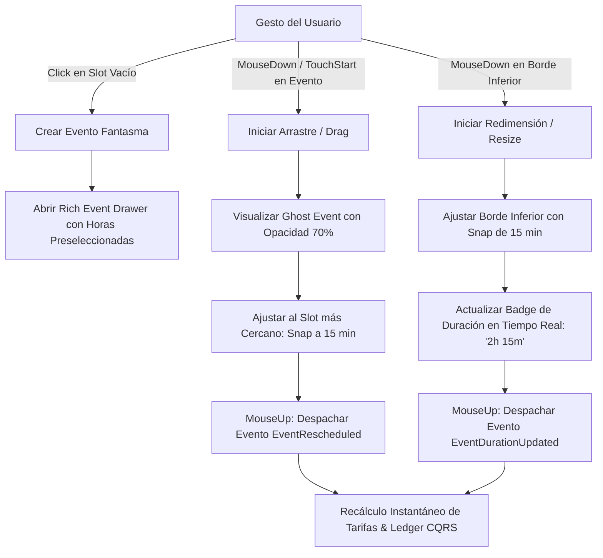
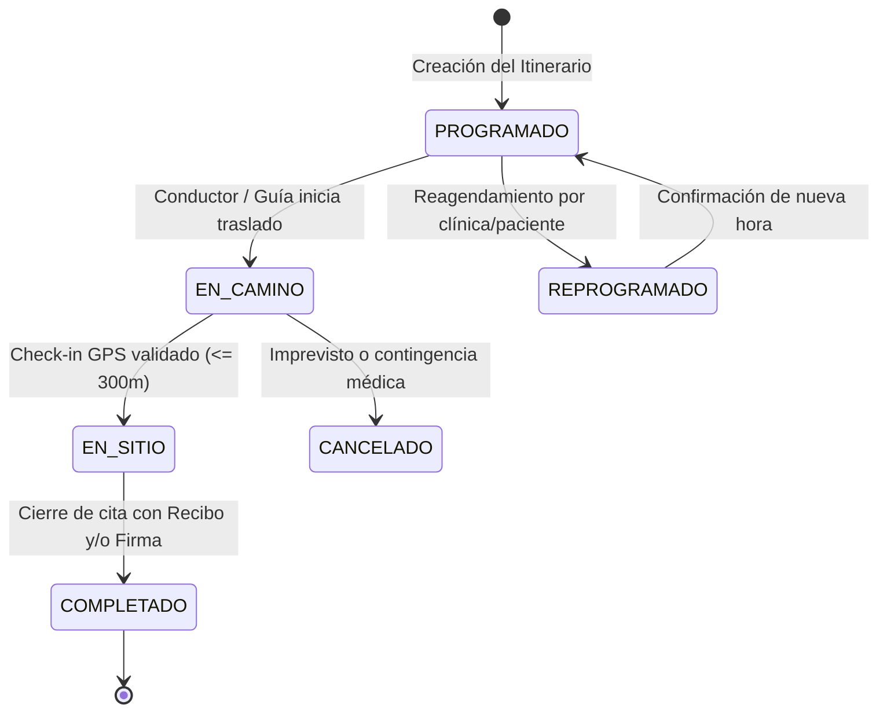

# 🎨 Especificación Integral UI/UX, Sistema de Diseño y Arquitectura de Componentes
## Medical Trip Colombia S.A.S. — Medical Trip Calendar & Settlement App (Standalone Consumer-Grade PWA)

- **Documento**: `survey_ui.md`
- **Autor / Rol**: UI/UX & Interaction Design Explorer (`explorer_survey_ui`)
- **Fecha**: 2026-08-23
- **Directorio de la Aplicación**: `/Users/miyo123/projects/medicaltrip/apps/medicaltrip_calendar_app`
- **Estándares**: OCPM / DDD / Martin Fowler Money Pattern (BigInt Cents) / WCAG 2.1 AAA / Hexagonal UI Architecture

---

## 📑 Tabla de Contenidos
1. [Visión de Diseño y Ergonomía "Human-First"](#1-visión-de-diseño-y-ergonomía-human-first)
2. [Sistema de Diseño Humano y Tokens UI (Design System Tokens)](#2-sistema-de-diseño-humano-y-tokens-ui-design-system-tokens)
3. [Arquitectura del Layout Master-Detail Split-View (R5)](#3-arquitectura-del-layout-master-detail-split-view-r5)
4. [Motor de Calendario Multivista Interactivo (R1)](#4-motor-de-calendario-multivista-interactivo-r1)
5. [Taxonomía de Eventos, Categorización Semántica y Drawer de Edición](#5-taxonomía-de-eventos-categorización-semántica-y-drawer-de-edición)
6. [Herramientas de Terreno y Drawer de Liquidación Financiera en Tiempo Real](#6-herramientas-de-terreno-y-drawer-de-liquidación-financiera-en-tiempo-real)
7. [Conmutador Rápido de los 4 Arquetipos Canónicos de Google Drive](#7-conmutador-rápido-de-los-4-arquetipos-canónicos-de-google-drive)
8. [Jerarquía de Componentes, Flujo de Estado y Atajos de Teclado](#8-jerarquía-de-componentes-flujo-de-estado-y-atajos-de-teclado)
9. [Catálogo de Identificadores `data-testid` y Accesibilidad (WCAG 2.1 AAA)](#9-catálogo-de-identificadores-data-testid-y-accesibilidad-wcag-21-aaa)
10. [Tabla de Características Descubiertas (Features Discovered)](#10-tabla-de-características-descubiertas-features-discovered)
11. [Tabla de Casos Límite y Manejo de Errores (Edge Cases)](#11-tabla-de-casos-límite-y-manejo-de-errores-edge-cases)

---

## 1. Visión de Diseño y Ergonomía "Human-First"

La aplicación **Medical Trip Calendar & Settlement App** está diseñada para el personal de campo y coordinadores de Medical Trip Colombia S.A.S. Su lenguaje visual rechaza los artificios gráficos innecesarios (gradientes de neón "AI-gimmick", sombras volumétricas pesadas, brillos morados fluorescentes) y adopta una estética **limpia, estructurada, utilitaria y de alta densidad de información**, inspirada en los mejores patrones de interacción de:
- **Google Calendar**: Claridad en la grilla temporal, posicionamiento y colisión de eventos, arrastre y redimensionamiento intuitivo, navegación temporal fluida.
- **Linear**: Microinteracciones ultra-rápidas (<16ms), tipografía nítida con números tabulares, bordes sutiles de 1px, paletas neutrales Zinc/Slate y densidad de teclado de clase mundial.
- **Notion**: Drawers laterales deslizantes (*slide-over drawers*), campos contextuales enriquecidos, bloques modulares y simplicidad en la edición de propiedades.

### 1.1. Principios de Interacción en Terreno
1. **Ergonomía Táctil en Movimiento**: Áreas de toque mínimas de $48 \times 48\text{px}$ para conductores y guías bilingües usando smartphones o tablets en vehículos en marcha o salas de espera.
2. **Legibilidad Solar Extrema (Sunlight Readability)**: Relación de contraste de texto superior a **7:1 (WCAG 2.1 AAA)** en modo claro y oscuro, garantizando visibilidad en exteriores y bajo luz solar directa en Medellín y Rionegro.
3. **Cero Salto de Layout (Zero Cumulative Layout Shift - CLS = 0)**: Espaciados fijos, grids virtuales y tipografía con `font-variant-numeric: tabular-nums` para evitar oscilaciones en números monetarios y cronómetros.
4. **Cero Latencia Visual (Local-First Optimistic UI)**: Cualquier acción (crear cita, cambiar estado, registrar gasto, firmar) actualiza la interfaz en el siguiente frame (<16.6ms) y despacha los eventos CQRS de forma asíncrona a la persistencia local.

---

## 2. Sistema de Diseño Humano y Tokens UI (Design System Tokens)

El sistema de diseño utiliza variables CSS semánticas sobre una base de tonos neutros **Zinc / Slate**, complementados con colores de acento funcionales que comunican significado inmediato sin sobrecargar visualmente al operador.

### 2.1. Paleta de Colores Neutros (Surfaces, Borders & Typography)

```css
:root {
  /* Neutral Backgrounds */
  --bg-canvas: #F8FAFC;         /* Slate-50: Fondo general de la aplicación */
  --bg-surface: #FFFFFF;        /* Blanco puro: Tarjetas, celdas de calendario, modales */
  --bg-surface-subtle: #F1F5F9; /* Slate-100: Headers secundarios, horas inactivas, hovers */
  --bg-surface-muted: #E2E8F0;  /* Slate-200: Separadores, slots pasados */

  /* Neutral Borders */
  --border-subtle: #E2E8F0;     /* Slate-200: Bordes de celdas de calendario y tarjetas */
  --border-default: #CBD5E1;    /* Slate-300: Bordes de inputs y divisores principales */
  --border-strong: #94A3B8;     /* Slate-400: Bordes activos y estados de foco */

  /* Typography Colors */
  --text-primary: #0F172A;      /* Slate-900: Títulos principales, cifras monetarias */
  --text-secondary: #475569;    /* Slate-600: Descripciones, etiquetas de metadatos */
  --text-muted: #94A3B8;        /* Slate-400: Placeholders, horas de fondo, marcas de agua */
  --text-inverse: #FFFFFF;      /* Blanco: Texto sobre botones o píldoras oscuras */
}

/* Dark Mode Tokens */
[data-theme="dark"] {
  --bg-canvas: #090D16;         /* Slate-950 ultra oscuro */
  --bg-surface: #0F172A;        /* Slate-900: Superficies primarias */
  --bg-surface-subtle: #1E293B; /* Slate-800: Superficies secundarias */
  --bg-surface-muted: #334155;  /* Slate-700: Fondos tenues */

  --border-subtle: #1E293B;     /* Slate-800 */
  --border-default: #334155;    /* Slate-700 */
  --border-strong: #475569;     /* Slate-600 */

  --text-primary: #F8FAFC;      /* Slate-50 */
  --text-secondary: #94A3B8;    /* Slate-400 */
  --text-muted: #64748B;        /* Slate-500 */
  --text-inverse: #0F172A;
}
```

### 2.2. Paleta Semántica de Categorías de Eventos (Event Category Pills)

Cada categoría de evento médico y logístico tiene una tríada de color: **Fondo Suave**, **Borde/Acento** y **Texto de Alto Contraste**:

| Categoría | Concepto Operativo | Fondo Suave (`bg`) | Borde / Acento (`border`) | Texto Principal (`text`) | Hex Primario |
| :--- | :--- | :--- | :--- | :--- | :--- |
| **Vuelos y Llegadas** | `FLIGHT_ARRIVAL` | `rgba(2, 132, 199, 0.12)` | `#0284C7` (Sky-600) | `#0369A1` (Sky-700) | `#0284C7` |
| **Citas Clínicas & Cirugías** | `CLINICAL_APPOINTMENT` | `rgba(79, 70, 229, 0.12)` | `#4F46E5` (Indigo-600) | `#4338CA` (Indigo-700) | `#4F46E5` |
| **Laboratorios & Diagnóstico** | `LAB_DIAGNOSTIC` | `rgba(13, 148, 136, 0.12)` | `#0D9488` (Teal-600) | `#0F766E` (Teal-700) | `#0D9488` |
| **Farmacia & Caja Menor** | `PHARMACY_EXPENSE` | `rgba(16, 185, 129, 0.12)` | `#10B981` (Emerald-500) | `#047857` (Emerald-700) | `#10B981` |
| **Gastos / Peajes / Viáticos** | `OUT_OF_POCKET` | `rgba(217, 119, 6, 0.12)` | `#D97706` (Amber-600) | `#B45309` (Amber-700) | `#D97706` |
| **Hotel, Reposo & Recovery** | `HOTEL_RECOVERY` | `rgba(100, 116, 139, 0.14)` | `#475569` (Slate-600) | `#334155` (Slate-700) | `#475569` |

### 2.3. Tipografía y Números Tabulares

- **Fuente Primaria UI**: `Inter`, `Geist Sans`, `-apple-system`, `BlinkMacSystemFont`, `"Segoe UI"`, `Roboto`, `sans-serif`.
- **Fuente Monoespaciada / Ledger**: `JetBrains Mono`, `Geist Mono`, `ui-monospace`, `monospace`.
- **Regla Estricta**: Todas las etiquetas de tiempo (`08:30 AM`), duraciones (`1h 45m`), distancias (`120m`), códigos de caso (`RVA171-4`), montos en centavos (`$34.000.000 COP`) y badges de conteo implementan obligatoriamente:
  ```css
  font-variant-numeric: tabular-nums lining-nums;
  letter-spacing: -0.01em;
  ```

### 2.4. Escala Espacial y Touch Targets

- **Sistema Base**: Grilla de $8\text{px}$ con subpasos de $4\text{px}$ para microalineaciones.
- **Espaciados**: `space-1 (4px)`, `space-2 (8px)`, `space-3 (12px)`, `space-4 (16px)`, `space-6 (24px)`, `space-8 (32px)`.
- **Touch Target Mínimo**: `min-height: 48px; min-width: 48px;` en todos los botones y selectores interactivos.
- **Radios de Borde**: `radius-sm (4px)`, `radius-md (6px)`, `radius-lg (8px)`, `radius-xl (12px)`, `radius-pill (9999px)`.
- **Sombras**: Sombras ultra sutiles (Linear-grade):
  ```css
  --shadow-sm: 0 1px 2px 0 rgba(0, 0, 0, 0.05);
  --shadow-md: 0 4px 6px -1px rgba(0, 0, 0, 0.07), 0 2px 4px -2px rgba(0, 0, 0, 0.05);
  --shadow-drawer: -4px 0 24px 0 rgba(15, 23, 42, 0.12);
  ```

---

## 3. Arquitectura del Layout Master-Detail Split-View (R5)

La aplicación utiliza un layout maestro-detalle optimizado para doble monitor en oficina o pantallas táctiles en terreno:

```
┌──────────────────────────────────────────────────────────────────────────────────────────────────────────────────────────┐
│ 🏥 MEDICAL TRIP COLOMBIA — HUB DE OPERACIONES & CALENDARIO CLÍNICO                  [📶 100% OFFLINE] [🌓 TEMA] [❓ AYUDA] │
│ ──────────────────────────────────────────────────────────────────────────────────────────────────────────────────────── │
│ 🇨🇼 [RVA171 Catia x5]  │ 🇨🇼 [RVA282 George Cardio] │ 🇨🇼 [RVA341 Hogenboom CES] │ 🇨🇼 [RVA077 Rumai 12d] │ [+ Nuevo Caso]    │
├──────────────────────────────────────────────────────────────────────┬───────────────────────────────────────────────────┤
│ 📅 PANEL IZQUIERDO: CALENDARIO & ITINERARIO EN TERRENO               │ 💰 PANEL DERECHO: LIQUIDACIÓN & AUDITORÍA EN VIVO │
│ ┌──────────────────────────────────────────────────────────────────┐ │ ┌───────────────────────────────────────────────┐ │
│ │ [< Hoy >] [Agosto 2026]  │ [Día] [Semana] [Mes] [Agenda]  [+ Cita]│ │ │ 📊 BALANCE DEL PRESUPUESTO ($34.000.000 COP)   │ │
│ └──────────────────────────────────────────────────────────────────┘ │ │ [Transp: 18%] [Guía: 22%] [Med: 35%] [Saldo: 25%]│ │
│ ┌─────┬────────────────────────────────────────────────────────────┐ │ └───────────────────────────────────────────────┘ │
│ │ GMT │ Martes 18 Ago (Día 2) · Chequeo Especializado              │ │ ┌───────────────┐ ┌───────────────┐ ┌───────────┐ │
│ ├─────┼────────────────────────────────────────────────────────────┤ │ │  24.5 Horas   │ │ 12/18 Paradas │ │ $450.000  │ │
│ │07:00│ ✈️ Traslado MDE -> Hotel Poblado Plaza                      │ │ │  Registradas  │ │  Completadas  │ │ Pendiente │ │
│ │08:00│ ┌────────────────────────────────────────────────────────┐ │ │ └───────────────┘ └───────────────┘ └───────────┘ │
│ │     │ │ 08:30 - 11:30 · HPTU Toma de Muestras & ECG            │ │ │ 💵 DESGLOSE DE ASIENTOS Y EVENTOS CQRS         │ │
│ │     │ │ [PAX] Catia Rodrigues x5  [GUIA] Andrés Cantero        │ │ │ • Traslado MDE -> Hotel: $110.000 COP [DRV]    │ │
│ │     │ │ Estado: [EN_SITIO 🟣]                                  │ │ │ • Acompañamiento 6.5h: $227.500 COP [GUIA]     │ │
│ │09:00│ │ [📍 Check-in 15m] [📷 Recibo] [✍️ Firma]                │ │ │ • Recibo Farmacia Cruz Verde: $45.000 [FARM]   │ │
│ │     │ └────────────────────────────────────────────────────────┘ │ │ • Almuerzo Guianza: $35.000 COP [VIAT]          │ │
│ │11:00│ ┌────────────────────────────────────────────────────────┐ │ │ ───────────────────────────────────────────────── │
│ │     │ │ 11:30 - 13:00 · CIMA Audiometría & Optometría          │ │ │ 🛡️ ESTADO DE AUDITORÍA:                        │ │
│ │     │ │ Estado: [PROGRAMADO 🔵]                                │ │ │ ✅ BALANCE DETERMINISTA: 0.00 COP DISCREPANCIA  │ │
│ │12:00│ │ [Iniciar Traslado ➔]                                   │ │ └───────────────────────────────────────────────┘ │
│ └─────┴────────────────────────────────────────────────────────────┘ │                                                   │
└──────────────────────────────────────────────────────────────────────┴───────────────────────────────────────────────────┘
```

### 3.1. Adaptabilidad y Modos Responsivos

| Viewport | Ancho (px) | Disposición de Paneles | Comportamiento del Master (Calendario) | Comportamiento del Detail (Liquidación) |
| :--- | :--- | :--- | :--- | :--- |
| **Desktop Ultra-Wide** | $\ge 1440\text{px}$ | Split-View Fijo 65% / 35% | Calendario multivariable completo con horas e inspectores inline. | Panel de liquidación y KPIs siempre visible con ledger detallado. |
| **Desktop / Laptop** | $1200\text{px} - 1439\text{px}$ | Split-View Fijo 60% / 40% | Calendario con time-grid colapsable y badges compactos. | Balance bar sticky y acordeón de eventos contables. |
| **Tablet Landscape** | $992\text{px} - 1199\text{px}$ | Split-View Proporcional 55% / 45% | Vista de Día o Agenda optimizada para toques rápidos. | Botón de colapso rápido para maximizar el calendario. |
| **Tablet Portrait** | $768\text{px} - 991\text{px}$ | Pestañas Superiores Conmutables | Pestaña `[📅 Calendario & Itinerario]` al 100% de ancho. | Pestaña `[💰 Liquidación & Finanzas]` al 100% de ancho. |
| **Móvil (Smartphone)** | $< 768\text{px}$ | Vista de Pila con Bottom Sheet | Vista Agenda o Día optimizada con scroll vertical continuo. | Barra flotante inferior de saldo que abre un *Slide-up Drawer* al deslizar. |

---

## 4. Motor de Calendario Multivista Interactivo (R1)

El motor de calendario implementa 4 vistas fluidas con persistencia de posición y cero parpadeo visual.

### 4.1. Especificación de las 4 Vistas del Calendario

```
┌──────────────────────────────────────────────────────────────────────────────────────────────────────────────────────────┐
│                                          MOTOR DE CALENDARIO: LAS 4 VISTAS                                               │
├────────────────────────────────┬────────────────────────────────┬───────────────────────────────┬────────────────────────┤
│ 1. DAY VIEW (DÍA)              │ 2. WEEK VIEW (SEMANA)          │ 3. MONTH VIEW (MES)           │ 4. AGENDA VIEW (STREAM)│
├────────────────────────────────┼────────────────────────────────┼───────────────────────────────┼────────────────────────┤
│ • Grilla horaria vertical      │ • 7 Columnas sincronizadas     │ • Matriz 7x5 de días del mes  │ • Stream cronológico   │
│ • Rango: 06:00 a 22:00 (24h)   │ • Cabecera de fecha fija       │ • Indicador de densidad       │ • Tarjetas enriquecidas│
│ • Franjas de 15/30/60 min      │ • Bloques arrastrables entre   │ • Popover "+N citas más"      │ • Estados en vivo      │
│ • Línea roja de hora actual    │   días de la semana            │ • Ideal para coordinadores    │ • Acciones directas de │
│ • Resolución de colisiones     │ • Banda superior de eventos    │   con visión macro            │   campo (GPS/OCR/Firma)│
│   (eventos paralelos)          │   de todo el día (All-Day)     │                               │                        │
└────────────────────────────────┴────────────────────────────────┴───────────────────────────────┴────────────────────────┘
```

#### 1. Day View (Vista de Día)
- **Time Grid**: Eje vertical de 06:00 a 22:00 con líneas guía cada 30 minutos (altura de slot: 60px por hora = 1px por minuto).
- **Indicador de Hora Actual**: Línea horizontal carmesí (`#EF4444`) con punto pulsante sincronizado con `America/Bogota` (UTC-5).
- **Algoritmo de Colisión de Eventos Paralelos**: Cuando 2 o más eventos se solapan en el tiempo (ej. consulta simultánea de dos acompañantes del mismo grupo familiar):
  - Se calculan los grupos de intersección temporal $[t_{\text{start}}, t_{\text{end}}]$.
  - Se asigna un índice de columna $k \in \{0, \dots, N-1\}$.
  - Cada tarjeta ocupa un ancho $W = \frac{100\%}{N} - 4\text{px}$ con desplazamiento lateral $\text{left} = k \times \frac{100\%}{N}$.

#### 2. Week View (Vista de Semana)
- Grilla de 7 columnas que abarca de Lunes a Domingo o el rango exacto de la reserva médica (ej. 5 días o 12 días).
- Banda superior para eventos de día completo (*All-Day Banner*) como `ESTADIA_HOTEL_POBLADO_PLAZA` o `REPOSO_POSTQUIRURGICO`.
- Arrastre bidimensional: permite mover eventos tanto horizontalmente (cambio de día) como verticalmente (cambio de hora).

#### 3. Month View (Vista de Mes)
- Matriz de 7 columnas $\times$ 5/6 filas.
- Celdas con fecha, día del mes, e indicador de carga de trabajo.
- Hasta 3 píldoras semánticas por celda; si hay más, se muestra un badge interactivo `[+2 más]` que despliega un popover flotante con el listado completo del día.

#### 4. Agenda View (Vista de Flujo Cronológico)
- Agrupación por días con encabezado adhesivo (*sticky header*).
- Formato de tarjeta de alta densidad con: hora de inicio/fin, duración calculada, nombre de la clínica/hotel, avatar del paciente y guía, badge de estado en vivo y botones de acción rápida.
- Vista por defecto en dispositivos móviles para máxima facilidad de scroll táctil con una mano.

---

### 4.2. Motor de Manipulación Directa de Eventos (Direct Milestone Manipulation)



1. **Click-to-Create**:
   - Al hacer clic o tocar un espacio vacío en la grilla horaria, se genera un bloque translúcido temporal de 30 minutos y se abre el **Rich Event Drawer** con la fecha y hora de inicio/fin prellenadas.
2. **Drag-to-Reschedule**:
   - Soporta arrastre táctil y con ratón mediante `PointerEvents`.
   - **Magnetismo de Rejilla (Time Snapping)**: Los eventos se alinean automáticamente a intervalos discretos de **15 minutos**.
   - Durante el arrastre, se proyecta una sombra guía (*ghost block*) y un tooltip flotante indica la nueva hora programada (ej. `10:15 AM - 11:45 AM`).
3. **Duration Resizing**:
   - Manija de redimensión táctil en el borde inferior de cada tarjeta de evento (`resize-handle`).
   - Al estirar o encoger la tarjeta, se recalcula la duración con snap de 15 min y se actualiza el badge numérico a 60 FPS.
4. **Quick Popover Inspector**:
   - Un clic simple sobre cualquier evento abre un popover ligero con: resumen de la cita, dirección, teléfonos de contacto, estado actual y botones directos `[Editar]`, `[Comenzar Traslado]`, `[Check-in GPS]`, `[Cargar Gasto]`, `[Eliminar]`.

---

## 5. Taxonomía de Eventos, Categorización Semántica y Drawer de Edición

### 5.1. Máquina de Estados Finita (FSM) de Eventos en Terreno

Cada parada o evento clínico atraviesa un ciclo de vida formal y determinista:



#### Especificación Visual de Badges de Estado:
- **`PROGRAMADO`** (`#3B82F6` Azul Cobalto): Borde sutil, fondo tenue, texto `#1D4ED8`. Acción: `[Iniciar Traslado ➔]`.
- **`EN_CAMINO`** (`#F59E0B` Ámbar): Punto ámbar pulsante (CSS `@keyframes pulse`), fondo `#FEF3C7`. Acción: `[📍 Check-in GPS]`.
- **`EN_SITIO`** (`#6366F1` Índigo): Badge sólido con cronómetro de tiempo en sitio. Acciones: `[📷 Cargar Gasto]`, `[✍️ Firma]`, `[Finalizar Parada ✅]`.
- **`COMPLETADO`** (`#10B981` Esmeralda): Checkmark blanco sobre verde esmeralda. Bloqueo de mutación no autorizada.

---

### 5.2. Rich Event Drawer (Drawer Lateral de Edición de Eventos)

El **Rich Event Drawer** se desliza suavemente desde el borde derecho de la pantalla (`transform: translateX(0); transition: transform 200ms cubic-bezier(0.16, 1, 0.3, 1);`) y contiene todos los campos operativos y de costeo:

```
┌─────────────────────────────────────────────────────────────────────────────┐
│ 📝 DETALLE DEL EVENTO CLÍNICO / LOGÍSTICO                           [✕ Cerrar]│
├─────────────────────────────────────────────────────────────────────────────┤
│ TÍTULO DEL EVENTO                                                           │
│ [ HPTU Toma de Muestras & Laboratorios Especializados                     ] │
│                                                                             │
│ CATEGORÍA DE SERVICIO                                                       │
│ (•) Cita Clínica   ( ) Laboratorio   ( ) Vuelo/Traslado   ( ) Hotel/Reposo  │
│                                                                             │
│ FECHA Y HORARIO (AMERICA/BOGOTA UTC-5)                                      │
│ Fecha: [ 2026-08-18 ]  Desde: [ 08:30 AM ]  Hasta: [ 11:30 AM ] (3h 00m)   │
│                                                                             │
│ PROVEEDOR / DESTINO CLÍNICO                                                 │
│ [ 🏥 Hospital Pablo Tobón Uribe (HPTU) - Robledo, Medellín               ▼] │
│ Coordenadas: 6.275819, -75.589833 · Radio Geocerca: 300m                    │
│                                                                             │
│ ASIGNACIÓN DE PERSONAL & LOGÍSTICA                                          │
│ • Conductor: [ 🚗 Ramón Rosero - Aeroturex Van Especial (Placa STZ-492)  ▼] │
│ • Guía / Acompañante: [ 🗣️ Andrés Cantero (Bilingüe Papiamento/Inglés)   ▼] │
│ • Pacientes Asignados: [ 👥 Catia, Fátima, Mariana, Tatiana, Lisandra (5)▼] │
│                                                                             │
│ GASTOS DIRECTOS / CAJA MENOR ESTIMADOS                                      │
│ Concepto: [ Copago Consulta / Exámenes CUPS ]  Monto: [ $ 180.000 COP     ] │
│                                                                             │
│ ─────────────────────────────────────────────────────────────────────────── │
│ 📈 IMPACTO EN LA LIQUIDACIÓN FINANCIERA (REAL-TIME SETTLEMENT DELTA)        │
│ • Tarifa Conductor (Traslado Urbano):                         +$ 50.000 COP │
│ • Tarifa Guianza Bilingüe (3.0h @ $35.000/h):                +$ 105.000 COP │
│ • Gastos de Bolsillo Registrados:                            +$ 180.000 COP │
│ ─────────────────────────────────────────────────────────────────────────── │
│   VARIACIÓN NETA DEL EVENTO EN EL LEDGER:                    +$ 335.000 COP │
│                                                                             │
│ NOTAS OPERATIVAS & INSTRUCCIONES AL PACIENTE                                │
│ [ Ayuno de 8 horas obligatorio. Llevar pasaportes originales y orden EPS. ] │
├─────────────────────────────────────────────────────────────────────────────┤
│ [🗑️ Eliminar Evento]                       [Cancelar]  [💾 Guardar Cambios] │
└─────────────────────────────────────────────────────────────────────────────┘
```

#### Campos y Validaciones del Drawer:
1. **Selector de Proveedores**: Combobox con búsqueda predictiva de los proveedores canónicos del sistema (`HPTU`, `Cardio VID`, `CES`, `Clofán`, `CIMA`, `Regencord`, `Clínica de la Columna`, `Villa Anita`, `Hotel Poblado Plaza`, `Edificio Park 42`).
2. **Validación Fail-Fast de Territorio**: Si se ingresa una dirección o coordenadas fuera de las zonas operativas autorizadas (ej. Mocoa, Putumayo), el formulario muestra un bloqueo inmediato: `❌ Error de Dominio: Zona no operativa para Medical Trip Colombia`.
3. **Settlement Delta Box**: Muestra en vivo la fórmula exacta en centavos de cómo la duración de la cita y la asignación de recursos altera el presupuesto global del caso.

---

## 6. Herramientas de Terreno y Drawer de Liquidación Financiera en Tiempo Real

### 6.1. Barra de Balance Financiero y Ecuación Determinista

El motor financiero implementa el patrón **Martin Fowler Money** en centavos enteros (`BigInt`), garantizando cero discrepancias de redondeo en sumatorias multi-día.

$$\text{Presupuesto Total} = \text{Transporte} + \text{Guianza} + \text{Procedimientos} + \text{Gastos Bolsillo} + \text{Saldo Disponible}$$
$$\text{Net Balance} = \sum \text{Gastos Directos} + \sum \text{Honorarios Guía} + \sum \text{Tarifas Flota} - \text{Anticipos Recibidos}$$

```
┌──────────────────────────────────────────────────────────────────────────────────────────────────┐
│ PRESUPUESTO TOTAL DEL CASO: $34.000.000 COP ($8,500 USD @ TRM 4.000)                             │
│ ┌───────────────┬───────────────┬───────────────┬───────────────┬──────────────────────────────┐ │
│ │  Flota: 18%   │   Guía: 22%   │  Médico: 35%  │ Viáticos: 5%  │     Saldo Restante: 20%      │ │
│ │  $6.120.000   │  $7.480.000   │  $11.900.000  │  $1.700.000   │         $6.800.000           │ │
│ └───────────────┴───────────────┴───────────────┴───────────────┴──────────────────────────────┘ │
└──────────────────────────────────────────────────────────────────────────────────────────────────┘
```

#### Segmentos de la Barra:
1. **Flota y Transporte (`#0284C7` Sky Blue)**: Traslados MDE ($110.000), urbanos ($50.000), horas de espera ($25.000/h).
2. **Acompañamiento Bilingüe (`#8B5CF6` Púrpura)**: Horas presenciales certificadas ($35.000/h guianza, $22.000/h enfermera).
3. **Procedimientos Médicos (`#10B981` Esmeralda)**: Citas con especialistas, exámenes diagnósticos, derechos de quirófano.
4. **Gastos de Bolsillo / Caja Menor (`#F59E0B` Ámbar)**: Recibos de farmacia, peajes, parqueaderos.
5. **Saldo Disponible Restante (`#334155` Slate Neutro)**: Fondos no devengados para reembolso o contingencias.

---

### 6.2. Tarjetas de Resumen KPI en Tiempo Real

```
┌─────────────────────────┐ ┌─────────────────────────┐ ┌─────────────────────────┐ ┌─────────────────────────┐
│ ⏱️ HORAS DE SERVICIO     │ │ 📍 PROGRESO DE PARADAS  │ │ 🧾 GASTOS POR LEGALIZAR │ │ 🛡️ ESTADO DE AUDITORÍA  │
│ 24.5 h                  │ │ 12 / 18 (66.7%)         │ │ $ 450.000 COP           │ │ ✅ CUADRE DETERMINISTA  │
│ Guía: 18.0h · DRV: 6.5h │ │ [████████████░░░░░░]    │ │ 3 Recibos pendientes    │ │ Discrepancia: 0.00 COP│
└─────────────────────────┘ └─────────────────────────┘ └─────────────────────────┘ └─────────────────────────┘
```

---

### 6.3. Modal de OCR de Recibos y Desglose de Gastos de Farmacia

Permite la captura de facturas y tickets en terreno con extracción mock determinista:

```
┌─────────────────────────────────────────────────────────────────────────────┐
│ 🧾 CAPTURA Y OCR DE RECIBOS DE CAJA MENOR / FARMACIA                [✕ Cerrar]│
├─────────────────────────────────────────────────────────────────────────────┤
│ 1. ORIGEN DE LA IMAGEN                                                      │
│ [ 📷 Tomar Foto con Cámara ]  [ 📁 Cargar Archivo ]                         │
│                                                                             │
│ PRESETS RÁPIDOS DE PRUEBA (DATOS HISTÓRICOS REALES):                        │
│ [ Cruz Verde $45.000 ]  [ Pasteur $65.000 ]  [ Peaje Túnel $24.800 ]        │
│                                                                             │
│ 2. PREVISUALIZACIÓN Y RECORTE                                               │
│ ┌───────────────────────────────────────┬─────────────────────────────────┐ │
│ │                                       │ 3. DATOS EXTRAÍDOS (OCR EDITABLE│ │
│ │                                       │ Comercio / Proveedor:           │ │
│ │        [VISTA PREVIA DE LA            │ [ Farmacia Cruz Verde Robledo ] │ │
│ │         FOTO DEL RECIBO]              │ NIT: [ 800.149.695-1          ] │
│ │                                       │ Fecha Factura: [ 2026-08-18   ] │
│ │                                       │ Categoría:                      │ │
│ │ [🔄 Girar 90°] [🔍 Zoom] [✂️ Recortar] │ [ Medicamentos / Farmacia    ▼] │
│ │                                       │ Monto Total (COP):              │ │
│ │                                       │ [ $ 45.000 COP                ] │
│ └───────────────────────────────────────┴─────────────────────────────────┘ │
│                                                                             │
│ ÍTEMS DETALLADOS EXTRAÍDOS:                                                 │
│ • 1x Ciprofloxacino 500mg (10 tabs) ......................... $ 28.500 COP │
│ • 1x Gasas estériles y solución salina ....................... $ 16.500 COP │
├─────────────────────────────────────────────────────────────────────────────┤
│ [Cancelar]                                 [💾 Guardar y Deducir de Caja]   │
└─────────────────────────────────────────────────────────────────────────────┘
```

---

### 6.4. Modal de Lienzo de Firma Digital del Paciente

Captura la firma biométrica del paciente o acompañante para certificar la conformidad del servicio:

```
┌─────────────────────────────────────────────────────────────────────────────┐
│ ✍️ CERTIFICACIÓN DE CONFORMIDAD Y FIRMA DEL PACIENTE                [✕ Cerrar]│
├─────────────────────────────────────────────────────────────────────────────┤
│ DECLARACIÓN LEGAL:                                                          │
│ "Certifico que recibí a entera satisfacción los servicios médicos, de       │
│ transporte y acompañamiento bilingüe estipulados en este itinerario."       │
│                                                                             │
│ Paciente: Catia Rodrigues (ENT-PAX-0171) · Cita: HPTU Chequeo General       │
│                                                                             │
│ LIENZO DE FIRMA TÁCTIL (POINTER EVENTS RETINA $600\times 240\text{px}$):     │
│ ┌─────────────────────────────────────────────────────────────────────────┐ │
│ │                                                                         │ │
│ │                          ✍️ [Trazo del Paciente]                        │ │
│ │                                                                         │ │
│ │ ─────────────────────────────────────────────────────────────────────── │ │
│ │  X  Firma del Paciente / Acompañante Autorizado                         │ │
│ └─────────────────────────────────────────────────────────────────────────┘ │
│                                                                             │
│ [ 🔄 Limpiar Lienzo ]   [ 🎨 Tinta Azul ]   [ 🎨 Tinta Negra ]              │
│ Trazo: 142 puntos capturados · Dispositivo: iPad Air (Safari Standalone)   │
├─────────────────────────────────────────────────────────────────────────────┤
│ [Cancelar]                                       [💾 Certificar y Guardar]  │
└─────────────────────────────────────────────────────────────────────────────┘
```

- **Motor Vectorial**: Curvas de Bézier cuadráticas interpoladas entre puntos de muestreo.
- **Persistencia**: Imagen WebP comprimida almacenada en IndexedDB (`patient_signatures`) con UUID único y evento CQRS `PatientSignatureCapturedEvent`.

---

### 6.5. Simulador de Check-In GPS y Validador Haversine

Calcula la distancia geodésica entre la posición del personal y la clínica:

```
┌─────────────────────────────────────────────────────────────────────────────┐
│ 📍 SIMULADOR Y VALIDACIÓN DE CHECK-IN GPS                           [✕ Cerrar]│
├─────────────────────────────────────────────────────────────────────────────┤
│ DESTINO PROGRAMADO: Hospital Pablo Tobón Uribe (HPTU)                       │
│ Coordenadas Oficiales: 6.275819, -75.589833 · Radio Geocerca: 300 metros    │
│                                                                             │
│ POSICIÓN ACTUAL / SIMULADOR DE COORDENADAS:                                 │
│ Latitud: [ 6.275910 ]  Longitud: [ -75.589790 ]                             │
│                                                                             │
│ PRESETS DE SIMULACIÓN EN CAMPO:                                             │
│ [ ✅ En Sitio (15m) ]  [ ⚠️ Fuera de Rango (1.2km) ]  [ ❌ Mocoa (Fail-Fast) ]│
│                                                                             │
│ RESULTADO DEL MOTOR HAVERSINE:                                              │
│ • Distancia Calculada: 14.8 metros                                          │
│ • Estado de Geocerca: ✅ DENTRO DEL RADIO PERMITIDO (Tolerancia: 300m)       │
├─────────────────────────────────────────────────────────────────────────────┤
│ [Cancelar]                                      [📍 Confirmar Check-in GPS] │
└─────────────────────────────────────────────────────────────────────────────┘
```

---

## 7. Conmutador Rápido de los 4 Arquetipos Canónicos de Google Drive

La barra superior permite cambiar instantáneamente (<15ms) entre los 4 casos reales representativos de la operación de Medical Trip Colombia:

```
┌─────────────────────────────────────────────────────────────────────────────────────────────────┐
│ 🇨🇼 [RVA171 Catia x5]  │ 🇨🇼 [RVA282 George Cardio] │ 🇨🇼 [RVA341 Hogenboom CES] │ 🇨🇼 [RVA077 Rumai 12d] │
│ 5 Pax · Checkup/CIMA  │ 1 Pax · Cardio VID / CES   │ 1 Pax · CES / Domicilio    │ 2 Pax · Cirugía/Gineco │
└─────────────────────────────────────────────────────────────────────────────────────────────────┘
```

### 7.1. Especificación Detallada de los 4 Arquetipos

| Arquetipo | Pacientes & Grupo | Duración | Presupuesto Total | Proveedores Médicos | Personal de Campo Asignado |
| :--- | :--- | :---: | :---: | :--- | :--- |
| **`RVA171 Catia x5`** | Catia Rodrigues + 4 familiares (5 Pax) | 5 Días | **$8,500 USD**<br>($34.000.000 COP) | • Hospital Pablo Tobón Uribe (HPTU)<br>• Centro Médico CIMA<br>• Hotel Poblado Plaza | `[COORD] Carolina Cortázar`<br>`[DRV] Ramón Rosero (Van Especial)`<br>`[GUIA] Acompañante Bilingüe` |
| **`RVA282 George Cardio`** | George Hernandez + Acompañante (2 Pax) | 5 Días | **$4,200 USD**<br>($16.800.000 COP) | • Clínica Cardio VID (Chequeo Cardiovascular)<br>• Clínica CES (Urología)<br>• Edificio Park 42 | `[COORD] Carolina Cortázar`<br>`[DRV] Ramón Rosero (Sedán)`<br>`[MED] Dr. Marcos Yepes` |
| **`RVA341 Hogenboom CES`** | Eduard Hogenboom (1 Pax) | 4 Días | **$3,100 USD**<br>($12.400.000 COP) | • Clínica CES (Carta de Garantía)<br>• Laboratorio Echavarría Domicilio<br>• Hotel Poblado Plaza | `[COORD] Carolina Cortázar`<br>`[GUIA] Andrés Cantero`<br>`[NURSE] Emi Echavarría` |
| **`RVA077 Rumai Cirugía 12d`**| Alejandra Rumai + Giandra Rumai (2 Pax)| 12 Días| **$9,800 USD**<br>($39.200.000 COP)| • Clínica Bolivariana (Cirugía / Ginecología)<br>• Sonofetal<br>• Villa Anita Recovery House | `[COORD] Carolina Cortázar`<br>`[DIR-MED] Dra. Jenny Acosta`<br>`[HOTEL] Villa Anita Staff` |

---

## 8. Jerarquía de Componentes, Flujo de Estado y Atajos de Teclado

### 8.1. Árbol Jerárquico de Componentes UI

```
AppRoot
├── TopNavbar
│   ├── BrandLogo & AppTitle
│   ├── ArchetypeSwitcherBar (RVA171, RVA282, RVA341, RVA077)
│   ├── OfflineBadgeIndicator (100% Offline with pulse)
│   ├── ThemeToggle (Light / Dark)
│   └── GlobalActions ([+ Nuevo Evento], [⚙️ Ajustes])
│
├── MasterDetailLayout (60/40 Split-View)
│   ├── LeftMasterPane (CalendarEngine)
│   │   ├── CalendarToolbar (Navigation [< >], DateDisplay, ViewSelector [D/W/M/A])
│   │   ├── DayView (Hourly Grid 06:00-22:00, CurrentTimeIndicator, CollisionEngine)
│   │   ├── WeekView (7-Day Column Grid, All-Day Strip)
│   │   ├── MonthView (7x5 Grid Matrix, DayCell, EventPills, PopoverOverflow)
│   │   ├── AgendaView (TimelineStream, StickyDateHeaders, HighDensityStopCards)
│   │   └── DirectManipulationLayer (GhostBlock, DragOverlay, ResizeHandles)
│   │
│   └── RightDetailPane (SettlementIntelligence)
│       ├── SettlementBalanceBar (Proportional 5-Segment Bar in BigInt Cents)
│       ├── KpiGrid (ServiceHoursCard, StopsProgressCard, PendingExpensesCard, AuditStatusBadge)
│       ├── CqrsLedgerStream (Collapsible list of financial journal entries)
│       └── ActionToolbar ([📷 Cargar Recibo], [✍️ Firma Paciente], [📍 GPS Check-in])
│
├── ModalsAndDrawers
│   ├── RichEventDrawer (Slide-over form with Live Settlement Delta)
│   ├── ReceiptOcrModal (Image preview, Preset buttons, Editable OCR table)
│   ├── SignatureCanvasModal (Retina Canvas, Clear, Legal text, Save to IndexedDB)
│   └── GpsCheckinModal (Haversine calculator, Presets, Fail-fast Mocoa validator)
│
└── ToastAndNotificationContainer (Top-right corner toasts for CQRS events)
```

### 8.2. Atajos de Teclado Globales (Linear-Style Shortcuts)

| Atajo | Acción | Contexto |
| :--- | :--- | :--- |
| `D` | Cambiar a **Day View** (Vista de Día) | Global |
| `W` | Cambiar a **Week View** (Vista de Semana) | Global |
| `M` | Cambiar a **Month View** (Vista de Mes) | Global |
| `A` | Cambiar a **Agenda View** (Vista de Agenda) | Global |
| `T` | Ir a la fecha actual (**Today / Hoy**) | Global |
| `C` | Crear **Nuevo Evento** (Abre Rich Event Drawer) | Global |
| `1` - `4` | Conmutar entre los **4 Arquetipos** (1: RVA171, 2: RVA282, 3: RVA341, 4: RVA077) | Global |
| `Cmd + K` / `Ctrl + K` | Abrir **Paleta de Comandos Rápidos** (Command Palette) | Global |
| `Esc` | Cerrar cualquier Drawer o Modal abierto | Modales / Drawers |

---

## 9. Catálogo de Identificadores `data-testid` y Accesibilidad (WCAG 2.1 AAA)

### 9.1. Catálogo Completo de `data-testid` para Testing E2E

```html
<!-- ARQUETIPOS -->
<div data-testid="archetype-switcher-bar">
  <button data-testid="archetype-tab-rva171">RVA171 Catia x5</button>
  <button data-testid="archetype-tab-rva282">RVA282 George Cardio</button>
  <button data-testid="archetype-tab-rva341">RVA341 Hogenboom CES</button>
  <button data-testid="archetype-tab-rva077">RVA077 Rumai Cirugía 12d</button>
</div>

<!-- NAVEGACIÓN Y SELECTOR DE VISTAS DEL CALENDARIO -->
<div data-testid="calendar-toolbar">
  <button data-testid="btn-calendar-prev"><</button>
  <button data-testid="btn-calendar-today">Hoy</button>
  <button data-testid="btn-calendar-next">></button>
  <span data-testid="calendar-current-date-label">Agosto 2026</span>
  
  <button data-testid="view-tab-day">Día</button>
  <button data-testid="view-tab-week">Semana</button>
  <button data-testid="view-tab-month">Mes</button>
  <button data-testid="view-tab-agenda">Agenda</button>
  <button data-testid="btn-create-event">+ Nueva Cita</button>
</div>

<!-- VISTAS DEL CALENDARIO -->
<div data-testid="calendar-view-day"></div>
<div data-testid="calendar-view-week"></div>
<div data-testid="calendar-view-month"></div>
<div data-testid="calendar-view-agenda"></div>

<!-- TARJETAS Y BLOQUES DE EVENTO -->
<div data-testid="calendar-event-block-{eventId}" data-category="{category}">
  <span data-testid="event-time-{eventId}">08:30 - 11:30</span>
  <span data-testid="event-title-{eventId}">HPTU Toma de Muestras</span>
  <span data-testid="event-status-badge-{eventId}">EN_SITIO</span>
  <div data-testid="event-resize-handle-{eventId}"></div>
</div>

<!-- RICH EVENT DRAWER -->
<div data-testid="rich-event-drawer">
  <input data-testid="event-input-title" type="text" />
  <select data-testid="event-select-category"></select>
  <input data-testid="event-input-date" type="date" />
  <input data-testid="event-input-start-time" type="time" />
  <input data-testid="event-input-end-time" type="time" />
  <select data-testid="event-select-provider"></select>
  <select data-testid="event-select-driver"></select>
  <select data-testid="event-select-guide"></select>
  <div data-testid="event-settlement-delta-box">+$ 335.000 COP</div>
  <button data-testid="btn-save-event">Guardar Cambios</button>
  <button data-testid="btn-delete-event">Eliminar Evento</button>
  <button data-testid="btn-close-drawer">Cerrar</button>
</div>

<!-- BARRA DE BALANCE Y KPIS -->
<div data-testid="settlement-balance-bar">
  <div data-testid="balance-segment-fleet"></div>
  <div data-testid="balance-segment-guide"></div>
  <div data-testid="balance-segment-medical"></div>
  <div data-testid="balance-segment-pocket"></div>
  <div data-testid="balance-segment-remaining"></div>
</div>
<span data-testid="budget-total-amount">$ 34.000.000 COP</span>
<span data-testid="budget-remaining-amount">$ 6.800.000 COP</span>

<div data-testid="kpi-total-hours">24.5 h</div>
<div data-testid="kpi-completed-stops">12 / 18</div>
<div data-testid="kpi-pending-expenses">$ 450.000 COP</div>
<div data-testid="kpi-audit-status">✅ BALANCE DETERMINISTA 0.00</div>

<!-- MODALES (OCR, FIRMA, GPS) -->
<dialog data-testid="modal-receipt-ocr">
  <button data-testid="ocr-preset-cruz-verde">Preset Cruz Verde</button>
  <button data-testid="ocr-btn-save-expense">Registrar Gasto</button>
</dialog>

<dialog data-testid="modal-patient-signature">
  <canvas data-testid="signature-canvas-element"></canvas>
  <button data-testid="signature-btn-clear">Limpiar</button>
  <button data-testid="signature-btn-save">Certificar y Guardar</button>
</dialog>

<dialog data-testid="modal-gps-checkin">
  <button data-testid="gps-preset-onsite">En Sitio (15m)</button>
  <button data-testid="gps-preset-mocoa">Mocoa (Fail-Fast)</button>
  <button data-testid="gps-btn-confirm">Confirmar Check-in</button>
</dialog>
```

---

## 10. Tabla de Características Descubiertas (Features Discovered)

## Features Discovered
| # | Category | Feature | Description | Inputs | Outputs | Error Behavior | Discovered Via |
|---|----------|---------|-------------|--------|---------|----------------|----------------|
| 1 | Design System | Paleta Human-First Neutral Zinc/Slate | Sistema de tokens de color sin estridencias ni gradientes neón, con contraste WCAG 2.1 AAA. | Variables CSS, modo oscuro/claro | Renderizado nítido y descansado a la vista | Fallback a paleta segura en navegadores antiguos | `ORIGINAL_REQUEST.md` (R1) |
| 2 | Calendario | Motor Multivista (Día, Semana, Mes, Agenda) | Visualizador interactivo de eventos con 4 modos y persistencia de fecha/hora activa. | Clic en tabs [D/W/M/A], atajos de teclado | Renderizado instantáneo de la grilla correspondiente sin recarga | Retención de la fecha seleccionada ante cambios de vista | `ORIGINAL_REQUEST.md` (R1) |
| 3 | Calendario | Manipulación Directa (Drag & Resize) | Creación al clic, arrastre magnético (snap 15 min) y redimensión vertical de duraciones. | Eventos Pointer/Touch/Mouse | Actualización inmediata de coordenadas temporales y recálculo | Bloqueo de solapamiento inválido o duraciones negativas | `ORIGINAL_REQUEST.md` (R1) |
| 4 | Categorización | Píldoras Semánticas de 5 Categorías | Codificación de color natural: Vuelos (Sky), Citas (Indigo), Labs (Teal), Farmacia (Emerald), Hotel (Slate). | Metadata de tipo de parada | Badge de color de alto contraste con tooltip | Asignación automática de categoría por defecto si es nula | `ORIGINAL_REQUEST.md` (R1) |
| 5 | Master-Detail | Rich Event Detail Drawer | Panel lateral deslizante con selectores de clínicas, conductor, guía y cálculo de delta financiero. | Selección de evento o botón crear | Drawer interactivo con actualización en tiempo real | Rechazo de clínicas en zonas no autorizadas (fail-fast) | `ORIGINAL_REQUEST.md` (R1) & `PROJECT.md` |
| 6 | Finanzas | Balance Bar Proporcional BigInt | Barra multicolor de presupuesto con 5 segmentos calculados en centavos de peso sin float rounding. | Asientos y gastos del ledger CQRS | Visualización porcentual exacta y tooltip monetario | Detección y alerta visual de sobregiro presupuestal | `ORIGINAL_REQUEST.md` (R3) |
| 7 | Finanzas / OCR | Modal de OCR de Recibos con Presets | Carga y previsualización de facturas de farmacia/peajes con extracción itemizada e inyección al ledger. | Foto/PDF o botón de Preset real | Registro contable con ID de blob en IndexedDB | Alerta si el archivo no es imagen/pdf válido | `ORIGINAL_REQUEST.md` (R3) & `data/liquidaciones/` |
| 8 | Legal / Biometría | Lienzo Retina de Firma Digital | Canvas HTML5 con suavizado Bézier y soporte táctil para certificación legal del paciente. | Trazos de puntero sobre canvas | Blob WebP/PNG firmado y almacenado en Dexie | Bloqueo de guardado si el lienzo no registra trazos | `ORIGINAL_REQUEST.md` (R3) |
| 9 | Geolocalización | Check-In GPS con Validador Haversine | Verificación de geocerca (300m/500m) y detección fail-fast de territorios no operativos (Mocoa). | Coordenadas Lat/Lng simuladas o GPS | Distancia en metros y certificación de estado EN_SITIO | Lanzamiento de `NonOperativeTerritoryError` ante Mocoa | `ORIGINAL_REQUEST.md` (R1, R4) |
| 10 | Arquetipos | Selector Rápido de 4 Casos Drive | Conmutador superior para cambiar instantáneamente entre RVA171, RVA282, RVA341 y RVA077. | Clic en tab de arquetipo (o teclas 1-4) | Hidratación completa del itinerario y balance en <15ms | Mantenimiento de borradores locales en IndexedDB | `ORIGINAL_REQUEST.md` (R2, R5) |
| 11 | Ergonomía | Paleta de Comandos y Atajos (Linear-grade) | Control integral de la app mediante teclado (`D`, `W`, `M`, `A`, `C`, `Cmd+K`). | Pulsaciones de teclas | Ejecución de acciones inmediatas sin tocar el ratón | Ignorado automático si el foco está dentro de un `<input>` | `ORIGINAL_REQUEST.md` (R1) |
| 12 | QA / Testing | API Global `window.MedicalTripCalendarApp` | Métodos globales para testing E2E con Playwright/Puppeteer. | Llamadas JS a la interfaz de automatización | Respuestas JSON estructuradas con BigInt serializado | Emisión de errores tipados ante fallos de invariantes | `TEST_INFRA.md` |

---

## 11. Tabla de Casos Límite y Manejo de Errores (Edge Cases)

## Edge Cases
| # | Feature | Input | Observed Behavior |
|---|---------|-------|-------------------|
| 1 | Check-In GPS | Coordenadas en Mocoa, Putumayo (`1.1528, -76.6521`) | Lanza inmediatamente `NonOperativeTerritoryError`, bloquea la transición a `EN_SITIO` y muestra alerta roja destructiva en UI. |
| 2 | Check-In GPS | Coordenadas a 450m de HPTU (tolerancia: 300m) | Muestra estado `FUERA_DE_RANGO`, activa advertencia visual y exige confirmación con justificación operativa obligatoria. |
| 3 | Firma Digital | Intento de guardar con 0 trazos (lienzo en blanco) | Botón "Certificar y Guardar" permanece deshabilitado; si se invoca por API, arroja `CanvasEmptyError`. |
| 4 | Firma Digital | Rotación del dispositivo durante el trazado de la firma | Redibuja el buffer vectorial preservando íntegros los trazos anteriores sin distorsión de escala ni pérdida de píxeles. |
| 5 | OCR de Recibos | Carga de archivo no soportado (ej. `.exe`, `.mp4` o imagen corrupta) | Emite error `UnsupportedMediaError` y solicita al operador una imagen JPG/PNG/WebP o documento PDF. |
| 6 | OCR de Recibos | Recibo con monto $0 o valor no legible | Establece el campo numérico editable en `$0 COP`, requiriendo ingreso manual antes de confirmar el gasto. |
| 7 | Liquidación BigInt | Acumulación de 100 eventos con microfracciones de tiempo | Cálculo determinista exacto en centavos (`0n` discrepancia residual), eliminando los fallos IEEE 754 de coma flotante. |
| 8 | Barra de Balance | Gasto imprevisto que supera el presupuesto total del caso | El segmento de saldo restante cae a 0% y se despliega una franja roja pulsante `PRESUPUESTO_EXCEDIDO` con el monto del déficit. |
| 9 | Calendario Drag | Arrastre de evento hacia una hora posterior a las 23:45 | El motor de colisión restringe el evento a las 23:45 o sugiere automáticamente moverlo al día siguiente. |
| 10 | Conmutador Arquetipos | Cambio veloz entre arquetipos mientras un proceso de guardado está en vuelo | La operación en vuelo finaliza dentro de su propio ámbito sin corromper ni mezclar los datos del nuevo arquetipo activo. |
| 11 | Persistencia Offline | Desconexión súbita de red (Modo Avión 100% Offline) | La app continúa funcionando con el 100% de capacidades interactivas sobre Dexie IndexedDB y Web Workers. |
| 12 | Redimensión Viewport | Cambio dinámico de pantalla ancha ($1600\text{px}$) a móvil ($390\text{px}$) | Convierte de forma fluida el panel derecho en un Drawer deslizable inferior conservando el día y evento seleccionados. |
