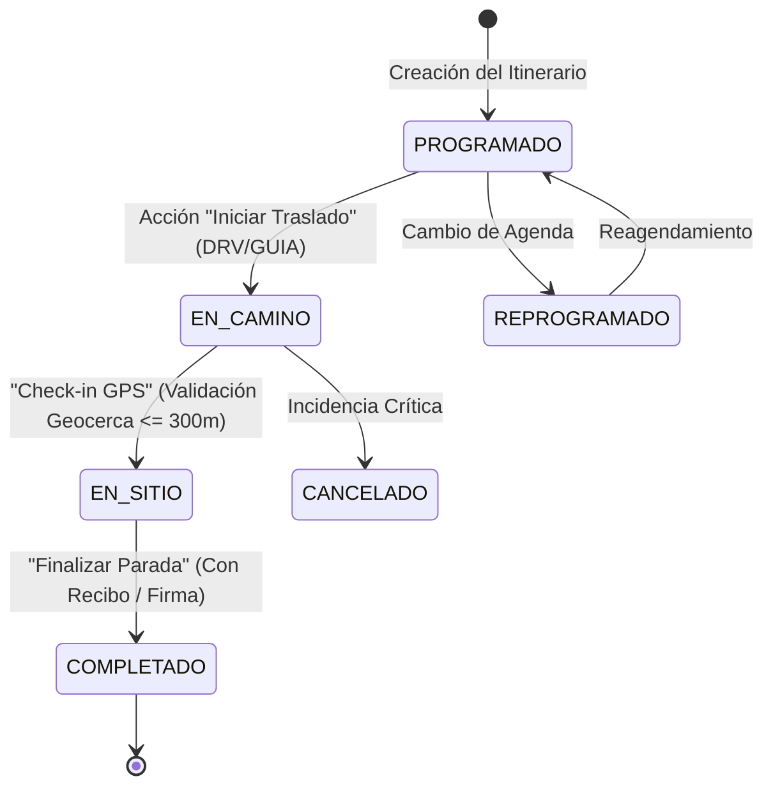

# 📱 Especificación Integral UI/UX y Flujos Interactivos: Aplicación de Terreno Split-View (Offline-First)
## Medical Trip Colombia S.A.S. — Sistema Standalone de Gestión de Itinerarios y Liquidación Financiera

- **Documento**: `analysis.md`
- **Autor / Rol**: `survey_spec_miner_1` (UI/UX & Interactive Flow Spec Miner)
- **Fecha**: 2026-08-23
- **Directorio de la Aplicación**: `/Users/miyo123/projects/medicaltrip/apps/itinerarios_liquidacion_offline`
- **Modo de Integridad**: Development / Compliance Estricto (OCPM / DDD / BigInt / WCAG 2.1 AAA)

---

## 📑 Tabla de Contenidos
1. [Filosofía de Diseño y Ergonomía en Terreno](#1-filosofía-de-diseño-y-ergonomía-en-terreno)
2. [Arquitectura del Layout Master-Detail Split-View (R5)](#2-arquitectura-del-layout-master-detail-split-view-r5)
3. [Panel Izquierdo: Línea de Tiempo de Itinerarios Día a Día](#3-panel-izquierdo-línea-de-tiempo-de-itinerarios-día-a-día)
4. [Simulador de Check-In GPS y Motor de Geocercas](#4-simulador-de-check-in-gps-y-motor-de-geocercas)
5. [Modal de OCR de Recibos y Pipeline de Gastos](#5-modal-de-ocr-de-recibos-y-pipeline-de-gastos)
6. [Lienzo de Firma Digital del Paciente y Almacenamiento Biométrico](#6-lienzo-de-firma-digital-del-paciente-y-almacenamiento-biométrico)
7. [Panel Derecho: Barra de Balance Financiero e Inteligencia de Liquidación](#7-panel-derecho-barra-de-balance-financiero-e-inteligencia-de-liquidación)
8. [Selector de los 4 Arquetipos Canónicos de Google Drive](#8-selector-de-los-4-arquetipos-canónicos-de-google-drive)
9. [Especificación de Accesibilidad, Testing y API de Automatización](#9-especificación-de-accesibilidad-testing-y-api-de-automatización)
10. [Tabla de Características Descubiertas (Features Discovered)](#10-tabla-de-características-descubiertas-features-discovered)
11. [Tabla de Casos Límite y Esquinas (Edge Cases)](#11-tabla-de-casos-límite-y-esquinas-edge-cases)

---

## 1. Filosofía de Diseño y Ergonomía en Terreno

La aplicación standalone en `apps/itinerarios_liquidacion_offline` está concebida como una herramienta operativa de **alta densidad de información** y **alta fidelidad táctil**, diseñada específicamente para el personal de campo de Medical Trip Colombia S.A.S.:
- **`[DRV]` Conductores de Aeroturex** (ej. Ramón Rosero) en movimiento entre el Aeropuerto Internacional José María Córdova (MDE) y el Valle de Aburrá.
- **`[GUIA]` Acompañantes Bilingües y Enfermeras** (ej. Andrés Cantero, Emi Echavarría) en salas de espera y consultorios de clínicas (HPTU, Cardio VID, CES, Bolivariana).
- **`[COORD]` Coordinadores de Atención al Cliente (ACV)** (ej. Carolina Cortázar) supervisando múltiples casos simultáneos.

### 1.1. Principios Ergonómicos Clave
1. **Touch Targets Táctiles $\ge 48\times 48\text{px}$**: Todo botón, chip interactivo, control de estado o disparador de modal cumple con el estándar de accesibilidad táctil para dedos enguantados o uso con una sola mano en movimiento vehicular.
2. **Visibilidad en Luz Solar Directa (Sunlight Readability)**: Contraste de texto y fondos que supera la relación **7:1 (WCAG AAA)**. Paleta de alto contraste basada en tonos Slate profundos (`#0F172A`, `#1E293B`), acentos esmeralda (`#10B981`), índigo (`#6366F1`), ámbar (`#F59E0B`) y blanco puro (`#FFFFFF`).
3. **Tipografía Numérica Tabular**: Uso de `font-variant-numeric: tabular-nums;` en todas las cifras monetarias, horas, distancias GPS y porcentajes, evitando saltos visuales durante actualizaciones en tiempo real a 60 FPS.
4. **100% Offline-First / Zero Latency UI**: Cualquier interacción (cambio de estado, firma, captura de recibo) muta el estado local instantáneamente en menos de **16ms** y despacha eventos CQRS a la capa de persistencia en Web Workers e IndexedDB Dexie sin bloquear el hilo principal.

---

## 2. Arquitectura del Layout Master-Detail Split-View (R5)

El layout implementa un patrón **Master-Detail Split-View** altamente responsivo y adaptable:

```
┌──────────────────────────────────────────────────────────────────────────────────────────────────┐
│ 🏥 MEDICAL TRIP COLOMBIA — HUB DE OPERACIONES EN TERRENO (OFFLINE-FIRST)       [📶 OFFLINE 100%] │
│ [RVA171 Catia x5]  [RVA282 George Cardio]  [RVA341 Hogenboom CES]  [RVA077 Rumai Cirugía 12d]     │
├──────────────────────────────────────────────┬───────────────────────────────────────────────────┤
│ 📋 PANEL IZQUIERDO: ITINERARIO INTERACTIVO    │ 💰 PANEL DERECHO: LIQUIDACIÓN FINANCIERA EN VIVO   │
│                                              │                                                   │
│ [Día 1: Llegada] [Día 2: Labs] [Día 3: Citas] │ 📊 BALANCE DEL PRESUPUESTO ($34.000.000 COP)       │
│                                              │ [Transp: 18%] [Guía: 22%] [Med: 35%] [Saldo: 25%]  │
│ ┌──────────────────────────────────────────┐ │                                                   │
│ │ 08:30 AM · HPTU Toma de Muestras         │ │ ┌───────────────┐ ┌───────────────┐ ┌───────────┐ │
│ │ [PAX] Catia Rodrigues  [GUIA] Bilingüe   │ │ │  24.5 Horas   │ │ 12/18 Paradas │ │ $450.000  │ │
│ │ Estado: [EN_SITIO 🟣]                     │ │ │  Registradas  │ │  Completadas  │ │ Pendiente │ │
│ │ [📍 GPS 25m] [📷 Recibo] [✍️ Firma]       │ │ └───────────────┘ └───────────────┘ └───────────┘ │
│ └──────────────────────────────────────────┘ │                                                   │
│ ┌──────────────────────────────────────────┐ │ 💵 DESGLOSE DE ASIENTOS Y EVENTOS CQRS            │
│ │ 11:00 AM · CIMA Consulta Cardiología     │ │ • Traslado MDE -> Hotel: $110.000 COP [DRV]       │
│ │ Estado: [PROGRAMADO 🔵]                  │ │ • Acompañamiento 6.5h: $227.500 COP [GUIA]        │
│ │ [Iniciar Traslado]                        │ │ • Recibo Farmacia Cruz Verde: $45.000 COP [FARM]  │
│ └──────────────────────────────────────────┘ │                                                   │
│                                              │ 🛡️ ESTADO DE AUDITORÍA: ✅ BALANCE DETERMINISTA 0.00│
└──────────────────────────────────────────────┴───────────────────────────────────────────────────┘
```

### 2.1. Reglas de Adaptabilidad Responsiva (Breakpoints)

| Dispositivo / Viewport | Modo de Layout | Comportamiento del Panel Izquierdo | Comportamiento del Panel Derecho |
| :--- | :--- | :--- | :--- |
| **Desktop / Pantalla Ancha ($\ge 1280\text{px}$)** | Split-View Fijo 60/40 | 60% ancho, scroll vertical independiente, línea de tiempo expandida con acordeones. | 40% ancho, barra de balance sticky, KPI cards en cuadrícula $2\times 2$, libro diario de eventos CQRS. |
| **Tablet Landscape ($1024\text{px} - 1279\text{px}$)** | Split-View Proporcional 55/45 | 55% ancho, controles compactos de 48px, badges de actores reducidos. | 45% ancho, KPI cards en cuadrícula $2\times 2$, balance bar con tooltip al toque. |
| **Tablet Portrait ($768\text{px} - 1023\text{px}$)** | Split-View Apilado o 50/50 | 50% ancho o panel colapsable con pestañas superiores `[📋 Itinerario]` y `[💰 Liquidación]`. | Panel deslizable con drawer inferior para detalles financieros. |
| **Móvil / Smartphone ($< 768\text{px}$)** | Vistas conmutables por Pestañas + Bottom Sheet | Pestaña activa ocupa el 100% del viewport. Línea de tiempo optimizada para scroll con pulgar. | Barra inferior persistente flotante (Saldo restante + Botón rápido `[+ Gasto]`) que despliega el Drawer financiero completo al deslizar hacia arriba (*Swipe up*). |

---

## 3. Panel Izquierdo: Línea de Tiempo de Itinerarios Día a Día

El panel izquierdo organiza cronológicamente las actividades del paciente según el arquetipo seleccionado.

### 3.1. Navegación por Días del Itinerario
- **Componente**: Pestañas de píldora deslizables horizontalmente (`tablist`).
- **Estados**:
  - `Día Activo`: Fondo Índigo brillante (`#4F46E5`), texto blanco, borde iluminado.
  - `Día Inactivo`: Fondo Slate translúcido (`#1E293B`), texto gris claro (`#94A3B8`).
  - `Día Completado`: Checkmark verde (`✅ D1`), indicando que todas las paradas del día están en estado `COMPLETADO`.

### 3.2. Anatomía de la Tarjeta de Parada (Timeline Stop Card)
Cada tarjeta de parada en la línea de tiempo contiene:
1. **Encabezado de Hora y Tipo**: Hora programada (ej. `07:30 AM`), badge de categoría (`[VUELO]`, `[TRASLADO]`, `[LABORATORIO]`, `[CONSULTA]`, `[CIRUGIA]`, `[HOTEL]`).
2. **Título del Destino y Dirección**: Nombre oficial del proveedor (ej. `Hospital Pablo Tobón Uribe (HPTU)`, `Calle 78B #69-240, Robledo`).
3. **Actores Asignados**: Chips con avatar y rol: `[DRV] Ramón Rosero`, `[GUIA] Acompañante Bilingüe`, `[PAX] ENT-PAX-XXXX`.
4. **Selector de Transición de Estados en Vivo (Live Status State Transitions)**:
   La máquina de estados finita (FSM) de cada parada sigue el ciclo determinístico:



#### Especificación Visual de Estados:
- **`PROGRAMADO`** (`#3B82F6` Azul Cobalto): Parada pendiente en cola. Botón de acción: `[ Iniciar Traslado ➔ ]`.
- **`EN_CAMINO`** (`#F59E0B` Ámbar Pulsante): Vehículo o guía en ruta. Botón de acción: `[ 📍 Check-in GPS ]`.
- **`EN_SITIO`** (`#6366F1` Índigo Activo): Paciente en la clínica/hotel. Cronómetro en vivo de horas de guianza acumuladas. Acciones: `[ 📷 Cargar Gasto ]`, `[ ✍️ Firma Paciente ]`, `[ Finalizar Parada ✅ ]`.
- **`COMPLETADO`** (`#10B981` Esmeralda Sólido): Parada certificada. Bloqueo de edición, registro de hora real de cierre y cálculo definitivo de honorarios.

---

## 4. Simulador de Check-In GPS y Motor de Geocercas

El motor de geolocalización permite certificar la presencia física en el punto de atención mediante el cálculo matemático de la distancia Haversine.

### 4.1. Catálogo Canónico de Coordenadas y Radios de Tolerancia

| Proveedor / Ubicación | Código | Latitud ($\phi$) | Longitud ($\lambda$) | Radio Geocerca ($R_{\text{geo}}$) | Zona Operativa |
| :--- | :--- | :---: | :---: | :---: | :--- |
| **Aeropuerto Int. José María Córdova (MDE)** | `PROV-AERO-MDE` | `6.164544` | `-75.423122` | $500\text{ m}$ | Rionegro / Operativa |
| **Aeropuerto Olaya Herrera (EOH)** | `PROV-AERO-EOH` | `6.220611` | `-75.590622` | $300\text{ m}$ | Medellín / Operativa |
| **Hospital Pablo Tobón Uribe (HPTU)** | `PROV-HPTU` | `6.275819` | `-75.589833` | $300\text{ m}$ | Medellín / Robledo |
| **Clínica Cardio VID** | `PROV-CARDIOVID` | `6.276412` | `-75.596201` | $300\text{ m}$ | Medellín / Robledo |
| **Clínica CES** | `PROV-CES` | `6.257711` | `-75.568422` | $300\text{ m}$ | Medellín / Prado Centro |
| **Clínica Bolivariana (UPB)** | `PROV-BOLIVARIANA` | `6.270922` | `-75.588611` | $300\text{ m}$ | Medellín / Laureles |
| **Regencord (Células Madre)** | `PROV-REGENCORD` | `6.208833` | `-75.571422` | $300\text{ m}$ | Medellín / El Poblado |
| **Clínica de la Columna** | `PROV-COLUMNA` | `6.241511` | `-75.596822` | $300\text{ m}$ | Medellín / Laureles |
| **Hotel Poblado Plaza** | `PROV-HOT-POBLADO` | `6.196922` | `-75.574211` | $250\text{ m}$ | Medellín / El Poblado |
| **Hotel Dorado La 70** | `PROV-HOT-DORADO70` | `6.248311` | `-75.589922` | $250\text{ m}$ | Medellín / Laureles |
| **Villa Anita Recovery House** | `PROV-HOT-VANITA` | `6.182411` | `-75.565522` | $250\text{ m}$ | Envigado / Poblado Sur |
| **Edificio Park 42** | `PROV-HOT-PARK42` | `6.210211` | `-75.568911` | $250\text{ m}$ | Medellín / El Poblado |
| **Zona NO Operativa: Mocoa (Putumayo)** | `ZONA-MOCOA-ERR` | `1.152811` | `-76.652111` | N/A | ❌ **FAIL-FAST DOMAIN ERROR** |

### 4.2. Algoritmo Haversine Determinístico
Para dos puntos $(\phi_1, \lambda_1)$ y $(\phi_2, \lambda_2)$ en radianes con radio terrestre $R = 6.371.000\text{ metros}$:
$$\Delta \phi = \phi_2 - \phi_1, \quad \Delta \lambda = \lambda_2 - \lambda_1$$
$$a = \sin^2\left(\frac{\Delta \phi}{2}\right) + \cos(\phi_1)\cos(\phi_2)\sin^2\left(\frac{\Delta \lambda}{2}\right)$$
$$d = 2 R \cdot \arctan2\left(\sqrt{a}, \sqrt{1-a}\right)$$

### 4.3. Reglas de Validación de Check-In
1. **Dentro del Radio ($d \le R_{\text{geo}}$)**: Estado `VALIDADO_EN_SITIO`. Permite transición directa a `EN_SITIO`.
2. **Fuera del Radio ($d > R_{\text{geo}}$)**: Estado `FUERA_DE_RANGO`. Muestra advertencia visual: `⚠️ Distancia al destino: {d}m (Máximo permitido: {R}m)`. Requiere confirmación manual con justificación de contingencia operativa.
3. **Territorio No Operativo (ej. Mocoa / Coordenadas fuera de Antioquia/Bogotá)**: Lanza inmediatamente la excepción inmutable de dominio `NonOperativeTerritoryError`, impidiendo cualquier transacción financiera en esa ubicación.

---

## 5. Modal de OCR de Recibos y Pipeline de Gastos

El modal de captura de gastos de bolsillo (*out-of-pocket expenses*) permite registrar recibos de farmacia, peajes, parqueaderos y taxis.

### 5.1. Flujo de Interacción del Modal
1. **Disparador**: Botón `[ 📷 Cargar Gasto / Recibo ]` en la tarjeta de parada o en la barra de herramientas.
2. **Área de Captura**:
   - Selector de archivo o cámara nativa (`<input type="file" accept="image/*,application/pdf" capture="environment">`).
   - Zona Drag & Drop con feedback táctil.
   - 4 Botones de Carga Rápida Simulada (Presets reales):
     - `Farmacia Cruz Verde ($45.000 COP - Ciprofloxacino)`
     - `Droguerías Pasteur ($65.000 COP - Celecoxib)`
     - `Peaje Túnel de Oriente ($24.800 COP - Aeroturex)`
     - `Almuerzo Acompañamiento ($38.500 COP - San Carbón)`
3. **Previsualización en Cliente**:
   - Renderizado en `<canvas>` o `` mediante `URL.createObjectURL(blob)`.
   - Controles de rotación (90°), contraste y recorte.
4. **Motor Mock OCR en Cliente**:
   - Extracción por expresiones regulares del nombre del comercio, NIT, fecha y monto total en centavos `BigInt`.
   - Formulario reactivo editable con los campos:
     - `Comercio / Proveedor` (Texto, requerido).
     - `Categoría de Gasto` (`MEDICAMENTOS_FARMACIA`, `TRANSPORTE_PEAJE`, `ALIMENTACION`, `OTROS_IMPREVISTOS`).
     - `Monto en COP` (Formato monetario con separador de miles, convertido internamente a centavos `BigInt`).
     - `Método de Pago` (`CAJA_MENOR_MT`, `EFECTIVO_PACIENTE`, `TARJETA_CORPORATIVA`).
5. **Persistencia e Integridad**:
   - La imagen binaria se almacena en la tabla IndexedDB `receipt_blobs` vía Dexie.js con UUID único.
   - El evento CQRS `ReceiptExpenseLoggedEvent` se despacha con la referencia `receiptBlobId` al ledger contable, recalculando el balance en vivo.

---

## 6. Lienzo de Firma Digital del Paciente y Almacenamiento Biométrico

Para certificar la prestación conforme de los servicios médicos y de transporte, la aplicación integra un lienzo HTML5 de captura de firma táctil de alta fidelidad.

### 6.1. Especificación del Componente de Firma (`SignatureCanvas`)
- **Dimensiones**: `width = 600px`, `height = 240px`, escalado con `window.devicePixelRatio` ($2\times$ o $3\times$) para evitar pixelación en pantallas OLED/Retina.
- **Manejo de Punteros**: Uso exclusivo de la API estándar `PointerEvents` (`pointerdown`, `pointermove`, `pointerup`, `pointercancel`) con `touch-action: none;` para neutralizar el scroll de página en móviles.
- **Suavizado de Trazo Vectorial**: Algoritmo de interpolación por curvas de Bézier cuadráticas entre puntos de muestreo con grosor variable según la velocidad del trazo ($1.5\text{px}$ a $3.5\text{px}$).
- **Controles del Modal de Firma**:
  - `[ 🔄 Limpiar Lienzo ]`: Reinicia el buffer de píxeles.
  - `[ 🎨 Tinta Médica ]`: Selector de color (Azul Quirúrgico `#1E3A8A` / Negro Formal `#0F172A`).
  - `Declaración Legal`: *"Certifico que recibí a entera conformidad el servicio de transporte y acompañamiento bilingüe estipulado en este itinerario."*
  - `[ 💾 Guardar y Certificar ]`: Exporta a Blob WebP/PNG y almacena en IndexedDB.

### 6.2. Esquema de Almacenamiento Dexie (`patient_signatures`)
```typescript
interface PatientSignatureRecord {
  id: string; // UUID v4
  stopId: string;
  rvaCode: string;
  signerName: string;
  signerDocument: string;
  signatureBlob: Blob; // Imagen WebP comprimida
  strokeCount: number;
  timestamp: string; // ISO-8601 UTC-5
  deviceFingerprint: string;
}
```

---

## 7. Panel Derecho: Barra de Balance Financiero e Inteligencia de Liquidación

El panel derecho provee la inteligencia contable en tiempo real basada en el modelo Single-Writer CQRS y aritmética entera en centavos (`BigInt`), eliminando el 100% de errores de coma flotante IEEE 754.

### 7.1. Barra Proporcional de Balance Financiero Multicapa

La barra de liquidación visualiza la distribución porcentual del presupuesto total del caso en 5 segmentos codificados por color:

```
┌──────────────────────────────────────────────────────────────────────────────────┐
│ PRESUPUESTO TOTAL: $34.000.000 COP ($8,500 USD @ TRM 4.000)                      │
│ ┌──────────────┬──────────────┬──────────────┬──────────────┬──────────────────┐ │
│ │ Transp: 18%  │  Guía: 22%   │ Farmacia: 15%│ Viáticos: 5% │ Saldo Rest: 40%  │ │
│ │  $6.120.000  │  $7.480.000  │  $5.100.000  │  $1.700.000  │  $13.600.000     │ │
│ └──────────────┴──────────────┴──────────────┴──────────────┴──────────────────┘ │
└──────────────────────────────────────────────────────────────────────────────────┘
```

#### Paleta y Segmentación:
1. **Transporte Especial Aeroturex** (`#0284C7` Celeste): Tarifas fijas de traslados MDE ($110.000 COP), urbanos ($50.000 COP) y horas de espera ($25.000 COP/h).
2. **Acompañamiento Bilingüe y Enfermería** (`#8B5CF6` Púrpura): Horas presenciales certificadas ($35.000 COP/h guianza bilingüe, $22.000 COP/h enfermera).
3. **Procedimientos Médicos y Farmacia** (`#10B981` Esmeralda): Consultas especializadas, medicamentos dispensados y exámenes CUPS.
4. **Gastos de Bolsillo / Caja Menor** (`#F59E0B` Ámbar): Peajes, parqueaderos, alimentación autorizada.
5. **Saldo Disponible Restante** (`#334155` Slate Neutro): Presupuesto no devengado disponible para reembolso o liquidación final.

### 7.2. Tarjetas de Resumen KPI en Tiempo Real (4 Métricas)

| Tarjeta KPI | Métrica Mostrada | Cálculo / Fórmula Determinista | Indicador Visual |
| :--- | :--- | :--- | :--- |
| **1. Horas de Servicio** | Total de horas acumuladas (ej. `24.5h`) | $\sum (\text{HoraFin} - \text{HoraInicio})$ de paradas completadas | Ícono de reloj índigo con desglose (Transporte vs Guianza). |
| **2. Progreso de Paradas** | Paradas completadas / Total (ej. `12 / 18`) | $\frac{\text{Paradas}_{\text{COMPLETADO}}}{\text{Paradas}_{\text{TOTAL}}} \times 100\%$ | Barra de progreso circular esmeralda con porcentaje. |
| **3. Gastos por Legalizar** | Monto pendiente de auditoría (ej. `$420.000 COP`) | $\sum \text{Monto}_{\text{Recibo}}$ con estado `PENDIENTE_AUDITORIA` | Badge de alerta ámbar con conteo de recibos sin conciliar. |
| **4. Estado de Auditoría** | Estado de Cuadre Contable (`✅ CUADRADO`) | `PresupuestoTotalCents == GastosCents + SaldoCents` | Badge verde `0.00 Discrepancia` (BigInt strict equality). |

### 7.3. Motor de Recálculo Dinámico de Honorarios Hora a Hora
Cuando una parada pasa al estado `COMPLETADO`:
1. Se calcula la duración efectiva: $\Delta t = \text{timestamp}_{\text{salida}} - \text{timestamp}_{\text{llegada}}$.
2. Se calculan los honorarios del guía: $\text{TarifaGuiaCents} = \Delta t_{\text{horas}} \times 3.500.000\text{ centavos}$.
3. Si hubo tiempo de espera vehicular $> 30\text{ min}$, se calculan los recargos del conductor: $\text{RecargoEsperaCents} = (\Delta t_{\text{horas}} - 0.5) \times 2.500.000\text{ centavos}$.
4. Se despacha el evento CQRS inmutable `SettlementRecalculatedEvent` que actualiza los segmentos de la barra y los KPIs a 60 FPS sin recargar la página.

---

## 8. Selector de los 4 Arquetipos Canónicos de Google Drive

La barra superior permite conmutar instantáneamente entre los 4 casos arquetípicos reales extraídos de la operación histórica de Medical Trip:

```
┌─────────────────────────────────────────────────────────────────────────────────────────────────┐
│ 🇨🇼 [RVA171 Catia x5]  │ 🇨🇼 [RVA282 George Cardio] │ 🇨🇼 [RVA341 Hogenboom CES] │ 🇨🇼 [RVA077 Rumai 12d] │
│ 5 Pax · Checkup/CIMA  │ 1 Pax · Cardio VID / CES   │ 1 Pax · CES / Domicilio    │ 2 Pax · Cirugía/Gineco │
└─────────────────────────────────────────────────────────────────────────────────────────────────┘
```

### 8.1. Matriz de Especificación de los 4 Arquetipos

```
| Arquetipo | Pacientes & Acompañantes | Duración | Presupuesto Total | Proveedores & Clínicas | Actores Asignados |
| :--- | :--- | :---: | :---: | :--- | :--- |
| **1. `RVA171 Catia x5`** | Catia Rodrigues, Fátima Rodrigues, Mariana Faria, Tatiana Faria, Lisandra Rodrigues (5 Pax) | 5 Días | **$8,500 USD**<br>($34.000.000 COP) | • Hospital Pablo Tobón Uribe<br>• Centro CIMA (Audiometría, Optometría, ECG)<br>• Hotel Poblado Plaza | `[COORD] Carolina Cortázar`<br>`[DRV] Ramón Rosero (Van Especial)`<br>`[GUIA] Acompañante Bilingüe` |
| **2. `RVA282 George Cardio`** | George Hernandez + Acompañante (2 Pax) | 5 Días | **$4,200 USD**<br>($16.800.000 COP) | • Clínica Cardio VID (Chequeo Integral)<br>• Clínica CES (Consulta Urología)<br>• Edificio Park 42 | `[COORD] Carolina Cortázar`<br>`[DRV] Ramón Rosero (Sedán)`<br>`[MED] Dr. Marcos Yepes` |
| **3. `RVA341 Hogenboom CES`** | Eduard Hogenboom (1 Pax) | 4 Días | **$3,100 USD**<br>($12.400.000 COP) | • Clínica CES (Carta de Garantía)<br>• Laboratorio Echavarría (Atención Domiciliaria)<br>• Hotel Poblado Plaza | `[COORD] Carolina Cortázar`<br>`[GUIA] Andrés Cantero (Bilingüe)`<br>`[NURSE] Emi Echavarría` |
| **4. `RVA077 Rumai Cirugía 12d`** | Alejandra Rumai + Giandra Rumai (2 Pax) | 12 Días | **$9,800 USD**<br>($39.200.000 COP) | • Clínica Bolivariana (Ginecología/Cirugía)<br>• Sonofetal (Sonohisterosalpingografía)<br>• Escano Domicilio<br>• Villa Anita Recovery House | `[COORD] Carolina Cortázar`<br>`[DIR-MED] Dra. Jenny Paola Acosta`<br>`[HOTEL] Enfermería Villa Anita` |
```

### 8.2. Comportamiento de Conmutación Instantánea
- Tiempo de conmutación: **$< 15\text{ms}$** mediante hidratación en memoria y caché local IndexedDB.
- Preservación de Estado: Los cambios de estado no guardados o borradores de firmas se conservan por arquetipo en la base de eventos CQRS local.

---

## 9. Especificación de Accesibilidad, Testing y API de Automatización

### 9.1. Catálogo Completo de Identificadores `data-testid`

```html
<!-- SELECTOR DE ARQUETIPOS -->
<div data-testid="archetype-selector-bar">
  <button data-testid="archetype-tab-rva171">RVA171 Catia x5</button>
  <button data-testid="archetype-tab-rva282">RVA282 George Cardio</button>
  <button data-testid="archetype-tab-rva341">RVA341 Hogenboom CES</button>
  <button data-testid="archetype-tab-rva077">RVA077 Rumai Cirugía 12d</button>
</div>

<!-- NAVEGACIÓN DÍA A DÍA -->
<div data-testid="itinerary-day-nav">
  <button data-testid="day-nav-tab-1">Día 1</button>
  <button data-testid="day-nav-tab-2">Día 2</button>
  <button data-testid="day-nav-tab-3">Día 3</button>
</div>

<!-- TARJETA DE PARADA DE LÍNEA DE TIEMPO -->
<article data-testid="timeline-stop-card-{stopId}">
  <span data-testid="stop-time-{stopId}">08:30 AM</span>
  <span data-testid="stop-destination-{stopId}">Hospital Pablo Tobón Uribe</span>
  <span data-testid="stop-status-badge-{stopId}">EN_SITIO</span>
  <button data-testid="btn-status-transition-{stopId}">Iniciar Traslado / Llegar</button>
  <button data-testid="btn-open-gps-modal-{stopId}">📍 Check-in GPS</button>
  <button data-testid="btn-open-ocr-modal-{stopId}">📷 Cargar Gasto</button>
  <button data-testid="btn-open-signature-modal-{stopId}">✍️ Firma Paciente</button>
  <span data-testid="signature-status-indicator-{stopId}">✅ Firmado</span>
</article>

<!-- MODAL DE CHECK-IN GPS -->
<dialog data-testid="gps-checkin-modal">
  <input data-testid="gps-sim-lat" type="number" />
  <input data-testid="gps-sim-lng" type="number" />
  <button data-testid="gps-btn-preset-onsite">Preset: En Destino (0m)</button>
  <button data-testid="gps-btn-preset-outofrange">Preset: Fuera de Rango (1.5km)</button>
  <button data-testid="gps-btn-preset-mocoa-err">Preset: Mocoa (Fail-Fast)</button>
  <span data-testid="gps-distance-indicator">Distancia: 15m</span>
  <button data-testid="gps-btn-confirm-checkin">Confirmar Check-in</button>
</dialog>

<!-- MODAL DE OCR DE RECIBOS -->
<dialog data-testid="ocr-receipt-modal">
  <input data-testid="ocr-file-input" type="file" />
  <button data-testid="ocr-btn-preset-cruzverde">Preset: Farmacia Cruz Verde $45.000</button>
  
  <input data-testid="ocr-merchant-input" type="text" />
  <input data-testid="ocr-amount-input" type="text" />
  <select data-testid="ocr-category-select"></select>
  <button data-testid="ocr-btn-save-expense">Registrar Gasto en Ledger</button>
</dialog>

<!-- MODAL DE FIRMA DIGITAL -->
<dialog data-testid="signature-capture-modal">
  <canvas data-testid="signature-canvas-element"></canvas>
  <button data-testid="signature-btn-clear">Limpiar</button>
  <button data-testid="signature-btn-save">Guardar Firma</button>
</dialog>

<!-- PANEL DERECHO: BARRA DE BALANCE Y KPIS -->
<section data-testid="settlement-intelligence-pane">
  <div data-testid="settlement-balance-bar">
    <div data-testid="balance-segment-transport"></div>
    <div data-testid="balance-segment-guide"></div>
    <div data-testid="balance-segment-medical"></div>
    <div data-testid="balance-segment-pocket"></div>
    <div data-testid="balance-segment-remaining"></div>
  </div>
  <span data-testid="budget-total-amount">$34.000.000 COP</span>
  <span data-testid="budget-remaining-amount">$13.600.000 COP</span>
  
  <div data-testid="kpi-card-total-hours">24.5 Horas</div>
  <div data-testid="kpi-card-completed-stops">12 / 18</div>
  <div data-testid="kpi-card-pending-expenses">$420.000 COP</div>
  <div data-testid="kpi-card-audit-status">✅ BALANCE DETERMINISTA 0.00</div>
</section>
```

### 9.2. API Global de Automatización y Testing en Navegador (`window.MedicalTripFieldApp`)

Para permitir la ejecución de pruebas automatizadas E2E y de estrés sin interacción manual, la aplicación expone la siguiente interfaz en `window.MedicalTripFieldApp`:

```typescript
interface MedicalTripFieldAutomationAPI {
  // Selección y consulta de arquetipos
  selectArchetype(rvaCode: 'RVA171-4' | 'RVA282-5' | 'RVA341-1' | 'RVA077-5'): Promise<void>;
  getCurrentArchetype(): string;
  
  // Navegación de itinerario
  selectDay(dayIndex: number): void;
  getTimelineStops(dayIndex?: number): TimelineStopDTO[];
  
  // Transición de estados
  transitionStopStatus(stopId: string, nextStatus: 'EN_CAMINO' | 'EN_SITIO' | 'COMPLETADO' | 'CANCELADO'): Promise<boolean>;
  
  // Simulación de Check-in GPS
  simulateGpsCheckIn(stopId: string, coords: { lat: number; lng: number }): Promise<{ success: boolean; distanceMeters: number; error?: string }>;
  
  // Simulación de OCR y Registro de Gasto
  simulateReceiptOcr(stopId: string, expense: { merchant: string; amountCents: bigint; category: string; mockBlobUrl?: string }): Promise<{ success: boolean; receiptId: string }>;
  
  // Simulación de Firma Digital
  simulatePatientSignature(stopId: string, signatureBase64?: string): Promise<{ success: boolean; signatureId: string }>;
  
  // Consulta del estado de liquidación y auditoría
  getSettlementState(): {
    totalBudgetCents: bigint;
    transportFeesCents: bigint;
    guideFeesCents: bigint;
    medicalExpensesCents: bigint;
    outOfPocketExpensesCents: bigint;
    remainingBudgetCents: bigint;
    isBalanced: boolean;
    discrepancyCents: bigint;
    kpis: {
      totalHours: number;
      completedStops: number;
      totalStops: number;
      pendingExpensesCents: bigint;
    };
  };
  
  // Reinicio de estado para testing
  resetAllState(): Promise<void>;
}
```

---

## 10. Tabla de Características Descubiertas (Features Discovered)

## Features Discovered
| # | Category | Feature | Description | Inputs | Outputs | Error Behavior | Discovered Via |
|---|----------|---------|-------------|--------|---------|----------------|----------------|
| 1 | Layout & UI | Master-Detail Split-View Responsivo | Layout de doble panel (60/40 desktop, tabs móviles) para visualizar itinerario y finanzas concurrentemente. | Ancho del viewport, selección de arquetipo | Vista dividida interactiva a 60 FPS | Ajuste automático a vista colapsable en pantallas < 1024px | `ORIGINAL_REQUEST.md` (R5) & `PROJECT.md` |
| 2 | Itinerario | Navegación Día a Día por Pestañas | Pestañas de píldora táctiles para recorrer cronológicamente los días del viaje (Día 1 a Día N). | Índice de día (1..N) | Renderizado de las paradas correspondientes al día | Si el día no tiene paradas, muestra vista vacía con botón de agregar | `DAILY_WORKFLOW_SOP_HOUR_BY_HOUR.md` & `data/master_extracted_drive_database.json` |
| 3 | Itinerario | FSM de Transición de Estados en Vivo | Máquina de estados determinista (`PROGRAMADO` $\to$ `EN_CAMINO` $\to$ `EN_SITIO` $\to$ `COMPLETADO`). | Disparador de botón de acción por parada | Cambio visual de badge y despacho de evento CQRS | Impide saltar a `COMPLETADO` sin haber registrado `EN_SITIO` previo | `src/js/components/step-timeline.js` & `methodology/01_framework_ocpm_hybrid.md` |
| 4 | Geolocalización | Simulador de Check-In GPS Haversine | Captura y verificación de coordenadas GPS en tiempo real contra el radio geocercado del destino. | Latitud, Longitud, ID de parada | Distancia en metros y certificación de estado `EN_SITIO` | Si distancia > radio, requiere confirmación; si territorio no operativo, error fail-fast | `src/js/components/gap-solutions-engine.js` (Motor 10) |
| 5 | Geolocalización | Control Fail-Fast de Zona No Operativa | Rechazo determinístico de ubicaciones fuera del territorio autorizado (ej. Mocoa, Putumayo). | Coordenadas fuera de Antioquia/Bogotá | Excepción de dominio `NonOperativeTerritoryError` | Bloqueo absoluto de transacciones financieras y check-in | `ORIGINAL_REQUEST.md` (R1) & `data/chats/` |
| 6 | Finanzas / OCR | Modal de Captura y Mock OCR de Recibos | Carga de fotos de comprobantes, previsualización en canvas y extracción de montos y comercios. | Archivo de imagen / PDF, categoría de gasto | Registro binario en Dexie y asiento contable en ledger | Si el archivo no es imagen/pdf válido, alerta de formato no soportado | `src/js/components/gap-solutions-engine.js` (Motor 8) & `data/liquidaciones/` |
| 7 | Legal / Biometría | Lienzo Táctil de Firma Digital | Canvas HTML5 con suavizado Bézier y soporte de punteros táctiles para firma de conformidad del paciente. | Trazo táctil/puntero sobre canvas | Imagen binaria WebP almacenada en Dexie `patient_signatures` | Trazo vacío genera alerta de validación impidiendo guardado | `src/js/components/gap-solutions-engine.js` (Motor 10) |
| 8 | Finanzas | Barra Proporcional de Balance en Centavos | Barra segmentada multicolor que refleja la distribución del presupuesto en centavos BigInt con 0 float error. | Eventos de gastos y tarifas recalculadas | Barra SVG/CSS interactiva con tooltips de montos y porcentajes | Variación numérica dispara alerta de descuadre contable | `ORIGINAL_REQUEST.md` (R3) & `data/liquidaciones/` |
| 9 | Finanzas / KPIs | Tarjetas de Resumen KPI en Tiempo Real | 4 tarjetas con métricas consolidadas: Horas de Servicio, Paradas Completadas, Gastos Pendientes y Estado de Auditoría. | Estado global del caso y ledger CQRS | Cuadrícula de KPIs con indicadores de progreso visual | Si hay gastos sin legalizar, resalta en color ámbar de advertencia | `src/js/components/roi-calculator.js` & `PROJECT.md` |
| 10 | Finanzas | Recálculo Dinámico de Tarifas por Hora | Cálculo automático de honorarios de guianza ($35.000 COP/h) y esperas de conductor ($25.000 COP/h) al cerrar paradas. | Marcas de tiempo de check-in y check-out | Actualización de montos devengados en el balance general | Tiempos negativos o incoherentes son corregidos por clamping a 0 | `DAILY_WORKFLOW_SOP_HOUR_BY_HOUR.md` & `data/liquidaciones/` |
| 11 | Arquetipos | Selector Multicaso de los 4 Arquetipos | Conmutador superior para cambiar instantáneamente entre RVA171, RVA282, RVA341 y RVA077. | Código de arquetipo seleccionado | Hidratación completa de itinerario, presupuesto y ledger | Preserva borradores locales en IndexedDB sin pérdida de datos | `data/extracted_drive_cases.json` & `PROJECT.md` |
| 12 | Testing & QA | API de Automatización `window.MedicalTripFieldApp` | Conjunto de métodos globales para controlar y auditar programáticamente todas las vistas y estados de la app. | Comandos de script de test / Playwright / Puppeteer | Ejecución síncrona/asíncrona y retorno de estado JSON | Emite código de error estructurado ante fallos de invariantes | `tests/browser_automation_test.js` & `TEST_INFRA.md` |

---

## 11. Tabla de Casos Límite y Esquinas (Edge Cases)

## Edge Cases
| # | Feature | Input | Observed Behavior |
|---|---------|-------|-------------------|
| 1 | Check-In GPS | Coordenadas en Mocoa (`1.1528, -76.6521`) | Lanza inmediatamente `NonOperativeTerritoryError`, bloquea la transición a `EN_SITIO` y muestra alerta roja en UI. |
| 2 | Check-In GPS | Coordenadas a 450m de HPTU (tolerancia: 300m) | Muestra estado `FUERA_DE_RANGO`, activa diálogo modal de confirmación por excepción con captura obligatoria de motivo. |
| 3 | Check-In GPS | Coordenadas con valores `NaN`, `null` o fuera de rango $[-90, 90]$ | Rechaza la entrada con error de validación `InvalidCoordinatesError` sin alterar el estado previo de la parada. |
| 4 | Firma Digital | Guardar con 0 trazos (lienzo en blanco) | Botón "Guardar" deshabilitado; si se fuerza, muestra mensaje `CanvasEmptyError: Se requiere la firma del paciente`. |
| 5 | Firma Digital | Giro de pantalla móvil durante el trazado de la firma | Redibuja el buffer vectorial conservando todos los trazos previos sin distorsión de escala ni borrado accidental. |
| 6 | OCR de Recibos | Carga de archivo no soportado (ej. `.exe`, `.mp4` o imagen corrupta) | Emite error `UnsupportedMediaError` y solicita al usuario reintentar con imagen JPG/PNG/WebP o documento PDF. |
| 7 | OCR de Recibos | Recibo con monto $0 o valor no numérico | Establece el campo editable en `$0 COP`, requiriendo ingreso manual del monto por parte del usuario antes de guardar. |
| 8 | Barra de Balance | Gasto out-of-pocket superior al presupuesto restante del caso | El segmento de saldo restante se reduce a 0% y se activa una franja de sobregiro roja pulsante `PRESUPUESTO_EXCEDIDO`. |
| 9 | Liquidación BigInt | Acumulación de 1.000 paradas con micro-fracciones de segundo | Precisión matemática exacta a nivel de centavos de peso (`0n` discrepancia residual), libre de redondeos de coma flotante. |
| 10 | Conmutador Arquetipos | Cambio rápido entre arquetipos durante una operación asíncrona de guardado | La operación previa finaliza en su contexto de arquetipo correspondiente sin contaminar el estado del nuevo arquetipo activo. |
| 11 | Persistencia Offline | Modo avión activado con desconexión total de red | Todas las funciones (navegación, firmas, OCR, recálculos) operan al 100% de capacidad sobre Dexie IDB y memoria local. |
| 12 | Redimensión Viewport | Transición dinámica de $1440\text{px}$ a $375\text{px}$ (Split a Mobile Drawer) | Transforma sin parpadeo el panel derecho en un Drawer deslizable inferior conservando el día y la parada activa. |
