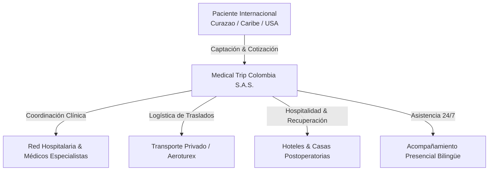
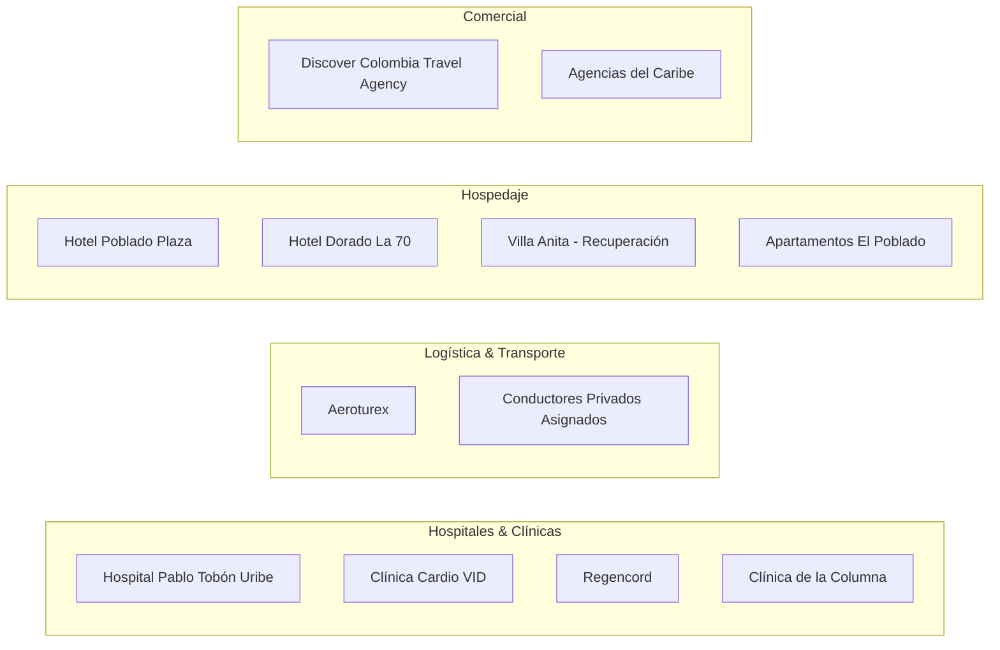

# 🇨🇴 Dossier Maestro de Negocio: MEDICAL TRIP COLOMBIA S.A.S.
> **Extracción Integral de Inteligencia Operativa, Base de Datos y Modelo de Negocio (4 Años de Operación)**

---

## 1. 🏢 Ficha Técnica e Identidad Corporativa

* **Razón Social**: MEDICAL TRIP COLOMBIA S.A.S.
* **Sector / Industria**: Turismo Médico, Turismo de Salud y Bienestar Internacional (*Medical Tourism Facilitator*).
* **Propósito Central**: Conectar y gestionar integralmente la experiencia de pacientes internacionales (principalmente del Caribe: Curazao, Surinam, Aruba, y EE.UU.) con la infraestructura médica de alta calidad en Colombia (Medellín, Bogotá, Rionegro), combinando servicios clínicos especializados con logística de hospitalidad 360°.
* **Años en Operación**: 4 años continuos.
* **Ubicación Base Operativa**: Medellín / Rionegro (Antioquia) y Bogotá D.C., Colombia.
* **Entidades Bancarias Operativas**: Bancolombia (Cuentas corrientes/ahorros empresariales para recepción de transferencias internacionales y pagos locales).



---

## 2. 👥 Estructura del Equipo y Roles Identificados

A partir del análisis de los historiales de chats, actas societarias y registros contables, se identifican los siguientes roles clave:

| Rol / Cargo | Nombre / Identificador | Responsabilidades Operativas |
| :--- | :--- | :--- |
| **[DIR-MED] Dirección General / Médica** | **[DIR-MED] Jenny Paola Acosta** | Representación legal, convenios institucionales con clínicas, supervisión de historias médicas y aprobación de cotizaciones complejas. |
| **[COORD] Atención al Cliente y Coordinación (ACV)** | **[COORD] Carolina Cortázar** (`@MedicaltripACV`) | Punto de contacto directo con pacientes por WhatsApp, coordinación en tiempo real de agendas médicas, enlace con conductores (Aeroturex), asignación de vehículos y resolución de incidencias. |
| **[COM-INT] Comercial & Alianzas Internacionales** | **[COM-INT] Blanca Gilma Corrales** | Gestión de agencias emisoras aliadas (ej. *Discover Colombia Travel Agency*), captación en Curazao y el Caribe, portafolios y catálogos. |
| **[MED] Médico Asesor Bilingüe / General** | **[MED] Dr. Marcos Yepes** | Valoraciones médicas iniciales, órdenes de laboratorio, resúmenes de atención médica en inglés/español y seguimiento de evoluciones. |
| **[GUIA] Equipo de Acompañamiento Presencial** | **[GUIA] Asistentes / Enfermería** (*Guianza Express*) | Acompañamiento físico del paciente a citas, traducciones en consultorio, compra de medicamentos y asistencia postoperatoria. |
| **[DRV] Logística y Transporte** | **[DRV] Aeroturex** (ej. [DRV] Ramón Rosero, Auxiliares) | Recogidas en aeropuerto (MDE / JMC / BOG), traslados inter-clínicas y retornos. |

---

## 3. 🗺️ El Customer Journey del Paciente Internacional

El negocio opera bajo una metodología estandarizada de 6 fases con códigos de trazabilidad interna:

```
[1. Lead & Contacto] ➔ [2. Valoración & CTZ] ➔ [3. Pago & RVA] ➔ [4. Vuelo & Check-Mig] ➔ [5. Atención Clínica & Post-Op] ➔ [6. Alta & Retorno]
```

### Nomenclatura Operativa de Expedientes:
* **`CTZ###-#` (Cotización)**: Ejemplo `CTZ271-1`, `CTZ023-1`. Registra la propuesta económica inicial detallada (procedimiento + hotel + traslados + acompañamiento).
* **`RVA###-#` (Reserva Confirmada)**: Ejemplo `RVA271-5-GitersonZulaica`, `RVA282-5-Hernandez_George`. Expediente maestro del viaje una vez confirmado el depósito.

### Detalle de las Fases:
1. **Captación y Recepción del Dossier**:
   - El paciente envía su historia médica (*Medisch Dossier* en neerlandés/papiamento o inglés).
   - Se determina el procedimiento o especialista requerido.
2. **Emisión de Cotización (`CTZ`)**:
   - Cotización multi-moneda (USD y COP).
   - Opciones de alojamiento (Hotel Poblado Plaza, Hotel Dorado 70, apartamentos) y paquetes de traslados.
3. **Confirmación y Reserva (`RVA`)**:
   - Pago de anticipo mediante transferencia bancaria.
   - Creación del grupo operativo de WhatsApp para el paciente.
4. **Logística Pre-Viaje**:
   - Verificación de itinerarios aéreos (Wingo, Avianca, Copa).
   - Diligenciamiento de formularios de migración obligatorios (**Check-Mig Colombia** de entrada y salida).
   - Emisión de póliza de seguro médico internacional al viajero.
5. **Estadía y Coordinación Clínica en Colombia**:
   - Bienvenida en Aeropuerto José María Córdova (Rionegro) por conductor privado.
   - Consulta médica preliminar y toma de laboratorios clínicos previos a cirugía/tratamiento.
   - Procedimiento quirúrgico / Chequeo / Tratamiento odontológico.
   - Acompañamiento presencial bilingüe durante consultas y hospitalización.
   - Estancia en alojamiento con dietas postoperatorias y enfermería si aplica.
   - Tours de recuperación (Guatapé, Comuna 13, compras en Medellín).
6. **Retorno y Cierre**:
   - Emisión de certificado médico de aptitud de vuelo (*Fit to Fly*).
   - Liquidación de cuentas de cobro, transporte y servicios adicionales.
   - Traslado al aeropuerto y Check-Mig de salida.

---

## 4. 🏥 Portafolio de Especialidades y Procedimientos

Medical Trip Colombia gestiona las siguientes líneas clínicas especializadas:

| Línea de Servicio | Procedimientos Principales | Aliados / Centros Médicos |
| :--- | :--- | :--- |
| **Chequeos Médicos Ejecutivos** | • Chequeo Cardiovascular Integral<br/>• Chequeo Ejecutivo Global Holístico<br/>• Pruebas de Esfuerzo, Ecocardiogramas, Imágenes | **Clínica Cardio VID**<br/>**Hospital Pablo Tobón Uribe (HPTU)** |
| **Medicina Especializada** | • Neurología y Resonancias Magnéticas<br/>• Alergología (Pruebas Prick Test - Dr. Daniel Amaya)<br/>• Neumología y Medicina Interna | **HPTU**<br/>Centros Médicos Especializados |
| **Medicina Regenerativa** | • Terapias Celulares y Células Madre<br/>• Protocolos Biológicos de Recuperación | **Regencord** |
| **Fisioterapia & Columna** | • Ajustes Quiroprácticos, Fisioterapia Postoperatoria | **Clínica de la Columna** |
| **Cirugía Plástica & Estética** | • Mamoplastia, Liposucción, Abdominoplastia, Rinoplastia | Cirujanos Plásticos Certificados SCCP |
| **Odontología & Estética Dental** | • Diseño de sonrisa, Rehabilitación Oral, Implantes | Clínicas Odontológicas Aliadas |

---

## 5. 🤝 Ecosistema de Proveedores y Aliados



### 1. Clínicas y Hospitales:
* **Hospital Pablo Tobón Uribe (HPTU)**: Aliado institucional principal para consultas especializadas (neurología, neumología) y exámenes diagnósticos de alta complejidad.
* **Clínica Cardio VID**: Centro de referencia para chequeos cardiovasculares ejecutivos.
* **Regencord**: Banco y centro biológico de medicina regenerativa.
* **Clínica de la Columna**: Atención quiropráctica y terapia física.

### 2. Transporte y Traslados:
* **Aeroturex**: Proveedor oficial de transporte turístico y especial. Realiza traslados programados con protocolo formal (datos de placa, nombre de conductor, confirmaciones de reserva y liquidaciones periódicas de transporte).

### 3. Alojamiento:
* **Hotel Poblado Plaza**: Alojamiento premium para pacientes y familiares en la zona de El Poblado.
* **Hotel Dorado La 70**: Alojamiento corporativo y accesible en el sector Laureles/Estadio.
* **Villa Anita / Casas de Recuperación**: Estancias especializadas con soporte postoperatorio y alimentación balanceada.
* **Apartamentos Amoblados**: Ej. *Edificio Park 42* (Cra 42 #9-28 El Poblado), *Casablanca*.

---

## 6. 💰 Modelo Financiero, Tarifario y Liquidaciones

El modelo de monetización se basa en el diferencial de tarifas (Convenio vs. Particular) más comisiones y cobro de servicios logísticos:

1. **Spread Tarifario Médico (Convenio vs. Particular)**:
   * Medical Trip negocia tarifas de convenio preferenciales con hospitales/especialistas y factura al paciente una tarifa paquete todo incluido con margen comercial integrado.
2. **Servicios Logísticos y Honorarios de Facilitación**:
   * Cobro por acompañamiento presencial bilingüe (por horas o por día de servicio).
   * Cobro por paquete de traslados ejecutivos (Aeropuerto ➔ Hotel ➔ Consultas ➔ Aeropuerto).
   * Comisiones de hospedaje y tours complementarios.
3. **Sistemas de Liquidación Controlada**:
   * **`Liquidacion_acompanamiento_presencial.xlsx`**: Registro detallado de turnos de acompañantes, horas ejecutadas, viáticos y gastos por paciente.
   * **`Liquidacion_transporte.xlsx`**: Conciliación de traslados efectuados por Aeroturex vs pagos y anticipos realizados.

---

## 7. 📲 Plantillas Operativas de Comunicación (WhatsApp & SOPs)

### A. Plantilla de Solicitud de Transporte a Proveedor (Aeroturex):
```text
Hola Buenas tardes, por favor para programar para mañana:

*RVA###-#-[Apellido]/[Nombre] [Título] x [N° Pax]*

Fecha: *[Día, Fecha]*
Pasajero: [Nombre del Pasajero]
Número de Contacto: *[Teléfono Internacional]* - [Teléfono Coordinadora] Carolina
Hora: [Hora de recogida]
Personas: [N°]
*N° Vuelo: [Aerolínea y N°]*
Origen: *[Aeropuerto JMC / Hotel]*
Destino: *[Dirección / Clínica]*
Método de Pago: Transferencia
```

### B. Plantilla de Confirmación de Conductor al Paciente:
```text
🚘 *Conductor Asignado:*
*Nombre:* [Nombre del Conductor]
*Contacto:* [Teléfono del Conductor]
*Vehículo:* [Marca, Modelo, Placa]
*Punto de encuentro:* Salida Puerta [N°], Aeropuerto José María Córdova.
```

---

## 8. 📊 Oportunidades y Plan de Digitalización

Con base en la extracción de los 4 años de datos, los siguientes módulos representan el siguiente paso evolutivo para el negocio:

1. **CRM Médico Centralizado**:
   * Migración de los 304 historiales de WhatsApp CSV a perfiles únicos de pacientes con timeline de cotizaciones y procedimientos.
2. **Generador Automático de Cotizaciones (`CTZ`)**:
   * Automatización del cálculo de márgenes y exportación de cotizaciones PDF multi-moneda (USD/COP) a partir del tarifario 2024–2025.
3. **Módulo de Trazabilidad Logística (Check-Mig, Vuelos y Traslados)**:
   * Tablero Kanban para el equipo de ACV (Carolina) con alertas de llegada de vuelos, estado de Check-Mig y asignación de conductores.
4. **Dashboard de Liquidaciones y Rentabilidad**:
   * Consolidación automática de los libros de acompañamiento y transporte con el estado financiero en tiempo real.
