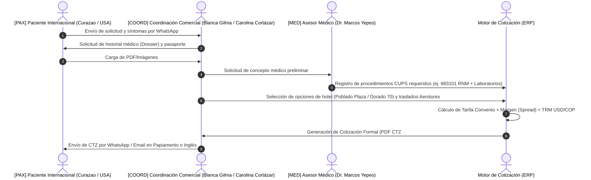
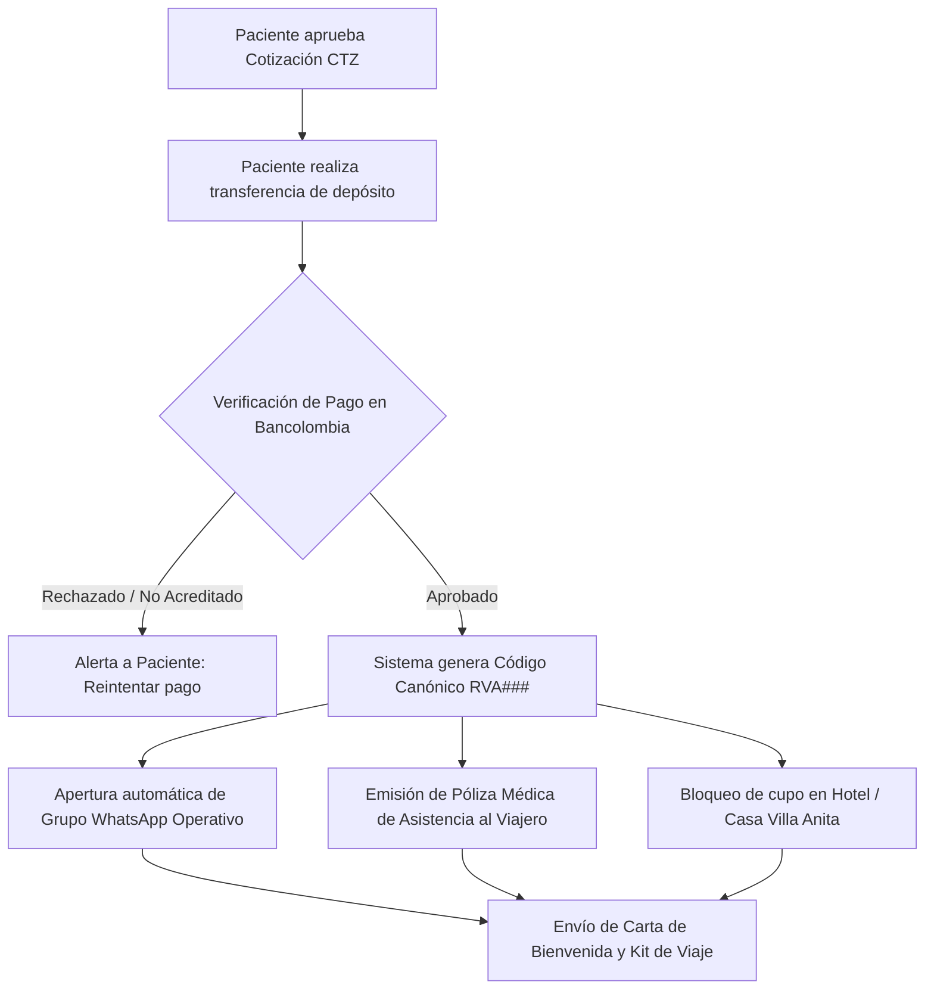
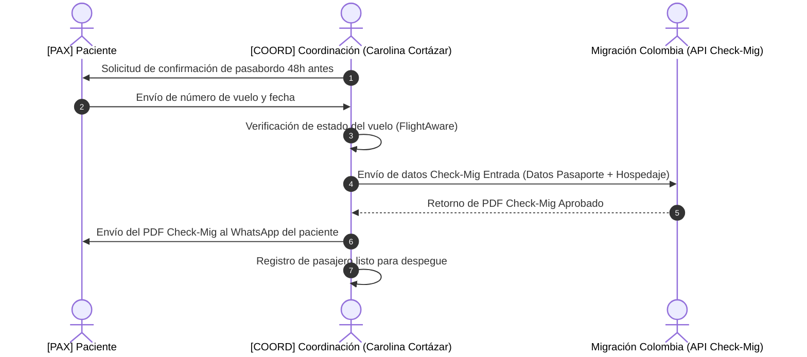
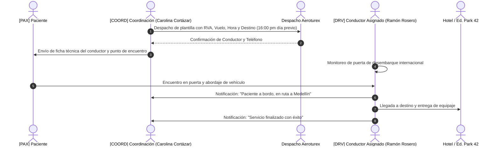
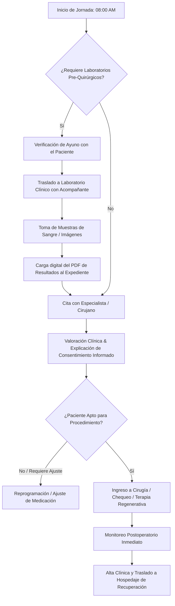
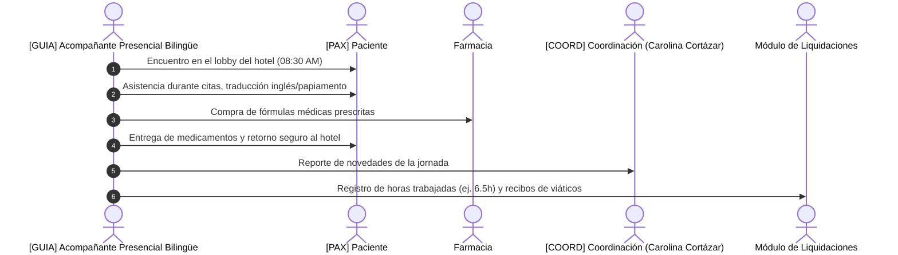
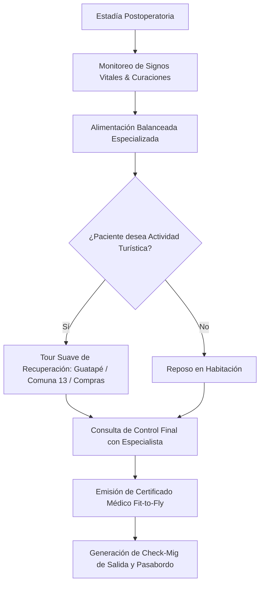
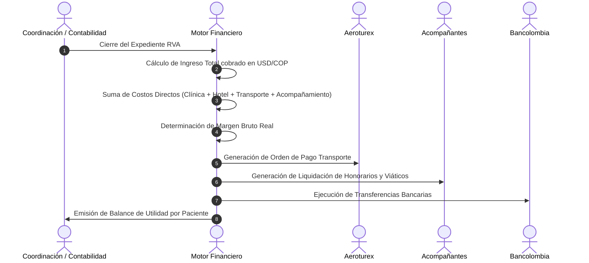

# 01. Flujos de Trabajo Maestros (BPMN 2.0 & Diagramas de Secuencia)

Este documento describe los **8 subprocesos operativos** que cubren el 100% de la operación de Medical Trip Colombia S.A.S. de inicio a fin.

---

## 🔄 Flujo 1: Comercial & Cotización Dinámica (`Lead ➔ CTZ`)

### Descripción:
Recepción del contacto internacional, triaje del historial clínico (*Medisch Dossier* en Papiamento/Inglés/Español), valoración preliminar con el [MED] Dr. Marcos Yepes o especialista, y cálculo automático de la cotización (`CTZ###`) con desglose de márgenes.

---

## 🔄 Flujo 2: Confirmación de Reserva & Emisión de Póliza (`CTZ ➔ RVA`)

### Descripción:
Aprobación del paciente, validación del comprobante de depósito bancario (Bancolombia), asignación formal del código de expediente `RVA###`, apertura del grupo de WhatsApp y emisión de la póliza de viajero.

---

## 🔄 Flujo 3: Logística Pre-Viaje y Migración (`Check-Mig & Vuelos`)

### Descripción:
48 a 24 horas antes del despegue, [COORD] Carolina Cortázar recopila los datos de vuelo (ej. Wingo 7449 / Avianca), diligencia el formulario obligatorio **Check-Mig Colombia** y confirma el estado de la reserva con la aerolínea.

---

## 🔄 Flujo 4: Logística en Terreno & Despacho Aeroturex

### Descripción:
Programación del transporte especial, asignación del conductor (ej. [DRV] Ramón Rosero), seguimiento en tiempo real del aterrizaje en el Aeropuerto José María Córdova (MDE) o Bogotá (BOG), y traslado al alojamiento.

---

## 🔄 Flujo 5: Atención Clínica, Citas Médicas y Laboratorios

### Descripción:
Protocolo de preparación del paciente (ayuno para exámenes de sangre), acompañamiento presencial al centro médico (HPTU, Cardio VID, Regencord), custodia de resultados y aval médico.

---

## 🔄 Flujo 6: Acompañamiento Presencial Bilingüe (Turnos y Guianza)

### Descripción:
Asignación de asistentes o enfermeras bilingües (*Guianza Express*), acompañamiento en consultas, traducción de indicaciones médicas, compra de medicamentos en farmacias y registro de turnos para liquidación.

---

## 🔄 Flujo 7: Recuperación Postoperatoria & Alta Médica (`Fit-to-Fly`)

### Descripción:
Monitoreo de la evolución en el hotel o casa de recuperación (*Villa Anita*), curaciones de enfermería, entrega del certificado de vuelo y tours de recuperación.

---

## 🔄 Flujo 8: Liquidaciones Financieras, Reconciliación & Pagos

### Descripción:
Cierre del expediente de viaje, cálculo de márgenes comerciales, liquidación de facturas a Aeroturex, pago de honorarios a acompañantes y conciliación con los registros bancarios.

