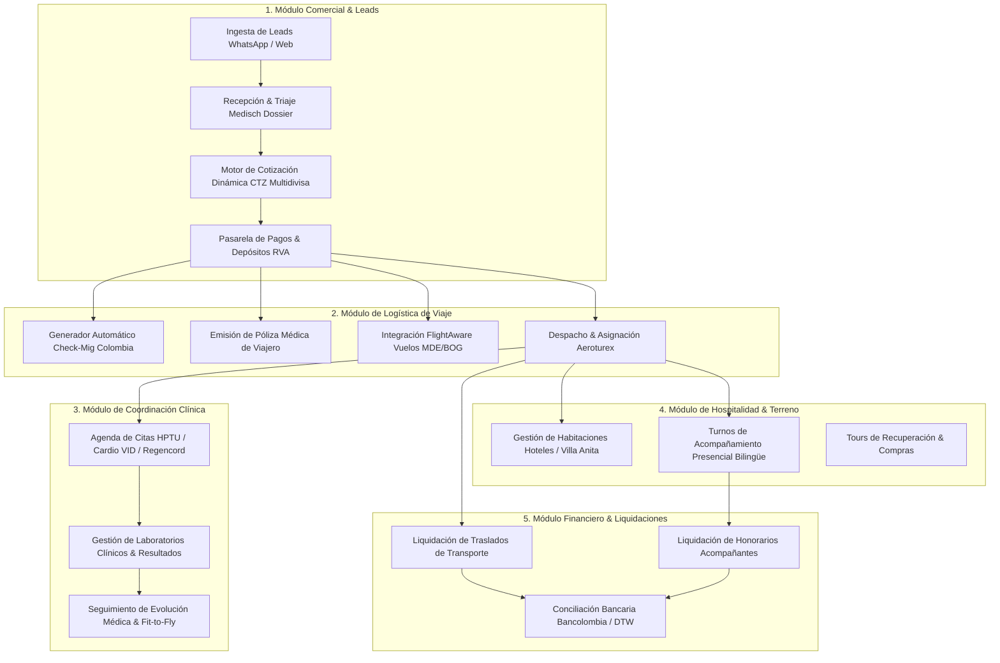

# 🏛️ Arquitectura de Software y Flujos de Trabajo End-to-End
## Plataforma de Gestión Integral: MEDICAL TRIP OPERATIVE CLOUD (ERP / CRM / BPM)

Este documento y directorio definen la especificación completa, los diagramas de flujo de control, el modelo de datos relacional y la arquitectura técnica para construir una **aplicación web nativa** que automatice y gestione la operación de **Medical Trip Colombia S.A.S.** de inicio a fin.

---

## 🗺️ Mapa de Módulos del Sistema

---

## 📑 Índice de Especificaciones Técnicas

| Documento | Enlace | Contenido |
| :--- | :--- | :--- |
| **1. Flujos de Trabajo Maestros (Workflows 1 al 8)** | [`01_master_workflows_bpmn.md`](file:///Users/miyo123/projects/medicaltrip/application_architecture/01_master_workflows_bpmn.md) | Diagramas de secuencia y BPMN 2.0 de los 8 subprocesos operativos. |
| **2. Esquema Relacional de Base de Datos (DDL)** | [`02_database_schema_3nf.sql`](file:///Users/miyo123/projects/medicaltrip/application_architecture/02_database_schema_3nf.sql) | 22 Tablas relacionales con llaves foráneas, índices, triggers y vistas. |
| **3. Catálogo de Tarifas y Servicios Semilla** | [`03_seed_catalogs.sql`](file:///Users/miyo123/projects/medicaltrip/application_architecture/03_seed_catalogs.sql) | Datos semilla de procedimientos CUPS, tarifas convenio 2024-2025, hoteles y rutas. |
| **4. Arquitectura de Software y APIs (OpenAPI / REST)** | [`04_api_architecture_and_endpoints.md`](file:///Users/miyo123/projects/medicaltrip/application_architecture/04_api_architecture_and_endpoints.md) | Contratos de API REST / GraphQL, Webhooks de WhatsApp y Workers en segundo plano. |
| **5. Diseño de Interfaces (UI/UX Wireframes)** | [`05_ui_ux_wireframes_and_views.md`](file:///Users/miyo123/projects/medicaltrip/application_architecture/05_ui_ux_wireframes_and_views.md) | Pantallas del Dashboard de Coordinación, App Móvil del Conductor y Portal del Paciente. |
