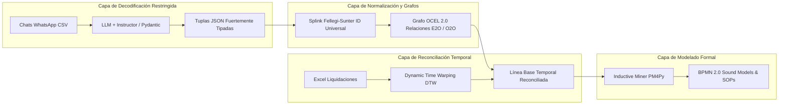

# 01. Framework OCPM Híbrido: Fundamentación Teórica y Matemática

## 1. El Desafío de la Minería de Procesos en Turismo Médico
El turismo médico es una industria intrínsecamente **multi-entidad, concurrente y asimétrica**. Un único viaje de paciente no es un caso secuencial cerrado, sino un hipergrafo de interacciones paralelas:
- El **Paciente** viaja en una fecha determinada.
- El **Hotel** reserva noches con políticas de check-in/out independientes.
- El **Transportador (Aeroturex)** ejecuta múltiples trayectos (aeropuerto-hotel, hotel-clínica, clínica-hotel).
- El **Hospital/Clínica (HPTU, Cardio VID)** agenda valoraciones, toma de muestras y cirugías con tiempos de espera variables.
- El **Acompañante Presencial** registra turnos por horas con liquidaciones periódicas.

La minería de procesos tradicional (basada en el estándar **XES**) colapsa en este entorno porque asume que cada evento pertenece a un **único identificador de caso (`Case ID`)**. Forzar un `Case ID` único (como el número de reserva `RVA`) destruye la visibilidad sobre el ciclo de vida del conductor, la ocupación del hotel o la disponibilidad del médico.

---

## 2. Benchmark de Enfoques Metodológicos

| Metodología | Ventajas | Vulnerabilidades Críticas en Medical Trip | Veredicto |
| :--- | :--- | :--- | :--- |
| **Conversational PM (Puro LLM)** | Ingiere lenguaje natural de WhatsApp y extrae eventos implícitos. | Alucinaciones severas en reglas de bifurcación; incapacidad de procesar sábanas de Excel masivas (>30MB). | ❌ Insuficiente como solución única |
| **Artifact-Centric BPM (AC-BPM / GSM)** | Modela fielmente el ciclo de vida de artefactos (`CTZ`, `RVA`, `Check-Mig`). | Descubrimiento automático de esquemas GSM directamente desde texto ruidoso es computacionalmente intratable. | ⚠️ Requiere capa previa de estructuración |
| **Knowledge Graphs (GraphRAG)** | Excelente para resolución topológica de entidades y relaciones estáticas. | Carece de dimensión temporal estricta y lógica de gateways BPMN (XOR, AND, OR) requeridos para SOPs. | ⚠️ Útil solo para desambiguación |
| **Service Blueprinting** | Claridad visual en la línea de visibilidad (Front-stage vs Back-stage). | Es un marco de diseño cualitativo; no es un algoritmo de ingeniería ni minería de datos. | ⚠️ Artefacto de salida, no de ingesta |
| **Metodología Híbrida Ágil (OCPM + LLM Constrained + DTW)** | **Sintetiza decodificación restringida Pydantic, estándar OCEL 2.0 y alineamiento temporal DTW.** | Mayor complejidad técnica de implementación inicial. | **✅ GANADORA (Estándar Definitivo)** |

---

## 3. Arquitectura del Framework Híbrido Ganador

### Componentes Clave:
1. **Decodificación Restringida (Constrained Decoding)**:
   Se utiliza **Instructor + Pydantic** para obligar a los LLMs a generar JSONs que cumplan esquemas matemáticos estrictos (enums de estados, validación regex de `RVA###`, `CTZ###`, números de vuelo). Se eliminan al 100% las respuestas conversacionales libres.
2. **Estándar OCEL 2.0 (Object-Centric Event Logs)**:
   Permite registrar eventos donde múltiples objetos coexisten:
   $$\text{Evento } e = \langle t, \text{activity}, \{o_{\text{paciente}}, o_{\text{conductor}}, o_{\text{clinica}}, o_{\text{hotel}}\}, \text{attributes} \rangle$$
3. **Alineamiento Temporal Dinámico (Dynamic Time Warping - DTW)**:
   Modela la función de distancia entre la señal temporal de eventos en chat ($X$) y la serie de registros contables en Excel ($Y$), absorbiendo la latencia administrativa entre la prestación del servicio y su liquidación.
