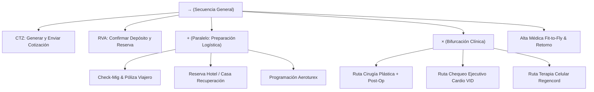

# 05. Modelado de Procesos BPMN 2.0 con Inductive Miner

## 1. Por qué Inductive Miner y no Alpha Miner / Heuristic Miner
En el análisis de flujos de turismo médico:
- **Alpha Miner**: No tolera ruido, bucles cortos ni eventos duplicados, produciendo modelos desconectados.
- **Heuristic Miner**: Aunque filtra ruido, no ofrece garantías matemáticas de ejecutabilidad (*Soundness*), generando bloqueos (*deadlocks*) o tokens infinitos.
- **Inductive Miner**: Utiliza una estrategia recursiva de divide y vencerás (*divide-and-conquer*) que garantiza formalmente que el modelo resultante es **Sound** (libre de interbloqueos y con terminación garantizada).

---

## 2. Árbol de Procesos y Operadores Lógicos

El Inductive Miner descompone el log de eventos en un **Process Tree** jerárquico compuesto por 4 operadores estándar:

| Operador | Símbolo | Equivalente BPMN 2.0 | Significado Operativo en Medical Trip |
| :--- | :---: | :--- | :--- |
| **Secuencia** | $\to$ | Flujo Secuencial | Paso A antes de Paso B (ej. Cotización $\to$ Reserva). |
| **Exclusivo** | $\times$ | Exclusive Gateway (XOR) | Bifurcación (ej. ¿Requiere Cirugía o solo Chequeo?). |
| **Paralelo** | $+$ | Parallel Gateway (AND) | Tareas simultáneas (ej. Reserva Hotel Y Asignación Conductor). |
| **Bucle** | $\circlearrowleft$ | Loop Activity / Retry | Repetición (ej. Reprogramación de Cita / Nueva Cotización). |



---

## 3. Pipeline de Descubrimiento con PM4Py

```python
# process_mining_bpmn.py
import pm4py

def discover_sound_bpmn_model(event_log_dataframe):
    """
    Convierte el Event Log unificado en un diagrama BPMN 2.0 ejecutable garantizando Soundness.
    """
    # 1. Formatear dataframe al estándar de pm4py
    event_log = pm4py.format_dataframe(
        event_log_dataframe,
        case_id='case_id',
        activity_key='activity',
        timestamp_key='timestamp'
    )

    # 2. Descubrir Process Tree con Inductive Miner (Filtro de ruido = 0.2)
    process_tree = pm4py.discover_process_tree_inductive(event_log, noise_threshold=0.2)

    # 3. Convertir Process Tree a Modelo BPMN 2.0
    bpmn_model = pm4py.convert_to_bpmn(process_tree)

    # 4. Exportar a XML BPMN 2.0 estándar (interoperable con Camunda / SpiffWorkflow)
    pm4py.write_bpmn(bpmn_model, "medical_trip_master_flow.bpmn")
    
    # 5. Evaluación de Calidad (Conformance Checking)
    fitness = pm4py.fitness_token_based_replay(event_log, bpmn_model)
    precision = pm4py.precision_token_based_replay(event_log, bpmn_model)
    
    return {
        "bpmn_file": "medical_trip_master_flow.bpmn",
        "fitness_score": fitness['log_fitness'],
        "precision_score": precision
    }
```

---

## 4. Integración con Motor de Ejecución (SpiffWorkflow)
El archivo `.bpmn` generado se carga directamente en el motor **SpiffWorkflow** en Python, permitiendo:
- Detonar alertas automáticas cuando un vuelo aterriza.
- Generar automáticamente órdenes de servicio para conductores de Aeroturex.
- Actualizar el estado del paciente en el CRM sin intervención manual.
