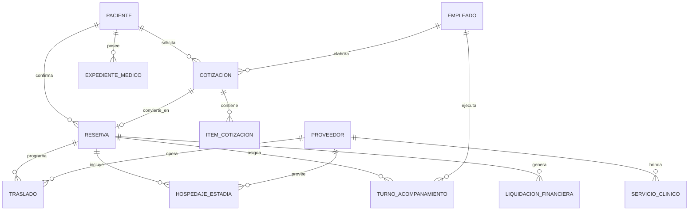

# 06. Modelo de Datos Relacional (ERD en 3NF) y Diccionario de Datos

Este modelo relacional es el resultado de la ingeniería inversa sobre los 4 años de datos de Medical Trip Colombia S.A.S., normalizado en Tercera Forma Normal (3NF) y listo para desplegarse en PostgreSQL o SQLite.

---

## 📐 Diagrama Entidad-Relación (ERD)



---

## 🗄️ Diccionario de Tablas Principales

### 1. `pacientes` (Directorio Maestro de Clientes Internacionales)
| Campo | Tipo | Restricción | Descripción |
| :--- | :--- | :--- | :--- |
| `id` | `UUID / SERIAL` | PRIMARY KEY | Identificador único universal (`ENT-PAX-XXXX`). |
| `nombres` | `VARCHAR(100)` | NOT NULL | Nombre(s) del paciente. |
| `apellidos` | `VARCHAR(100)` | NOT NULL | Apellido(s) del paciente. |
| `pasaporte_numero` | `VARCHAR(50)` | UNIQUE | Número de pasaporte oficial. |
| `pais_origen` | `VARCHAR(50)` | NOT NULL | Curazao, Aruba, Surinam, EE.UU., etc. |
| `idioma_principal` | `VARCHAR(20)` | DEFAULT 'Papiamento' | Papiamento, Español, Inglés, Neerlandés. |
| `telefono_e164` | `VARCHAR(30)` | INDEX | Teléfono internacional formateado. |
| `email` | `VARCHAR(150)` | NULL | Correo electrónico de contacto. |

### 2. `reservas_rva` (Expedientes Operativos de Viaje)
| Campo | Tipo | Restricción | Descripción |
| :--- | :--- | :--- | :--- |
| `id` | `UUID / SERIAL` | PRIMARY KEY | Identificador interno. |
| `codigo_rva` | `VARCHAR(30)` | UNIQUE, NOT NULL | Código canónico del expediente (ej. `RVA282-5`). |
| `paciente_id` | `UUID` | FK -> `pacientes(id)` | Paciente titular de la reserva. |
| `cotizacion_id` | `UUID` | FK -> `cotizaciones(id)` | Cotización base aprobada. |
| `fecha_llegada` | `DATE` | NOT NULL | Fecha de aterrizaje en Colombia. |
| `fecha_salida` | `DATE` | NOT NULL | Fecha de retorno al país de origen. |
| `aerolinea_llegada` | `VARCHAR(50)` | NULL | Wingo, Avianca, Copa Airlines. |
| `numero_vuelo_llegada`| `VARCHAR(20)`| NULL | Ej. `WINGO 7449`. |
| `aeropuerto_llegada` | `VARCHAR(10)` | DEFAULT 'MDE' | `MDE` (Rionegro) o `BOG` (Bogotá). |
| `estado_checkmig_in` | `BOOLEAN` | DEFAULT FALSE | Estado del formulario migratorio de entrada. |
| `estado_checkmig_out`| `BOOLEAN` | DEFAULT FALSE | Estado del formulario migratorio de salida. |
| `estado_reserva` | `VARCHAR(30)` | DEFAULT 'PROGRAMADO' | `[PROGRAMADO, EN_CURSO, COMPLETADO, CANCELADO]` |

### 3. `traslados_logistica` (Registro de Servicios de Transporte)
| Campo | Tipo | Restricción | Descripción |
| :--- | :--- | :--- | :--- |
| `id` | `UUID / SERIAL` | PRIMARY KEY | Identificador único del trayecto. |
| `reserva_id` | `UUID` | FK -> `reservas_rva(id)` | Expediente de viaje asociado. |
| `proveedor_id` | `UUID` | FK -> `proveedores(id)` | Proveedor (ej. Aeroturex). |
| `conductor_nombre` | `VARCHAR(100)` | NOT NULL | Conductor asignado (ej. Ramón Rosero). |
| `conductor_telefono`| `VARCHAR(30)` | NULL | Teléfono móvil del chofer. |
| `fecha_hora_recogida`| `TIMESTAMP` | NOT NULL | Fecha y hora exacta programada. |
| `origen` | `VARCHAR(200)` | NOT NULL | Aeropuerto JMC, Hotel, Clínica. |
| `destino` | `VARCHAR(200)` | NOT NULL | Dirección de destino exacta. |
| `costo_proveedor` | `DECIMAL(12,2)`| NOT NULL | Tarifa liquidada al transportador (COP). |
| `precio_cobrado_pax`| `DECIMAL(12,2)`| NOT NULL | Monto cobrado al paciente (USD o COP). |

### 4. `turnos_acompanamiento` (Acompañamiento Presencial Bilingüe)
| Campo | Tipo | Restricción | Descripción |
| :--- | :--- | :--- | :--- |
| `id` | `UUID / SERIAL` | PRIMARY KEY | Identificador del turno. |
| `reserva_id` | `UUID` | FK -> `reservas_rva(id)` | Expediente de viaje asociado. |
| `empleado_id` | `UUID` | FK -> `empleados(id)` | Acompañante o enfermera asignada. |
| `fecha` | `DATE` | NOT NULL | Fecha del servicio. |
| `horas_trabajadas` | `DECIMAL(4,2)` | NOT NULL | Número de horas presenciales. |
| `tipo_actividad` | `VARCHAR(100)` | NOT NULL | Consulta médica, cirugía, traducción, compras. |
| `viaticos_cop` | `DECIMAL(10,2)`| DEFAULT 0.0 | Gastos de alimentación o transporte menor. |
| `honorarios_cop` | `DECIMAL(10,2)`| NOT NULL | Pago liquidado al acompañante. |

---

## 💻 Script DDL (PostgreSQL / SQLite)

```sql
-- DDL_Medical_Trip_Master.sql
CREATE TABLE pacientes (
    id UUID PRIMARY KEY DEFAULT gen_random_uuid(),
    nombres VARCHAR(100) NOT NULL,
    apellidos VARCHAR(100) NOT NULL,
    pasaporte_numero VARCHAR(50) UNIQUE,
    pais_origen VARCHAR(50) NOT NULL,
    idioma_principal VARCHAR(20) DEFAULT 'Papiamento',
    telefono_e164 VARCHAR(30) UNIQUE,
    email VARCHAR(150),
    created_at TIMESTAMP WITH TIME ZONE DEFAULT CURRENT_TIMESTAMP
);

CREATE TABLE proveedores (
    id UUID PRIMARY KEY DEFAULT gen_random_uuid(),
    tipo_proveedor VARCHAR(30) NOT NULL, -- 'CLINICA', 'TRANSPORTE', 'HOTEL', 'LABORATORIO'
    razon_social VARCHAR(150) NOT NULL,
    nit_rut VARCHAR(50),
    contacto_nombre VARCHAR(100),
    contacto_telefono VARCHAR(30),
    ciudad VARCHAR(50) DEFAULT 'Medellin'
);

CREATE TABLE reservas_rva (
    id UUID PRIMARY KEY DEFAULT gen_random_uuid(),
    codigo_rva VARCHAR(30) UNIQUE NOT NULL,
    paciente_id UUID REFERENCES pacientes(id) ON DELETE RESTRICT,
    fecha_llegada DATE NOT NULL,
    fecha_salida DATE NOT NULL,
    aerolinea_llegada VARCHAR(50),
    numero_vuelo_llegada VARCHAR(20),
    aeropuerto_llegada VARCHAR(10) DEFAULT 'MDE',
    estado_checkmig_in BOOLEAN DEFAULT FALSE,
    estado_checkmig_out BOOLEAN DEFAULT FALSE,
    estado_reserva VARCHAR(30) DEFAULT 'PROGRAMADO',
    created_at TIMESTAMP WITH TIME ZONE DEFAULT CURRENT_TIMESTAMP
);
```
