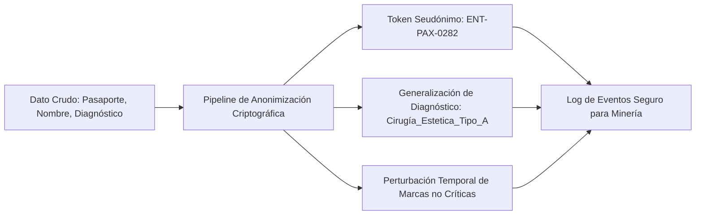

# 07. Matriz de Riesgos Metodológicos, Cumplimiento PHI y Aseguramiento de Calidad

## 1. Matriz de Riesgos Operativos y Estrategias Técnicas

| Riesgo Metodológico | Causa Raíz / Vector de Afectación | Impacto en la Minería | Estrategia de Mitigación Implementada |
| :--- | :--- | :--- | :--- |
| **Alucinación Semántica & Multilingüismo** | *Code-switching* continuo entre Papiamento, Neerlandés y Español en los chats de WhatsApp. | Clasificación errónea de eventos clínicos y de fechas. | **Decodificación Restringida (Instructor/Pydantic)** con diccionarios de terminología caribeña/médica inyectados y bucles de autocorrección. |
| **Entropía y Desfase Temporal** | Diferencia de días o semanas entre la conversación de WhatsApp y el asiento en las hojas de Excel. | Destrucción de la secuencia lógica de eventos y métricas de costos erróneas. | **Dynamic Time Warping (DTW)** con ventana de restricción Sakoe-Chiba ($\pm 7\text{ días}$) sobre matrices de costos morfológicas. |
| **Fuga de Datos Médicos (PHI / GDPR / Ley 1581)** | Exposición de historias clínicas, diagnósticos, números de pasaporte y cédulas en logs públicos. | Infracción legal de secreto médico y privacidad del paciente. | Capa de **Privacy-Preserving Process Mining (PPPM)** con *k-anonimato*, seudonimización criptográfica y enmascaramiento antes del modelado. |
| **Pérdida de Contexto en Notas de Voz** | 68 audios `.opus` con instrucciones críticas de médicos o pacientes no reflejadas en texto. | Vacíos de información en momentos clave del viaje. | Pipeline de transcripción bilingüe con modelos Whisper y marcado de confianza acústica. |

---

## 2. Protocolo de Privacidad y Anonimización (PPPM)

Antes de que cualquier registro sea procesado por los modelos de minería o subagentes:

### Reglas de Transformación:
1. **Identificadores Directos**: Números de pasaporte y teléfonos son reemplazados por hashes SHA-256 con Salt (`ENT-PAX-XXXX`).
2. **Diagnósticos Médicos Sensibles**: Se clasifican en macro-categorías clínicas según la clasificación internacional CIE-10 / ICD-11.
3. **K-Anonimato**: Cualquier combinación de atributos cuasi-identificadores (ej. `[Edad: 45, Procedencia: Curazao, Fecha: 05-Ago]`) debe tener al menos $k \ge 5$ registros equivalentes en el log analítico.

---

## 3. Métricas de Calidad de la Extracción

Para validar el éxito del pipeline de ingeniería inversa, se auditan las siguientes 4 dimensiones:

$$\text{Fitness} = \frac{\text{Eventos reproducibles en el modelo BPMN}}{\text{Total de eventos en el log hist\acute{o}rico}} \ge 0.88$$

$$\text{Precision} = 1 - \frac{\text{Comportamientos permitidos por el modelo no vistos en datos}}{\text{Espacio total de estados}} \ge 0.82$$

$$\text{Entity Resolution F1-Score} = 2 \cdot \frac{\text{Precision} \cdot \text{Recall}}{\text{Precision} + \text{Recall}} \ge 0.95$$

$$\text{Financial Reconciliation Rate} = \frac{\text{Costos de Excel apareados con eventos de WhatsApp}}{\text{Total de registros financieros}} \ge 0.92$$
