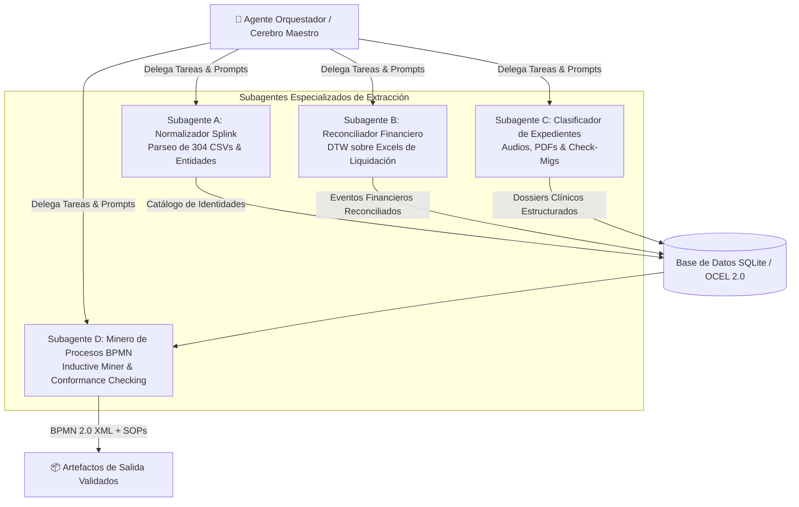

# 08. Orquestación Multi-Agente en Antigravity (Subagentes y Hilos Paralelos)

## 1. Arquitectura de Cerebro y Subagentes
Para procesar el volumen masivo de datos (304 chats CSV, 2,294 archivos y 2 libros contables masivos) sin saturar la ventana de contexto de un único agente, Antigravity implementa una **Arquitectura de Enjambre de Subagentes Especializados**:

---

## 2. Definición de Tareas y Roles de los Subagentes

### 🤖 Subagente A: `worker-splink-entity-resolver`
* **Misión**: Recorrer los 304 archivos CSV en `data/chats/contacts/`, extraer todos los números telefónicos, nombres propios, códigos `RVA` y generar la tabla `entities_master.json`.
* **Herramientas**: `run_command` (Python/DuckDB), `view_file`, `write_to_file`.
* **Entregable**: `data/normalized/master_entities.json`.

### 🤖 Subagente B: `worker-financial-dtw-aligner`
* **Misión**: Leer `Liquidacion_transporte.xlsx` y `Liquidacion_acompanamiento_presencial.xlsx`, estructurar los registros contables y aplicar el algoritmo DTW para alinearlos con los eventos de WhatsApp.
* **Herramientas**: `run_command` (Python/fastdtw), `view_file`.
* **Entregable**: `data/normalized/reconciled_financial_events.json`.

### 🤖 Subagente C: `worker-dossier-document-miner`
* **Misión**: Procesar los 2,294 archivos de `data/chats/whatsapp_all_extracted/`, extrayendo los datos de cotizaciones `CTZ`, cartas de consentimiento, pólizas de asistencia médica y órdenes de laboratorio.
* **Herramientas**: `view_file`, `grep_search`, `write_to_file`.
* **Entregable**: `data/normalized/clinical_dossiers.json`.

### 🤖 Subagente D: `worker-bpmn-inductive-modeler`
* **Misión**: Consolidar el log OCEL 2.0 unificado, ejecutar el Inductive Miner en PM4Py y generar los diagramas BPMN 2.0 con métricas de Fitness y Precision.
* **Herramientas**: `run_command` (PM4Py), `write_to_file`.
* **Entregable**: `methodology/outputs/medical_trip_master.bpmn`.

---

## 3. Protocolo de Comunicación Inter-Agente y Memoria Compartida

1. **Estado Centralizado en Base de Datos**:
   Todos los subagentes persisten sus resultados atómicos en `data/ocel_database.sqlite`.
2. **Control de Errores y Calidad Asíncrona**:
   El agente orquestador valida que cada subagente complete sus *Quality Gates* antes de detonar la siguiente fase.
3. **Persistencia de Transcripciones**:
   Los logs de ejecución de cada subagente quedan guardados para auditoría y trazabilidad en el cerebro de Antigravity.
