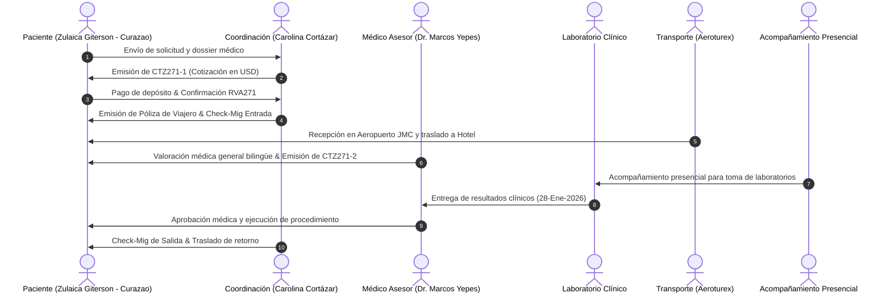

# Ejemplo Real de Extracción 2: Expediente `RVA271-5-GitersonZulaica`
> **Fuente**: `data/chats/passengers/RVA271-5-GitersonZulaica/` (28 Documentos, 77 Imágenes, 68 Audios, Historial de Chat)

---

## 1. Documentos y Evidencias Clínicas Extraídas

En el expediente de Zulaica Giterson (procedente de Curazao 🇨🇼) se identifican los siguientes artefactos:
1. **`CTZ271-1-Cotización actualizada.pdf`**: Cotización integral de tratamiento médico, hospedaje y traslados.
2. **`CTZ271-2-Laboratorios clínicos.pdf`**: Orden médica de exámenes pre-quirúrgicos / pre-tratamiento.
3. **`1.1 LABORATORIOS CLINICOS-28-01-2026-ZulaicaRVA271.pdf`**: Resultados de laboratorios clínicos procesados en Colombia.
4. **`Check Migración Colombia- Zulaica.pdf`**: Formulario migratorio de entrada.
5. **`RVA271- Póliza - Certificado_M44-118787-2826004_1768311073260.pdf`**: Póliza de seguro y asistencia médica internacional.
6. **`Mde médico general inglés Marcos Yepes.vcf`**: Contacto del médico general asignado para la valoración bilingüe.

---

## 2. Reconstrucción del Grafo de Eventos del Paciente

---

## 3. Reconciliación con `Liquidacion_acompanamiento_presencial.xlsx`

| Registro Contable | Horas | Actividad Ejecutada | Reconciliación con Chat |
| :--- | :--- | :--- | :--- |
| **Acompañamiento Día 1** | 6.5 hrs | Traslado + Cita valoración Dr. Marcos Yepes | Chat confirma salida de hotel 08:30 am y regreso 15:00 pm. |
| **Acompañamiento Día 2** | 5.0 hrs | Toma de laboratorios clínicos y farmacia | Coincide con entrega de PDF de laboratorios a las 14:15 pm. |
| **Viáticos Liquidación** | `$35.000 COP` | Transporte local / refrigerio acompañante | Asiento formal en sábana de liquidación presencial. |

---

## 4. SOP Inducido para Protocolo Clínico y de Laboratorios

1. **Revisión Previa**: La coordinación verifica que el paciente tenga ayuno adecuado para la toma de muestras de sangre y laboratorios.
2. **Asignación de Acompañante**: Se designa personal bilingüe para acompañar físicamente al paciente desde el lobby del hotel hasta el laboratorio.
3. **Custodia y Carga de Resultados**: El acompañante toma fotografía o escanea el resultado oficial y lo envía de inmediato al grupo de WhatsApp para que el médico tratante dé el aval.
4. **Liquidación del Turno**: Al finalizar la jornada, el acompañante reporta hora de inicio, hora de finalización y comprobantes de viáticos para su registro en `Liquidacion_acompanamiento_presencial.xlsx`.
